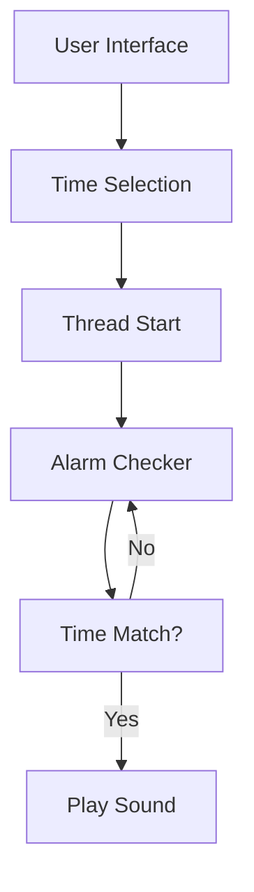
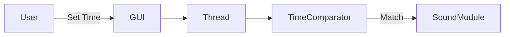
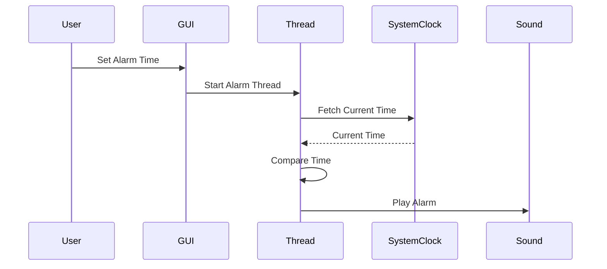

<!--
SEO KEYWORDS:
Python Alarm Clock, Tkinter Alarm Clock, Python GUI Project, Desktop Alarm App,
Python Threading Project, Beginner Python Project, Tkinter GUI Example,
Python Mini Project, Alarm Clock Source Code
-->

# ⏰ Alarm Clock Application (Python | Tkinter)

<p align="center">
  
  
  
  
  
</p>

---

## 📌 Project Title
**Desktop Alarm Clock Application using Python & Tkinter**

---

## 📖 Description
A lightweight **desktop-based alarm clock application** built using **Python**, **Tkinter GUI**, and **Multithreading**.  
Users can set alarms with **hour, minute, and second precision**, and the application plays a sound at the exact scheduled time **without freezing the UI**.

---

## 📚 Table of Contents
<details>
<summary>Click to Expand</summary>

1. Overview  
2. Features  
3. Technology Stack  
4. Installation & Setup  
5. Code Explanation  
6. Architecture Diagram  
7. Data Flow Diagram (DFD)  
8. Program Flow Diagram  
9. Use Cases  
10. Real-World Applications  
11. Pros & Cons  
12. Future Enhancements  
13. Author & Repository  

</details>

---

## 🔍 Overview
<details>
<summary>Expand</summary>

- GUI-based alarm clock
- Uses **Tkinter OptionMenu** for time selection
- Runs alarm checking in a **separate thread**
- Ensures **non-blocking UI**
- Plays alarm sound asynchronously

</details>

---

## ✨ Features
<details>
<summary>Expand</summary>

- ⏱ Hour, Minute & Second selection
- 🧵 Multithreaded alarm execution
- 🔔 Asynchronous sound playback
- 🖥 Simple & clean GUI
- 🚫 No UI freezing
- 🪟 Windows compatible (`winsound`)

</details>

---

## 🛠 Technology Stack
<details>
<summary>Expand</summary>

- **Language:** Python 3.x  
- **GUI:** Tkinter  
- **Threading:** threading module  
- **Time Handling:** datetime, time  
- **Sound:** winsound (Windows only)

</details>

---

## ⚙ Installation & Setup
<details>
<summary>Expand</summary>

```bash
git clone https://github.com/alok-kumar8765/Cool_Project_2.git
cd Cool_Project_2
python alarm_clock.py
````

> ⚠ Ensure `sound.wav` exists in the same directory

</details>

---

## 🧠 Code Explanation

<details>
<summary>Expand</summary>

### 1️⃣ GUI Initialization

* Creates Tkinter root window
* Sets geometry to `400x200`

### 2️⃣ Time Selection

* Uses `StringVar()` and `OptionMenu`
* Allows selecting Hour, Minute, Second

### 3️⃣ Multithreading

* Alarm runs in a **separate thread**
* Prevents UI blocking

### 4️⃣ Alarm Logic

* Continuously compares current time with set time
* Triggers alarm sound on match

### 5️⃣ Sound Playback

* Uses `winsound.PlaySound()` asynchronously

</details>

---

## 🏗 Architecture Diagram

<details>
<summary>Expand</summary>



</details>

---

## 🔄 Data Flow Diagram (DFD)

<details>
<summary>Expand</summary>



</details>

---

## 🔁 Program Flow Diagram

<details>
<summary>Expand</summary>



</details>

---

## 🎯 Use Cases

<details>
<summary>Expand</summary>

* Morning wake-up alarm
* Study reminders
* Workout timer
* Medication reminders
* Task scheduling

</details>

---

## 🌍 Real-World Applications

<details>
<summary>Expand</summary>

### Example 1: Student

> Sets alarm at **5:30 AM** for exam preparation.

### Example 2: Office Professional

> Reminder for **meetings or breaks**.

### Example 3: Fitness Enthusiast

> Workout interval alarm.

</details>

---

## ✅ Pros & ❌ Cons

<details>
<summary>Expand</summary>

### ✅ Pros

* Simple & lightweight
* Beginner-friendly
* No external dependencies
* Responsive UI

### ❌ Cons

* Windows-only sound support
* Single alarm only
* No alarm persistence
* No snooze feature

</details>

---

## 🚀 Future Enhancements

<details>
<summary>Expand</summary>

* Cross-platform sound support
* Multiple alarms
* Snooze functionality
* Save alarms to file/database
* Dark mode UI
* Notification support

</details>

---

## 👨‍💻 Author & Repository

<details>
<summary>Expand</summary>

**Author:** Alok Kumar
**GitHub:** [alok-kumar8765](https://github.com/alok-kumar8765)
**Repository:** Cool_Project_2

⭐ If you like this project, don’t forget to star the repo!

</details>


---
