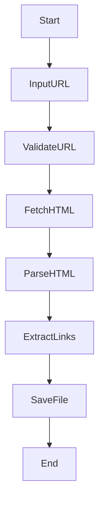

<!--how to extract all links from a webpage using python  
python script to scrape links from website  
beautifulsoup extract href links example  
python requests beautifulsoup link scraping  
beginner friendly web scraping project python  
python project for web scraping beginners  -->
# 🔗 Cool Project 2 – Webpage Link Extractor  
**Python | Web Scraping | BeautifulSoup | Requests**

<p align="center">
  
  
  
  
  
  
</p>

---

<details>
<summary>📌 <strong>Project Title</strong></summary>

### **All Links Extractor from a Given Webpage**
A Python-based automation tool that extracts all anchor (`<a>`) tag links from any webpage and stores them efficiently into a text file.

</details>

---

<details>
<summary>📖 <strong>Description</strong></summary>

This project is a **lightweight Python web scraping utility** that:
- Accepts a webpage URL from the user
- Fetches HTML content using `requests`
- Parses the content using `BeautifulSoup`
- Extracts all hyperlinks (`href`)
- Saves extracted links into a local file (`myLinks.txt`)

Designed for **beginners, automation engineers, SEO analysts, and backend developers**, this script demonstrates clean scraping logic with minimal dependencies.

</details>

---

<details>
<summary>📚 <strong>Table of Contents</strong></summary>

- 📌 Project Overview  
- ⚙️ Technology Stack  
- 🧠 How It Works  
- 🗂️ Data Flow Diagram (DFD)  
- 🏗️ System Architecture  
- 🔁 Execution Flow Diagram  
- 🧪 Example Input & Output  
- 🌍 Real-World Use Cases  
- ✅ Pros & ❌ Cons  
- 🔐 Limitations  
- 🚀 Future Enhancements  

</details>

---

<details>
<summary>⚙️ <strong>Technology Stack</strong></summary>

- **Language:** Python 3.x  
- **Libraries Used:**
  - `requests` – HTTP requests handling
  - `BeautifulSoup (bs4)` – HTML parsing
- **Output Format:** `.txt` file
- **Environment:** CLI / Terminal

</details>

---

<details>
<summary>🧠 <strong>How the Code Works</strong></summary>

- Accepts URL input from the user
- Automatically handles missing `https://`
- Sends HTTP GET request
- Parses webpage HTML content
- Extracts all `<a href="">` links
- Saves first 10 extracted links into a file

🔹 Clean  
🔹 Beginner-friendly  
🔹 Extendable  

</details>

---

<details>
<summary>🗂️ <strong>Data Flow Diagram (DFD)</strong></summary>

```mermaid
graph TD
    User[User Inputs URL]
    Request[HTTP Request via Requests]
    Parse[Parse HTML via BeautifulSoup]
    Extract[Extract Anchor Links]
    Store[Save Links to File]

    User --> Request
    Request --> Parse
    Parse --> Extract
    Extract --> Store
````

</details>

---

<details>
<summary>🏗️ <strong>System Architecture</strong></summary>

```mermaid
graph LR
    A[CLI Interface]
    B[Requests Module]
    C[HTML Content]
    D[BeautifulSoup Parser]
    E[Link Collection]
    F[Text File Storage]

    A --> B
    B --> C
    C --> D
    D --> E
    E --> F
```

</details>

---

<details>
<summary>🔁 <strong>Execution Flow Diagram</strong></summary>



</details>

---

<details>
<summary>🧪 <strong>Example</strong></summary>

### Input

```
Enter Link: https://example.com
```

### Output (myLinks.txt)

```
['/about', '/contact', '/blog', '/login', ...]
```

</details>

---

<details>
<summary>🌍 <strong>Real-World Use Cases</strong></summary>

* 🔍 **SEO Auditing**

  * Analyze internal & external links
* 🕵️ **Web Reconnaissance**

  * Crawl website structure
* 📊 **Data Mining**

  * Collect URLs for analysis
* 🤖 **Automation Pipelines**

  * Feed links into crawlers or bots
* 🧑‍💻 **Learning Web Scraping**

  * Ideal beginner project

**Example:**
An SEO analyst can extract all outbound links from a competitor’s website for backlink analysis.

</details>

---

<details>
<summary>✅ <strong>Pros</strong></summary>

* ✔ Simple & readable code
* ✔ Minimal dependencies
* ✔ Fast execution
* ✔ Easily extendable
* ✔ Beginner-friendly

</details>

---

<details>
<summary>❌ <strong>Cons</strong></summary>

* ❌ No duplicate filtering
* ❌ Relative URLs not normalized
* ❌ No error handling for invalid URLs
* ❌ No JavaScript-rendered links

</details>

---

<details>
<summary>🔐 <strong>Limitations</strong></summary>

* Cannot scrape JavaScript-heavy websites
* Appends data continuously (may duplicate links)
* Limited to first 10 links by default

</details>

---

<details>
<summary>🚀 <strong>Future Enhancements</strong></summary>

* 🔄 Convert relative URLs to absolute
* 🧹 Remove duplicate links
* 📁 Export to CSV / JSON
* ⚠ Add exception handling
* 🌐 Support JavaScript rendering (Selenium / Playwright)
* 📊 Add link categorization

</details>

---

<details>
<summary>👨‍💻 <strong>Author</strong></summary>

**Alok Kumar**
🔗 GitHub: [https://github.com/alok-kumar8765](https://github.com/alok-kumar8765)
📁 Repository: Cool_Project_2

</details>

---

<details>
<summary>⭐ <strong>Support</strong></summary>

If you find this project useful:

* ⭐ Star the repository
* 🍴 Fork it
* 🐛 Report issues
* 🤝 Contribute enhancements

</details>

---

<p align="center">
  🚀 <strong>Happy Coding & Web Scraping!</strong>
</p>

---

