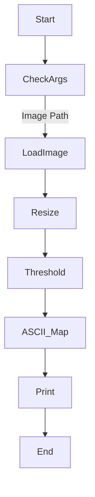

# 🎨 ASCII Art Generator using Python & OpenCV

<p align="center">
  
  
  
  
  
  
</p>

---

## 📌 Project Title
**ASCII Art Image Converter (CLI Based)**

---

<details>
<summary><strong>📖 Description</strong></summary>

This project converts **grayscale images into ASCII art** using **Python, OpenCV, and NumPy**.  
Each pixel intensity is mapped to a predefined ASCII symbol, producing a text-based visual representation of the image directly in the terminal.

✔ Lightweight  
✔ CLI-based  
✔ Beginner-friendly  
✔ Extensible  

</details>

---

<details>
<summary><strong>📑 Table of Contents</strong></summary>

- 📌 Overview
- ⚙️ How It Works
- 🧠 Core Logic Explanation
- 📊 Data Flow Diagram (DFD)
- 🏗 Architecture Diagram
- 🔄 Execution Flow Diagram
- 🧪 Example Output
- 💼 Real World Use Cases
- ✅ Pros & ❌ Cons
- 🚀 Future Enhancements
- 🛠 Tech Stack
- 📂 Project Structure
- ▶️ How to Run

</details>

---

<details>
<summary><strong>📌 Overview</strong></summary>

**Goal:**  
Convert images into ASCII characters for creative visualization.

**Key Concept:**  
Pixel intensity → Threshold → Index → ASCII Symbol

</details>

---

<details>
<summary><strong>⚙️ How It Works</strong></summary>

1. Load image in grayscale mode.
2. Resize image to fit terminal screen.
3. Apply threshold-based segmentation.
4. Map numeric values to ASCII symbols.
5. Print ASCII art to terminal.

</details>

---

<details>
<summary><strong>🧠 Core Logic Explanation</strong></summary>

- **`symbols_list`** → Defines ASCII characters
- **`threshold_list`** → Controls brightness mapping
- **`img_to_ascii()`** → Converts image to numeric matrix
- **`print_out_ascii()`** → Prints ASCII representation

✔ Modulo logic ensures safe symbol indexing  
✔ NumPy enables fast pixel processing  

</details>

---

<details>
<summary><strong>📊 Data Flow Diagram (DFD)</strong></summary>

```mermaid
graph TD
A[Image File] --> B[OpenCV Read Image]
B --> C[Resize Image]
C --> D[Apply Thresholds]
D --> E[Map to ASCII Symbols]
E --> F[Print ASCII Art]
````

</details>

---

<details>
<summary><strong>🏗 Architecture Diagram</strong></summary>

```mermaid
graph LR
User -->|CLI Input| PythonScript
PythonScript --> OpenCV
OpenCV --> NumPy
NumPy --> ASCII_Output
```

</details>

---

<details>
<summary><strong>🔄 Execution Flow Diagram</strong></summary>



</details>

---

<details>
<summary><strong>🧪 Example Output</strong></summary>

```
###***+++ooo
##***+++ooo.
#***+++ooo..
```

</details>

---

<details>
<summary><strong>💼 Real World Use Cases</strong></summary>

* 🎨 **Terminal Art & Demos**
* 🧪 **Computer Vision Learning**
* 📟 **Low-resource Displays**
* 🎮 **Game Assets (Retro Games)**
* 🧑‍🏫 **Teaching Image Processing Concepts**

**Example:**
A hacker-style terminal intro screen displaying ASCII logos.

</details>

---

<details>
<summary><strong>✅ Pros & ❌ Cons</strong></summary>

### ✅ Pros

* Simple & readable code
* Minimal dependencies
* Fast execution
* Easy customization

### ❌ Cons

* Terminal font dependent
* No color support (yet)
* Output size limited by terminal

</details>

---

<details>
<summary><strong>🚀 Future Enhancements</strong></summary>

* 🎨 Colored ASCII output
* 🖼 Support for RGB images
* 📐 Dynamic terminal resizing
* 🧠 AI-based symbol mapping
* 📁 Save ASCII output to file

</details>

---

<details>
<summary><strong>🛠 Tech Stack</strong></summary>

* **Python 3**
* **OpenCV**
* **NumPy**
* **CLI (Terminal-based UI)**

</details>

---

<details>
<summary><strong>📂 Project Structure</strong></summary>

```
Ascii_art/
│── ascii_art.py
│── sample_image.png
│── README.md
```

</details>

---

<details>
<summary><strong>▶️ How to Run</strong></summary>

```bash
pip install opencv-python numpy
python ascii_art.py image.png
```

If no image is provided:

```bash
python ascii_art.py
```

</details>

---

## 🔗 Repository Link

👉 **[https://github.com/alok-kumar8765/Cool_Project_2/tree/main/Ascii_art](https://github.com/alok-kumar8765/Cool_Project_2/tree/main/Ascii_art)**

---

<!--
## ⭐ SEO Keywords

`ASCII Art Python`, `Image to ASCII`, `OpenCV ASCII Converter`, `Python Computer Vision`, `Terminal Art Generator`
-->

### 👨‍💻 Author

**Alok Kumar**
GitHub: [alok-kumar8765](https://github.com/alok-kumar8765)

---

✨ *If you like this project, don’t forget to ⭐ star the repository!*


---

