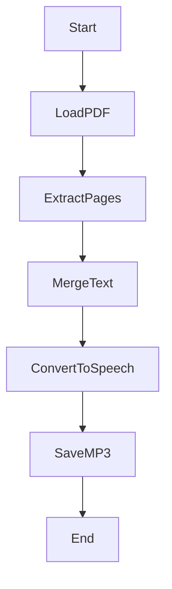

# 🎧 AudioBook Generator – PDF to Speech Converter

<p align="center">
  
  
  
  
  
</p>

<p align="center">
  🔗 <b>GitHub Repository:</b>  
  <a href="https://github.com/alok-kumar8765/Cool_Project_2/tree/main/AudioBook">
    alok-kumar8765/Cool_Project_2 – AudioBook
  </a>
</p>

---

## 📌 Project Overview

<details>
<summary><b>🔍 What is AudioBook Generator?</b></summary>

**AudioBook Generator** is a Python-based automation tool that converts **PDF documents into spoken audio (MP3)** using **Google Text-to-Speech (gTTS)**.

It extracts text from each page of a PDF file and converts the combined content into a natural-sounding audio file, enabling users to **listen instead of read**.

</details>

---

## 🚀 Key Features

<details>
<summary><b>✨ Core Functionalities</b></summary>

- 📄 Reads multi-page PDF files
- 🔎 Extracts text from each page
- 🔗 Merges text into a single readable string
- 🔊 Converts text into speech using **Google TTS**
- 💾 Saves output as an **MP3 audio file**
- ⚡ Lightweight & beginner-friendly
- 🧠 Ideal for automation and accessibility

</details>

---

## 🛠️ Technologies Used

<details>
<summary><b>🧰 Tech Stack</b></summary>

- **Python 3.x**
- **gTTS (Google Text-to-Speech)**
- **PyPDF2**
- **PDF File Handling**
- **MP3 Audio Encoding**

</details>

---

## 📚 Table of Contents

<details>
<summary><b>📖 Expand Index</b></summary>

1. Project Overview  
2. Features  
3. Technologies  
4. Code Explanation  
5. Architecture Diagram  
6. Data Flow Diagram (DFD)  
7. Process Flow Diagram  
8. Installation & Usage  
9. Real-World Use Cases  
10. Pros & Cons  
11. Future Enhancements  

</details>

---

## 🧩 Code Explanation

<details>
<summary><b>🧠 Step-by-Step Logic</b></summary>

- Import required libraries (`gTTS`, `PyPDF2`)
- Open PDF file in binary read mode
- Read total number of pages
- Extract text page-by-page safely using `try/except`
- Merge extracted text into a single string
- Pass text to Google TTS engine
- Generate and save MP3 audio file

</details>

---

## 🏗️ System Architecture Diagram

<details>
<summary><b>📐 Architecture (Mermaid)</b></summary>

```mermaid
flowchart LR
    A[User PDF File] --> B[PyPDF2 Reader]
    B --> C[Text Extraction Engine]
    C --> D[gTTS Processor]
    D --> E[MP3 Audio Output]
````

</details>

---

## 🔄 Data Flow Diagram (DFD)

<details>
<summary><b>📊 DFD Level 1</b></summary>

```mermaid
flowchart TD
    User -->|Uploads PDF| System
    System -->|Extract Text| PDF_Processor
    PDF_Processor -->|Raw Text| Text_Parser
    Text_Parser -->|Clean Text| TTS_Engine
    TTS_Engine -->|Audio File| User
```

</details>

---

## 🔁 Process Flow Diagram

<details>
<summary><b>🔀 Execution Flow</b></summary>



</details>

---

## ⚙️ Installation & Usage

<details>
<summary><b>▶️ How to Run</b></summary>

### Install Dependencies

```bash
pip install gtts PyPDF2
```

### Run Script

```bash
python audiobook.py
```

📌 Make sure your PDF file is named **`name.pdf`** and placed in the same directory.

</details>

---

## 🌍 Real-World Use Cases

<details>
<summary><b>📌 Practical Applications</b></summary>

* 🎓 **Students** converting textbooks into audio
* 👨‍🦯 **Visually impaired users** accessing documents
* 🚗 **Commuters** listening to PDFs while traveling
* 📖 **Audiobook creation** for learning platforms
* 🏢 **Corporate reports** converted to voice summaries

🔹 *Example:*
A UPSC aspirant converts a 300-page PDF syllabus into MP3 and listens daily during workouts or travel.

</details>

---

## ⚖️ Pros & Cons

<details>
<summary><b>✅ Advantages</b></summary>

* Easy to use
* Free & open-source
* No complex setup
* Supports large PDFs
* Improves accessibility

</details>

<details>
<summary><b>❌ Limitations</b></summary>

* Requires internet (gTTS API)
* PDF text extraction may fail for scanned PDFs
* Single language at a time
* No voice customization

</details>

---

## 🔮 Future Enhancements

<details>
<summary><b>🚀 Planned Improvements</b></summary>

* 🎙️ Multiple voice options
* 🌐 Multi-language support
* 📱 GUI / Web Interface
* 🧠 OCR support for scanned PDFs
* ⏸️ Chapter-wise audio splitting

</details>

---

## 👨‍💻 Author

<details>
<summary><b>🧑‍💻 Developer Info</b></summary>

**Alok Kumar**
🔗 GitHub: [alok-kumar8765](https://github.com/alok-kumar8765)

</details>

---

⭐ *If you found this project useful, don’t forget to star the repository!*


---

