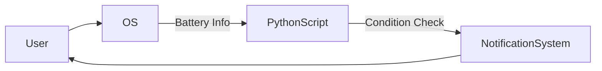

# 🔋 Battery Notification System (Python)

<p align="center">
  <picture>
    <source media="(prefers-color-scheme: dark)" srcset="https://raw.githubusercontent.com/alok-kumar8765/Cool_Project_2/main/.github/assets/battery-dark.png">
    <source media="(prefers-color-scheme: light)" srcset="https://raw.githubusercontent.com/alok-kumar8765/Cool_Project_2/main/.github/assets/battery-light.png">
    
  </picture>
</p>

<p align="center">
  <!-- Core Badges -->
  
  
  

  <!-- Tech Badges -->
  
  

  <!-- Test & Quality Badges -->
  
  
  
  
  
</p>


---

## 📌 Project Title
**Battery Notification System using Python**

---

<details open>
<summary><h2>📖 Table of Contents</h2></summary>

- 🔍 Overview  
- 🧠 How It Works  
- ⚙️ Tech Stack  
- 📐 System Architecture  
- 🔄 Application Flow  
- 📊 Data Flow Diagram (DFD)  
- 🚀 Installation & Usage  
- 💡 Real-World Use Cases  
- ✅ Pros  
- ❌ Cons  
- 🧪 Example Scenario  
- 🔐 Future Enhancements  

</details>

---

<details>
<summary><h2>🔍 Overview</h2></summary>

The **Battery Notification System** is a lightweight Python utility that monitors the system battery level and sends a **desktop notification** when battery power drops below **30% and the charger is not connected**.

This project is ideal for:
- Preventing sudden system shutdowns
- Background system monitoring
- Automation and system utility demonstrations

SEO Keywords:  
`Python battery monitor`, `battery notification python`, `psutil battery`, `desktop alert python`, `system automation`

</details>

---

<details>
<summary><h2>🧠 How It Works</h2></summary>

- Reads system battery data using `psutil`
- Checks:
  - Battery percentage
  - Charger connection status
- Triggers a Windows notification when:
  - Battery ≤ 30%
  - Charger is NOT connected

</details>

---

<details>
<summary><h2>⚙️ Tech Stack</h2></summary>

- **Language:** Python 3.x  
- **Libraries:**
  - `psutil` – Battery statistics
  - `pynotifier` – Desktop notifications
- **OS Support:** Windows  

</details>

---

<details>
<summary><h2>📐 System Architecture</h2></summary>

```mermaid
graph TD
    A[Operating System] --> B[psutil Library]
    B --> C[Battery Data]
    C --> D{Battery ≤ 30%?}
    D -->|Yes| E{Charger Plugged?}
    E -->|No| F[Send Notification]
    E -->|Yes| G[Do Nothing]
    D -->|No| G
````

</details>

---

<details>
<summary><h2>🔄 Application Flow Diagram</h2></summary>

```mermaid
flowchart TD
    Start --> ReadBattery
    ReadBattery --> CheckPercentage
    CheckPercentage -->|≤ 30%| CheckPlug
    CheckPercentage -->|> 30%| End
    CheckPlug -->|Not Plugged| Notify
    CheckPlug -->|Plugged| End
    Notify --> End
```

</details>

---

<details>
<summary><h2>📊 Data Flow Diagram (DFD)</h2></summary>



</details>

---

<details>
<summary><h2>🚀 Installation & Usage</h2></summary>

### 🔹 Install Dependencies

```bash
pip install psutil pynotifier win10toast
```

### 🔹 Run Script

```bash
python battery_notification.py
```

### 🔹 Recommended

* Add to **Startup folder**
* Run as **background task**
* Schedule using **Task Scheduler**

</details>

---

<details>
<summary><h2>💡 Real-World Use Cases</h2></summary>

* 💻 **Office Employees:** Prevent work loss during meetings
* 🎓 **Students:** Avoid shutdowns during online exams
* 🧑‍💻 **Developers:** Protect long-running builds
* 🖥️ **Servers / Kiosks:** Battery health monitoring

</details>

---

<details>
<summary><h2>🧪 Example Scenario</h2></summary>

> You are working on a laptop without a charger.
> Battery drops to **28%**.
> ⚠️ Desktop notification appears:
> **“Battery Low – 28% Battery remaining!!”**

This gives you enough time to plug in the charger.

</details>

---

<details>
<summary><h2>✅ Pros</h2></summary>

* Lightweight & fast
* Minimal dependencies
* Beginner-friendly
* Easy to customize
* Background execution

</details>

---

<details>
<summary><h2>❌ Cons</h2></summary>

* Windows-focused notifications
* No sound alert (by default)
* Needs manual startup setup
* No mobile support

</details>

---

<details>
<summary><h2>🔐 Future Enhancements</h2></summary>

* 🔊 Sound alerts
* 🔁 Continuous monitoring loop
* 📱 Cross-platform support
* ⚡ Configurable battery threshold
* 📊 Battery usage analytics

</details>

---

## 👨‍💻 Author

**Alok Kumar**
🔗 GitHub: [alok-kumar8765](https://github.com/alok-kumar8765)

---

⭐ If you like this project, **give it a star** and feel free to contribute!


---
