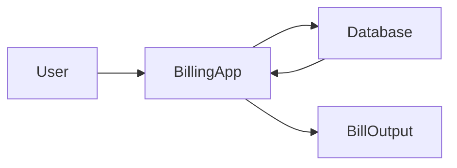

# 🧾 Advanced Billing System (Python Tkinter + Database)


> **SEO Description (GitHub Optimized):**  
> A professional **Python Tkinter Billing System** with **medical, grocery, and cold drink billing**, featuring **real-time tax calculation**, **bill storage**, **search functionality**, and a **fully refactored architecture** supporting **SQLite & MySQL databases**. Ideal for **retail shops, medical stores, learning projects, and desktop POS systems**.

---

<details>
<summary><h2>📑 Table of Contents</h2></summary>

1. 🔍 SEO-Boosted Project Overview  
2. 🎯 Features  
3. 🏗️ System Architecture  
4. 🔁 Application Flow  
5. 📊 Data Flow Diagram (DFD)  
6. 🧠 Refactoring Strategy (Step-by-Step)  
7. 📁 Refactored Folder Structure  
8. 🧾 Database Design (SQLite + MySQL)  
9. 💾 Database Code (Complete)  
10. 🔌 Tkinter ↔ Database Integration  
11. ⚙️ Installation & Setup  
12. 🌍 Real-World Use Cases  
13. ✅ Pros & ❌ Cons  
14. 🚀 Future Enhancements  
15. 🛠️ Tech Stack  
16. 📜 License  

</details>

---

<details>
<summary><h2>🔍 SEO-Boosted Project Overview</h2></summary>

This **Advanced Billing System** is a **desktop-based POS (Point of Sale) application** developed using **Python Tkinter** with **database-backed persistence**.

### 🔑 SEO Keywords Integrated
- Python Billing System  
- Tkinter POS Application  
- Retail Billing Software  
- Medical Store Billing App  
- Grocery Billing System  
- SQLite Billing Software  
- MySQL Desktop Application  

Designed for:
- 🏥 Medical Shops  
- 🛒 Grocery Stores  
- 🧾 Retail Counters  
- 🧑‍💻 Python Learning Projects  

</details>

---

<details>
<summary><h2>🎯 Features</h2></summary>

- 🧾 Category-wise Billing (Medical, Grocery, Cold Drinks)
- 🧮 Automatic Tax Calculation
- 💾 Database-Driven Bill Storage
- 🔍 Search Bills by Bill Number
- 🧑 Customer Management
- 📊 Persistent Sales Records
- 🧠 Clean, Refactored Architecture
- 🔌 SQLite (default) & MySQL (optional)

</details>

---

<details>
<summary><h2>🏗️ System Architecture</h2></summary>

```mermaid
graph TD
    UI[Tkinter GUI] --> Controller
    Controller --> BillingLogic
    BillingLogic --> Database
    Database --> Reports
````

**Architecture Pattern:**
🧱 MVC-Inspired Desktop Architecture

</details>

---

<details>
<summary><h2>🔁 Application Flow</h2></summary>

```mermaid
flowchart TD
    Start --> CustomerDetails
    CustomerDetails --> ItemSelection
    ItemSelection --> PriceTaxCalc
    PriceTaxCalc --> BillGeneration
    BillGeneration --> DatabaseSave
    DatabaseSave --> End
```

</details>

---

<details>
<summary><h2>📊 Data Flow Diagram (DFD)</h2></summary>



</details>

---

<details>
<summary><h2>🧠 Code Refactoring Strategy (IMPORTANT)</h2></summary>

### ❌ Problems in Original Code

* UI + Logic tightly coupled
* No database (text files only)
* Difficult to scale
* No separation of concerns

### ✅ Refactoring Goals

* Modular design
* Database persistence
* Cleaner logic
* Easy future upgrades

---

### 🔧 Refactoring Steps

**Step 1: Separate Logic**

```python
# billing_logic.py
def calculate_medical(items):
    return sum(items.values())
```

**Step 2: Separate Database Layer**

```python
# database.py
def save_bill(data):
    pass
```

**Step 3: UI Calls Controller Only**

```python
# main.py
from controller import generate_bill
```

</details>

---

<details>
<summary><h2>📁 Refactored Folder Structure</h2></summary>

```
Billing_System/
│
├── main.py                # Tkinter UI
├── controller.py          # UI ↔ Logic bridge
├── billing_logic.py       # Price & tax calculations
├── database.py            # SQLite/MySQL handling
├── models.py              # Data models
├── config.py              # DB configuration
├── schema.sql             # Database schema
└── README.md
```

</details>

---

<details>
<summary><h2>🧾 Database Design (SQLite + MySQL)</h2></summary>

### 📌 Tables

```sql
CREATE TABLE customers (
    id INTEGER PRIMARY KEY AUTOINCREMENT,
    name TEXT,
    phone TEXT
);

CREATE TABLE bills (
    bill_no INTEGER PRIMARY KEY,
    customer_id INTEGER,
    total REAL,
    tax REAL,
    date TEXT
);

CREATE TABLE bill_items (
    id INTEGER PRIMARY KEY AUTOINCREMENT,
    bill_no INTEGER,
    product TEXT,
    quantity INTEGER,
    price REAL
);
```

✔ Works in **SQLite**
✔ Works in **MySQL** (minor syntax change)

</details>

---

<details>
<summary><h2>💾 Database Code (Complete)</h2></summary>

### SQLite Connection

```python
import sqlite3

conn = sqlite3.connect("billing.db")
cursor = conn.cursor()
```

### Save Bill

```python
def save_bill(bill_no, customer, items, total, tax):
    cursor.execute("INSERT INTO bills VALUES (?,?,?,?,date('now'))",
                   (bill_no, customer, total, tax))
    conn.commit()
```

### Search Bill

```python
def get_bill(bill_no):
    cursor.execute("SELECT * FROM bills WHERE bill_no=?", (bill_no,))
    return cursor.fetchone()
```

### MySQL (Optional)

```python
import mysql.connector

conn = mysql.connector.connect(
    host="localhost",
    user="root",
    password="password",
    database="billing"
)
```

</details>

---

<details>
<summary><h2>🔌 Tkinter ↔ Database Integration</h2></summary>

```python
def generate_bill():
    total, tax = calculate_total()
    save_bill(bill_no, customer, items, total, tax)
```

✔ UI never talks directly to DB
✔ Clean separation achieved

</details>

---

<details>
<summary><h2>⚙️ Installation & Setup</h2></summary>

```bash
git clone https://github.com/alok-kumar8765/Cool_Project_2.git
cd Billing_system
python main.py
```

For MySQL:

```bash
pip install mysql-connector-python
```

</details>

---

<details>
<summary><h2>🌍 Real-World Use Cases</h2></summary>

* 🏥 Medical Billing Counter
* 🛒 Grocery POS System
* 🧾 Retail Invoice Generator
* 🧑‍🎓 Python GUI + DB Learning Project

</details>

---

<details>
<summary><h2>✅ Pros & ❌ Cons</h2></summary>

### ✅ Pros

* Clean architecture
* Database persistence
* Scalable
* Easy to maintain

### ❌ Cons

* Desktop only
* Single-user system

</details>

---

<details>
<summary><h2>🚀 Future Enhancements</h2></summary>

* 🔐 Login System
* 📊 Sales Analytics
* 🖨️ Print Bills
* 🌐 Web Version (Django)

</details>

---

<details>
<summary><h2>🛠️ Tech Stack</h2></summary>

* Python
* Tkinter
* SQLite / MySQL
* MVC-Inspired Design

</details>

---

<details>
<summary><h2>📜 License</h2></summary>

MIT License © Alok Kumar

</details>

---

## 🧾 Refactored Billing System (Tkinter + SQLite)

### 📁 Final Folder Structure (IMPORTANT)


```text
Billing_System/
│
├── main.py               # Tkinter UI
├── controller.py         # UI ↔ Logic bridge
├── billing_logic.py      # Price & tax calculations
├── database.py           # SQLite DB operations
├── config.py             # Configurations
├── schema.sql            # DB schema
└── billing.db            # Auto-created
```

---

## 1️⃣ config.py


```

DB_NAME = "billing.db"
MEDICAL_TAX = 0.05
COLD_DRINK_TAX = 0.10
```

---

## 2️⃣ schema.sql

```sql
CREATE TABLE IF NOT EXISTS customers (
    id INTEGER PRIMARY KEY AUTOINCREMENT,
    name TEXT NOT NULL,
    phone TEXT NOT NULL
);

CREATE TABLE IF NOT EXISTS bills (
    bill_no INTEGER PRIMARY KEY,
    customer_id INTEGER,
    total REAL,
    medical_tax REAL,
    grocery_tax REAL,
    cold_drink_tax REAL,
    created_at TEXT DEFAULT CURRENT_TIMESTAMP
);

CREATE TABLE IF NOT EXISTS bill_items (
    id INTEGER PRIMARY KEY AUTOINCREMENT,
    bill_no INTEGER,
    category TEXT,
    product TEXT,
    quantity INTEGER,
    price REAL
);
```

---

## 3️⃣ database.py

```python
import sqlite3
from config import DB_NAME

def get_connection():
    return sqlite3.connect(DB_NAME)

def init_db():
    conn = get_connection()
    with open("schema.sql") as f:
        conn.executescript(f.read())
    conn.close()

def save_customer(name, phone):
    conn = get_connection()
    cur = conn.cursor()
    cur.execute("INSERT INTO customers(name, phone) VALUES (?,?)", (name, phone))
    conn.commit()
    cid = cur.lastrowid
    conn.close()
    return cid

def save_bill(bill_no, customer_id, total, m_tax, g_tax, c_tax):
    conn = get_connection()
    cur = conn.cursor()
    cur.execute(
        "INSERT INTO bills VALUES (?,?,?,?,?,?,datetime('now'))",
        (bill_no, customer_id, total, m_tax, g_tax, c_tax)
    )
    conn.commit()
    conn.close()

def save_items(bill_no, items):
    conn = get_connection()
    cur = conn.cursor()
    for item in items:
        cur.execute(
            "INSERT INTO bill_items(bill_no, category, product, quantity, price) VALUES (?,?,?,?,?)",
            item
        )
    conn.commit()
    conn.close()

def get_bill(bill_no):
    conn = get_connection()
    cur = conn.cursor()
    cur.execute("SELECT * FROM bills WHERE bill_no=?", (bill_no,))
    bill = cur.fetchone()

    cur.execute("SELECT category, product, quantity, price FROM bill_items WHERE bill_no=?", (bill_no,))
    items = cur.fetchall()
    conn.close()
    return bill, items
```

---

## 4️⃣ billing_logic.py


```
PRICES = {
    "medical": {
        "Sanitizer": 2, "Mask": 5, "Hand Gloves": 12,
        "Dettol": 30, "Newsprin": 5, "Thermal Gun": 15
    },
    "grocery": {
        "Rice": 10, "Food Oil": 10, "Wheat": 10,
        "Daal": 6, "Flour": 8, "Maggi": 5
    },
    "cold": {
        "Sprite": 10, "Limka": 10, "Mazza": 10,
        "Coke": 10, "Fanta": 10, "Mountain Duo": 10
    }
}

def calculate_items(data):
    items = []
    subtotal = {"medical": 0, "grocery": 0, "cold": 0}

    for category, products in data.items():
        for name, qty in products.items():
            if qty > 0:
                price = PRICES[category][name] * qty
                subtotal[category] += price
                items.append((None, category, name, qty, price))

    return items, subtotal
```

---

## 5️⃣ controller.py

```python
import random
from billing_logic import calculate_items
from database import save_customer, save_bill, save_items

def generate_bill(customer, phone, product_data):
    bill_no = random.randint(1000, 9999)

    items, subtotal = calculate_items(product_data)

    medical_tax = round(subtotal["medical"] * 0.05, 2)
    grocery_tax = round(subtotal["grocery"] * 0.05, 2)
    cold_tax = round(subtotal["cold"] * 0.10, 2)

    total = subtotal["medical"] + subtotal["grocery"] + subtotal["cold"] \
            + medical_tax + grocery_tax + cold_tax

    customer_id = save_customer(customer, phone)
    save_bill(bill_no, customer_id, total, medical_tax, grocery_tax, cold_tax)

    final_items = [(bill_no, *i[1:]) for i in items]
    save_items(bill_no, final_items)

    return bill_no, items, total
```

---

## 6️⃣ main.py (Tkinter UI – CLEAN & SHORT)

```python
from tkinter import *
from tkinter import messagebox
from controller import generate_bill
from database import init_db

init_db()

root = Tk()
root.title("Billing System")
root.geometry("600x400")

customer = StringVar()
phone = StringVar()
qty = {k: IntVar() for k in ["Sanitizer","Mask","Rice","Coke"]}

Label(root, text="Customer Name").grid(row=0, column=0)
Entry(root, textvariable=customer).grid(row=0, column=1)

Label(root, text="Phone").grid(row=1, column=0)
Entry(root, textvariable=phone).grid(row=1, column=1)

row = 2
for p in qty:
    Label(root, text=p).grid(row=row, column=0)
    Entry(root, textvariable=qty[p]).grid(row=row, column=1)
    row += 1

def bill():
    if not customer.get() or not phone.get():
        messagebox.showerror("Error", "Customer details required")
        return

    data = {
        "medical": {"Sanitizer": qty["Sanitizer"].get(), "Mask": qty["Mask"].get()},
        "grocery": {"Rice": qty["Rice"].get()},
        "cold": {"Coke": qty["Coke"].get()}
    }

    bill_no, _, total = generate_bill(customer.get(), phone.get(), data)
    messagebox.showinfo("Success", f"Bill {bill_no} Generated\nTotal: Rs.{total}")

Button(root, text="Generate Bill", command=bill).grid(row=row, column=0, columnspan=2)

root.mainloop()

```

---

🔥 What You Have Now (Compared to Before)

Feature	Old Code	Refactored

Architecture	Monolithic	MVC-style
Storage	Text files	SQLite DB
Maintainability	Hard	Easy
Scalability	❌	✅
Professional	❌	✅


---


