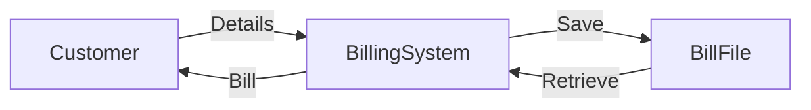

# 🧾 Billing System – Python Tkinter Desktop Application  


> A **GUI-based Billing Software** built using **Python & Tkinter** to generate, calculate, store, and retrieve retail bills for **Medical, Grocery, and Cold Drink items**.

---

<details>
<summary><h2>📑 Table of Contents</h2></summary>

1. 📌 Project Overview  
2. 🎯 Key Features  
3. 🏗️ System Architecture  
4. 🔁 Application Flow  
5. 📊 Data Flow Diagram (DFD)  
6. 🧩 Module Breakdown  
7. ⚙️ Installation & Setup  
8. 🖥️ How It Works (Execution Flow)  
9. 🧪 Example Bill Output  
10. 🌍 Real-World Use Cases  
11. ✅ Pros & ❌ Cons  
12. 🚀 Future Enhancements  
13. 🛠️ Tech Stack  
14. 📜 License  
15. 👨‍💻 Author  

</details>

---

<details>
<summary><h2>📌 Project Overview</h2></summary>

This **Billing System** is a **desktop-based retail billing application** designed for:

- 🏥 Medical Stores  
- 🛒 Grocery Shops  
- 🥤 Beverage Counters  

It allows shop owners to:
- Enter customer details
- Select product quantities
- Automatically calculate taxes
- Generate printable bills
- Save & search bills locally

💡 Built entirely using **Python Tkinter**, making it lightweight and beginner-friendly.

</details>

---

<details>
<summary><h2>🎯 Key Features</h2></summary>

- 🧾 Automatic Bill Generation  
- 🧮 Real-time Price & Tax Calculation  
- 💾 Bill Save & Retrieve (File-based)  
- 🔍 Search Bill by Bill Number  
- 🖥️ User-Friendly GUI  
- 🧑 Customer Details Management  
- 📂 Category-wise Product Billing  
- 🔐 Error Handling & Validations  

</details>

---

<details>
<summary><h2>🏗️ System Architecture</h2></summary>

```mermaid
graph TD
    User -->|Input| GUI[Tkinter GUI]
    GUI --> Logic[Billing Logic]
    Logic --> Tax[Tax Calculator]
    Logic --> Bill[Bill Generator]
    Bill --> File[Text File Storage]
    File --> GUI
````

**Architecture Type:**
🧱 Monolithic Desktop Application

</details>

---

<details>
<summary><h2>🔁 Application Flow</h2></summary>

```mermaid
flowchart TD
    Start --> EnterCustomer
    EnterCustomer --> SelectItems
    SelectItems --> CalculateTotal
    CalculateTotal --> GenerateBill
    GenerateBill --> SaveBill
    SaveBill --> End
```

</details>

---

<details>
<summary><h2>📊 Data Flow Diagram (DFD)</h2></summary>



</details>

---

<details>
<summary><h2>🧩 Module Breakdown</h2></summary>

### 🔹 GUI Module

* Built using **Tkinter**
* Handles user interaction

### 🔹 Billing Logic

* Calculates:

  * Medical Price (5% tax)
  * Grocery Price
  * Cold Drinks Price (10% tax)

### 🔹 File Management

* Stores bills as `.txt` files
* Retrieves bills via bill number

### 🔹 Validation Module

* Ensures:

  * Customer details are entered
  * At least one product is selected

</details>

---

<details>
<summary><h2>⚙️ Installation & Setup</h2></summary>

```bash
git clone https://github.com/alok-kumar8765/Cool_Project_2.git
cd Cool_Project_2/Billing_system
python billing.py
```

📁 **Important:**
Create a folder named `bills/` in the project directory to store generated bills.

</details>

---

<details>
<summary><h2>🖥️ How It Works (Execution Flow)</h2></summary>

1. Launch application
2. Enter customer details
3. Select item quantities
4. Click **Total** to calculate
5. Click **Generate Bill**
6. Save bill locally
7. Search bills anytime

</details>

---

<details>
<summary><h2>🧪 Example Bill Output</h2></summary>

```
Welcome Webcode Retail
Bill No: 1234
Customer: Rahul
Phone: 98XXXXXX

Products      QTY     Price
Sanitizer     2       4
Rice          5       50
Coke          3       30

Medical Tax: Rs.5
Total Bill: Rs.89
```


</details>

---

<details>
<summary><h2>🌍 Real-World Use Cases</h2></summary>

### 🏪 Small Retail Shops

Generate daily bills quickly without internet.

### 🏥 Medical Stores

Apply category-wise tax automatically.

### 🧑‍💻 Learning Projects

Perfect for:

* Python beginners
* Tkinter GUI practice
* File handling concepts

</details>

---

<details>
<summary><h2>✅ Pros & ❌ Cons</h2></summary>

### ✅ Pros

* Simple & Lightweight
* No Database Required
* Easy to Understand
* Beginner Friendly

### ❌ Cons

* No Database (Text file only)
* Desktop-only (No Web/Mobile)
* Single-User System

</details>

---

<details>
<summary><h2>🚀 Future Enhancements</h2></summary>

* 🗄️ Database Integration (SQLite/MySQL)
* 🖨️ Print Bill Feature
* 📊 Sales Analytics Dashboard
* 🔐 Login & Authentication
* 🌐 Web Version (Django/Flask)

</details>

---

<details>
<summary><h2>🛠️ Tech Stack</h2></summary>

* **Language:** Python
* **GUI:** Tkinter
* **Storage:** Text Files
* **OS:** Cross-Platform

</details>

---

<details>
<summary><h2>📜 License</h2></summary>

This project is licensed under the **MIT License** – free to use, modify, and distribute.

</details>

---

<details>
<summary><h2>👨‍💻 Author</h2></summary>

**Alok Kumar**
🔗 GitHub: [https://github.com/alok-kumar8765](https://github.com/alok-kumar8765)

If you like this project ⭐ the repository!

</details>

---
