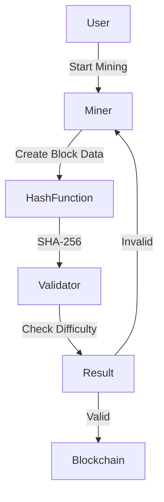
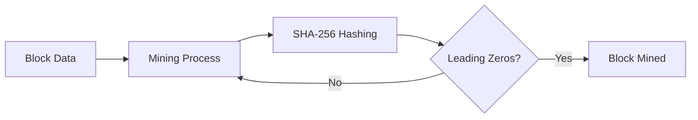
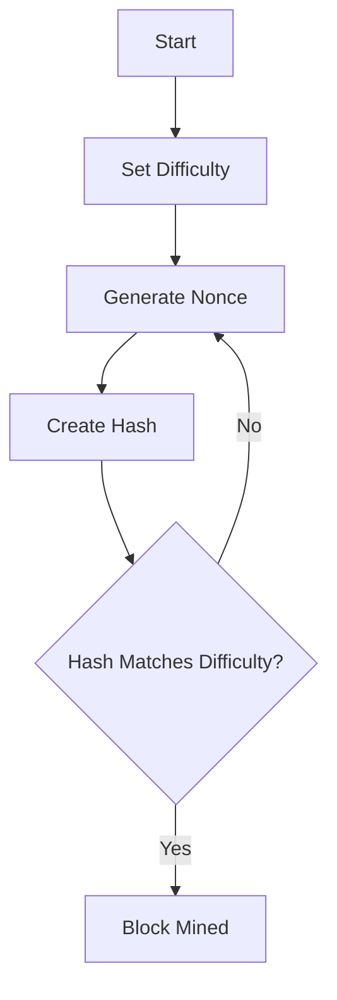

# ⛏️ Bitcoin Mining Simulation (Python)

<p align="center">
  
  
  
  
  
</p>

---

## 📌 Project Title
**Bitcoin Mining Simulation using SHA-256 (Proof-of-Work)**

---

## 📖 Project Description
This project is a **simplified Bitcoin mining simulation** written in **Python**, demonstrating the **core concept of Proof-of-Work (PoW)** used in blockchain systems.

It mimics how miners:
- Combine block data
- Try multiple nonce values
- Generate SHA-256 hashes
- Meet difficulty constraints (leading zeros)
- Successfully mine a block

This repository is ideal for **learning blockchain fundamentals**, **cryptographic hashing**, and **mining difficulty mechanics**.

---

<details>
<summary>📑 Table of Contents</summary>

1. Overview  
2. Features  
3. How Bitcoin Mining Works  
4. Code Explanation  
5. Architecture Diagram  
6. Data Flow Diagram (DFD)  
7. Mining Flow Diagram  
8. Mermaid Diagrams  
9. Pros & Cons  
10. Real-World Use Cases  
11. Example Scenario  
12. Limitations  
13. How to Run  
14. SEO Keywords  

</details>

---

<details>
<summary>🚀 Features</summary>

- ✔ SHA-256 Cryptographic Hashing  
- ✔ Proof-of-Work Mining Logic  
- ✔ Adjustable Mining Difficulty  
- ✔ Nonce-Based Hash Searching  
- ✔ Time Measurement for Mining  
- ✔ Beginner-Friendly & Educational  

</details>

---

<details>
<summary>⚙️ How Bitcoin Mining Works (Concept)</summary>

Bitcoin mining is the process of:
- Validating transactions
- Creating a cryptographic hash
- Finding a nonce such that the hash starts with **N leading zeros**
- Adding the block to the blockchain

This project simulates that exact behavior.

</details>

---

<details>
<summary>🧠 Code Explanation</summary>

### 🔹 SHA256 Hash Function
```python
def SHA256(text):
    return sha256(text.encode("ascii")).hexdigest()
```

- Converts input text into a 64-character hexadecimal hash

- Uses SHA-256, the same algorithm used by Bitcoin


---

## 🔹 Mining Function

- def mine(block_number, transactions, previous_hash, prefix_zeros):

Combines:

- Block number

- Transactions

- Previous block hash

- Nonce


- Tries up to 100 billion nonce values

- Stops when hash meets difficulty criteria


---

## 🔹 Difficulty Control

- difficulty = 4

- Higher difficulty = more leading zeros required

- Directly increases mining time


---

## 🔹 Output

- Prints:

- Successful nonce

- Mining time

- Final hash


</details>

---

<details>
<summary>🏗️ Architecture Diagram</summary>



</details>

---

<details>
<summary>📊 Data Flow Diagram (DFD)</summary>



</details>

---

<details>
<summary>🔁 Mining Flow Diagram</summary>



</details>

---

<details>
<summary>✅ Pros & ❌ Cons</summary>

## ✅ Pros

- Easy to understand blockchain mining

- Demonstrates real Bitcoin logic

- Adjustable difficulty

- Clean & readable code


## ❌ Cons

- CPU-only (no GPU/ASIC)

- Not suitable for real mining

- No transaction validation

- Single-node simulation


</details>

---

<details>
<summary>🌍 Real-World Use Cases</summary>

- 🎓 Blockchain Education & Training

- 🧪 Cryptography Demonstrations

- 📚 Academic Projects

- 🧠 Proof-of-Work Research

- 🛠️ Blockchain Interview Preparation


</details>

---

<details>
<summary>📌 Example Use Case</summary>

> A student wants to understand how Bitcoin miners compete to solve cryptographic puzzles.
This project allows them to:


- Change difficulty

- Observe mining time

- Understand nonce iteration

- Visualize Proof-of-Work


</details>

---

<details>
<summary>⚠️ Limitations</summary>

- Not decentralized

- No peer-to-peer network

- No real transaction verification

- Educational only


</details>

---

<details>
<summary>▶️ How to Run</summary>

```python 
git clone https://github.com/alok-kumar8765/Cool_Project_2.git
cd Bitcoin Mining
python mining.py
```

> Modify difficulty to observe mining performance changes.


</details>


---

<details>
<summary>🔍 SEO Keywords</summary>

- Bitcoin Mining Python

- Proof of Work Simulation

- SHA256 Hashing Python

- Blockchain Mining Example

- Bitcoin Algorithm Explained

- Cryptography Python Project

- Mining Nonce Simulation


</details>

---

👨‍💻 Author

Alok Kumar Kaushal

🔗 GitHub: alok-kumar8765


---

## ⭐ Support

If you found this project helpful:

- ⭐ Star the repository

- 🍴 Fork it

- 🧠 Learn Blockchain deeply


---

> Disclaimer: This project is for educational purposes only and does not mine real Bitcoins.


---

