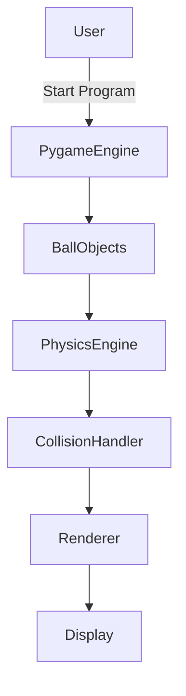
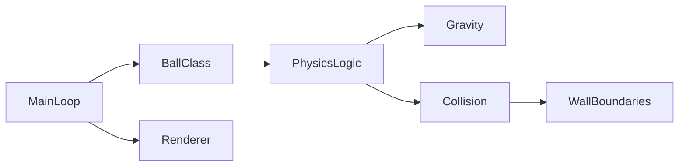
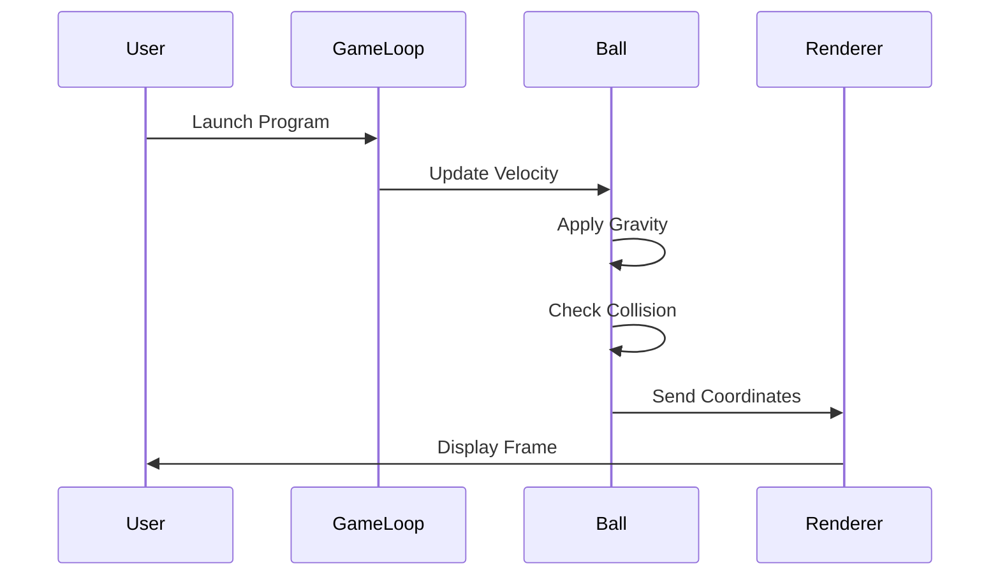

# 🟢 Bouncing Ball Simulator using Pygame  
### Physics-Based Gravity & Elastic Collision Simulation  


---

## 📌 Project Overview
<details open>
<summary><strong>Click to Expand</strong></summary>

**Bouncing Ball Simulator** is a visually engaging **2D physics simulation** built using **Python & Pygame**.  
It demonstrates **gravitational acceleration**, **elastic collision**, and **real-time rendering** by simulating **five balls bouncing inside a container**.

This project is ideal for:
- Learning **game physics fundamentals**
- Understanding **object-oriented programming**
- Visualizing **gravity and motion**
- Practicing **Pygame-based simulations**

</details>

---

## 📑 Table of Contents
<details open>
<summary><strong>Index</strong></summary>

1. Project Description  
2. Features  
3. Technology Stack  
4. Folder Structure  
5. How It Works  
6. Data Flow Diagram (DFD)  
7. System Architecture  
8. Execution Flow Diagram  
9. Real-World Use Cases  
10. Advantages & Limitations  
11. Installation & Run  
12. Future Enhancements  
13. Author  

</details>

---

## ✨ Features
<details>
<summary><strong>Key Highlights</strong></summary>

- 🎯 Gravity-based vertical acceleration
- 🧱 Elastic collision with container walls
- 🔄 Real-time animation loop
- 🎲 Randomized initial positions
- 🧠 Object-oriented design
- 🎨 Background & sprite rendering
- ⏱️ Smooth frame control

</details>

---

## 🛠️ Technology Stack
<details>
<summary><strong>Tools & Libraries</strong></summary>

- **Language:** Python 3.8+
- **Graphics Engine:** Pygame
- **Concepts Used:**
  - Physics Simulation
  - OOP (Classes & Objects)
  - Game Loop Architecture
  - Collision Detection

</details>

---

## 📁 Folder Structure
<details>
<summary><strong>Project Layout</strong></summary>

```text
Bouncing_ball_simulator/
│
├── ball.png
├── background-img.jpg
├── main.py
└── README.md
```
</details>

---

## ⚙️ How It Works
<details>
<summary><strong>Core Logic Explanation</strong></summary>

1. Initialize Pygame and create an 800×600 window
2. Load background and ball sprite
3. Create **5 Ball objects**
4. Apply gravity (`velocityY += g`)
5. Update position using velocity
6. Detect wall collisions and reverse velocity
7. Render objects every frame

</details>

---

## 📊 Data Flow Diagram (DFD)
<details>
<summary><strong>DFD – Level 0</strong></summary>


</details>

---

🏗️ System Architecture

<details>
<summary><strong>Architecture Diagram</strong></summary>



</details>


---

## 🔁 Execution Flow Diagram

<details>
<summary><strong>Program Flow</strong></summary>



</details>


---

## 🌍 Real-World Use Cases

<details>
<summary><strong>Practical Applications</strong></summary>

- 🎮 Game development physics engines

- 📚 Physics education (gravity & motion)

- 🧪 Simulation modeling

- 🧠 AI reinforcement learning environments

- 🏀 Sports trajectory analysis (conceptual)


Example:
Used in a game prototype to simulate falling objects under gravity with realistic bounce behavior.

</details>

---

## ✅ Pros & ❌ Cons

<details>
<summary><strong>Advantages & Limitations</strong></summary>

## ✅ Pros

- Simple & easy to understand

- Real-time visual feedback

- Beginner-friendly physics logic

- Extendable architecture


## ❌ Cons

- No inter-ball collision

- Fixed gravity constant

- No FPS optimization

- No user interaction


</details>

---

## ▶️ Installation & Run

<details>
<summary><strong>Steps to Execute</strong></summary>

```bash
git clone https://github.com/alok-kumar8765/Cool_Project_2.git
cd Cool_Project_2/Bouncing_ball_simulator
pip install pygame
python main.py
```

</details>


---

## 🚀 Future Enhancements

<details>
<summary><strong>Planned Improvements</strong></summary>

- 🔥 Inter-ball collision detection

- 🎮 User-controlled gravity

- 📊 FPS counter & performance stats

- 🧲 Air resistance & friction

- 🧠 Physics engine abstraction


</details>

---

## 👨‍💻 Author

<details open>
<summary><strong>Developer Info</strong></summary>


Alok Kumar
🔗 GitHub: alok-kumar8765
💡 Passionate about Python, Game Physics & Simulations

</details>


---

⭐ If you find this project useful, consider starring the repository!

---

