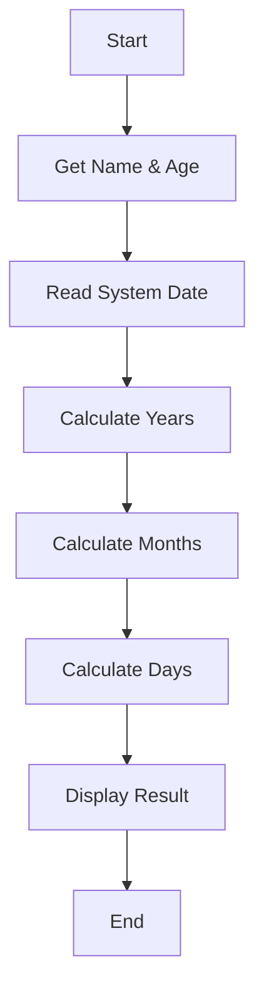

# 🧮 Calculate Age – Python Age Calculator  
> A lightweight, accurate Python utility to calculate age in **years, months, and days** using system time and leap-year logic.

<p align="center">
  
  
  
  
</p>

<p align="center">
  🔗 <strong>Repository:</strong> https://github.com/alok-kumar8765/Cool_Project_2  
  <br/>
  📂 <strong>Module Path:</strong> <code>Calculate_age</code>
</p>

---

<details>
<summary><h2>📌 Project Overview</h2></summary>

### 📖 Description
**Calculate Age** is a Python-based utility that computes a user's age in:
- **Years**
- **Months**
- **Days**

The program dynamically fetches the current system date and accurately calculates elapsed time using **calendar-aware leap year logic**.

### 🎯 Key Highlights
- Accurate leap year handling
- Uses Python standard libraries only
- Beginner-friendly & interview-ready logic
- Fast execution with low memory footprint

</details>

---

<details>
<summary><h2>📚 Table of Contents</h2></summary>

1. Project Overview  
2. Features  
3. Technology Stack  
4. Code Explanation  
5. Data Flow Diagram (DFD)  
6. System Architecture  
7. Program Flow Diagram  
8. Real-World Use Cases  
9. Pros & Cons  
10. SEO Keywords  
11. How to Run  
12. Future Enhancements  

</details>

---

<details>
<summary><h2>✨ Features</h2></summary>

- ✅ Calculates age in **years, months, and days**
- ✅ Leap year aware (Gregorian calendar)
- ✅ Uses real-time system clock
- ✅ Modular helper functions
- ✅ No external dependencies
- ✅ Beginner + Production ready logic

</details>

---

<details>
<summary><h2>🛠 Technology Stack</h2></summary>

- **Language:** Python 3.x  
- **Libraries Used:**
  - `time` – system date & time
  - `calendar` – leap year detection
- **Execution Type:** CLI (Command Line Interface)

</details>

---

<details>
<summary><h2>🧠 Code Explanation</h2></summary>

### 🔹 `judge_leap_year(year)`
- Determines whether a given year is a leap year.
- Uses Python’s built-in `calendar.isleap()`.

### 🔹 `month_days(month, leap_year)`
- Returns the correct number of days for a given month.
- Handles February differently for leap years.

### 🔹 Core Logic
- Takes user input (`name`, `age`)
- Fetches current date from system
- Converts years into months
- Iteratively calculates total days lived
- Outputs age in **3 different units**

</details>

---

<details>
<summary><h2>📊 Data Flow Diagram (DFD)</h2></summary>

```mermaid
graph TD
A[User Input: Name & Age] --> B[System Time Fetch]
B --> C[Leap Year Validation]
C --> D[Year-wise Day Calculation]
D --> E[Month-wise Day Calculation]
E --> F[Total Days Computed]
F --> G[Formatted Output Display]
````

</details>

---

<details>
<summary><h2>🏗 System Architecture</h2></summary>

```mermaid
graph LR
UI[User CLI Input] --> Logic[Age Calculation Engine]
Logic --> Calendar[Leap Year & Month Logic]
Calendar --> Output[Years / Months / Days]
```

</details>

---

<details>
<summary><h2>🔄 Program Flow Diagram</h2></summary>



</details>

---

<details>
<summary><h2>🌍 Real-World Use Cases</h2></summary>

### 🏥 Healthcare Systems

* Patient age verification
* Medical eligibility checks

### 🏫 Education Platforms

* Student age validation
* Exam eligibility systems

### 🏦 Banking & KYC

* Age-based account creation
* Compliance checks

### 🧑‍💻 Example

> A hospital system automatically calculates a patient’s exact age (in days) to determine pediatric dosage eligibility.

</details>

---

<details>
<summary><h2>⚖ Pros & Cons</h2></summary>

### ✅ Pros

* Accurate leap year handling
* Clean & readable logic
* Zero dependencies
* Fast execution
* Ideal for learning & interviews

### ❌ Cons

* CLI based (no GUI)
* Assumes age input in years only
* No exception handling for invalid input

</details>

---

<details>
<summary><h2>🚀 How to Run</h2></summary>

```bash
python calculate_age.py
```

**Input:**

```text
input your name: Alok
input your age: 25
```

**Output:**

```text
Alok's age is 25 years or 300 months or 9125 days
```

</details>

---

<details>
<summary><h2>🔮 Future Enhancements</h2></summary>

* 🔹 Accept full DOB instead of age
* 🔹 Add GUI (Tkinter / Web)
* 🔹 Input validation & error handling
* 🔹 REST API version
* 🔹 Timezone support

</details>

---

<details>
<summary><h2>🔍 SEO Keywords</h2></summary>

* Python Age Calculator
* Calculate Age in Python
* Leap Year Python Program
* Age Calculation Script
* Python Date & Time Project
* Beginner Python Projects
* CLI Python Utility

</details>

---

<p align="center">
  ⭐ If you found this useful, consider starring the repo  
  <br/>
  👨‍💻 Author: <strong>Alok Kumar</strong>
</p>


---
