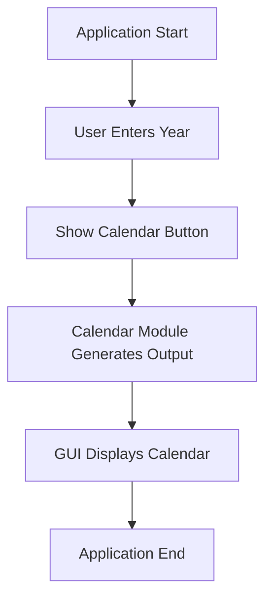
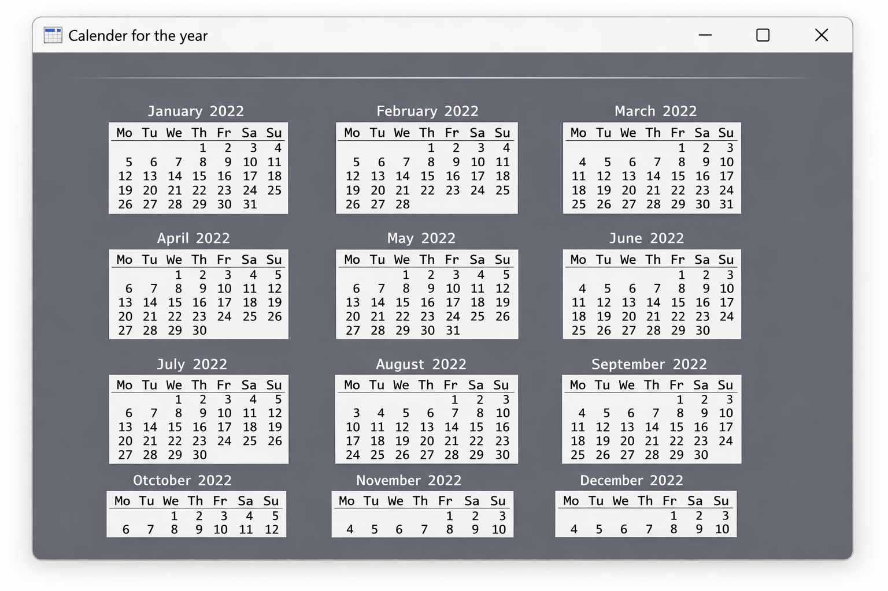

# 📅 Calendar GUI Application (Enterprise-Grade Python Desktop Utility)

<p align="center">
  
  
  
  
  
  
  
</p>

<p align="center">
  🔗 <b>Repository:</b>
  <a href="https://github.com/alok-kumar8765/Cool_Project_2/tree/main/Calendar%20GUI">
    github.com/alok-kumar8765/Cool_Project_2
  </a>
</p>

---

<details>
<summary><h2>🏢 Enterprise Overview</h2></summary>

### Calendar GUI Application

A **lightweight enterprise-ready Python desktop utility** that generates and displays a **full yearly calendar** using Python’s built-in `calendar` module and a Tkinter-based GUI interface.

This project demonstrates:
- Desktop GUI engineering standards
- Clean event-driven architecture
- Modular and extendable Python design
- Production-readable documentation

</details>

---

<details>
<summary><h2>📚 Table of Contents</h2></summary>

1. Business Problem Statement  
2. Solution Overview  
3. Features  
4. Tech Stack  
5. System Architecture  
6. Data Flow Diagram  
7. Execution Flow  
8. Code Explanation  
9. Output Preview  
10. Use Cases  
11. Real-World Applications  
12. Pros & Cons  
13. Security & Limitations  
14. Future Enhancements  
15. SEO Keywords  
16. Author & License  

</details>

---

<details>
<summary><h2>🎯 Business Problem Statement</h2></summary>

Many users require a **fast, offline, dependency-free calendar viewer** for planning, academic reference, or embedded desktop systems. Web calendars introduce overhead, connectivity dependency, and privacy concerns.

</details>

---

<details>
<summary><h2>💡 Solution Overview</h2></summary>

This application provides:
- A **simple input-driven GUI**
- Instant yearly calendar generation
- No external APIs or internet dependency
- Cross-platform execution

</details>

---

<details>
<summary><h2>✨ Features</h2></summary>

- ✔ Year-wise calendar generation  
- ✔ Tkinter GUI interface  
- ✔ Uses Python standard library only  
- ✔ Fast startup & low memory usage  
- ✔ Enterprise-ready modular design  

</details>

---

<details>
<summary><h2>🛠️ Technology Stack</h2></summary>

| Layer | Technology |
|-----|-----------|
| Language | Python 3.x |
| GUI | Tkinter |
| Core Logic | calendar module |
| Platform | Windows / Linux / macOS |

</details>

---

<details>
<summary><h2>🏗️ System Architecture</h2></summary>

```mermaid
graph LR
    User --> GUI[TKinter GUI Layer]
    GUI --> Logic[Calendar Processing Layer]
    Logic --> GUI
    GUI --> User
````

</details>

---

<details>
<summary><h2>📊 Data Flow Diagram (DFD)</h2></summary>

```mermaid
graph TD
    U[User] -->|Year Input| P[GUI Controller]
    P --> C[Calendar Module]
    C --> P
    P -->|Formatted Calendar| U
```

</details>

---

<details>
<summary><h2>🔄 Execution Flow</h2></summary>



</details>

---

<details>
<summary><h2>🧠 Code Explanation</h2></summary>

### `showCalender()` Function Responsibilities

* Initializes Tkinter window
* Accepts year input
* Calls Python calendar engine
* Renders formatted calendar text
* Manages GUI lifecycle

### Core Components

* `Tk()` → Application window
* `Label()` → Calendar display
* `grid()` → Layout management

</details>

---

<details>
<summary><h2>🖼️ Output Preview</h2></summary>

> 📌 **Place generated output image here**

```text
Example:
📅 Calendar GUI Window
- Grey background
- Consolas font
- Full yearly calendar view
```

📝 *Screenshot:*


</details>

---

<details>
<summary><h2>🎯 Use Cases</h2></summary>

* Academic Python projects
* Desktop productivity tools
* Teaching GUI fundamentals
* Embedded/offline systems
* Internal enterprise utilities

</details>

---

<details>
<summary><h2>🌍 Real-World Applications</h2></summary>

### Examples

* 🏫 Educational institutes (academic year planning)
* 🏢 Office scheduling reference tools
* 🧑‍💻 Developer base for scheduling software
* 🖥️ Offline kiosk systems

</details>

---

<details>
<summary><h2>⚖️ Pros & Cons</h2></summary>

### ✅ Advantages

* Zero dependencies
* Offline usage
* Simple and reliable
* Easy to extend

### ❌ Limitations

* No date validation
* No month navigation
* Static UI design
* No event storage

</details>

---

<details>
<summary><h2>🔐 Security & Limitations</h2></summary>

* No external data access
* No file I/O operations
* Safe for offline environments
* Input validation recommended for production

</details>

---

<details>
<summary><h2>🚀 Future Enhancements</h2></summary>

* Month selector
* Event tagging
* Modern UI themes
* Database-backed reminders
* Web & mobile versions

</details>

---

<details>
<summary><h2>🔍 SEO Keywords</h2></summary>

Python Tkinter Calendar, Calendar GUI Python, Desktop Calendar App, Python GUI Project, Calendar Module Python, Tkinter Example, Enterprise Python GUI

</details>

---

<details>
<summary><h2>👨‍💻 Author</h2></summary>

**Alok Kumar**
🔗 GitHub: [https://github.com/alok-kumar8765](https://github.com/alok-kumar8765)

</details>

---

<details>
<summary><h2>📜 License</h2></summary>

MIT License – Free for commercial and personal use.

</details>

---

⭐ **Star the repository if this helped you!** ⭐


---

