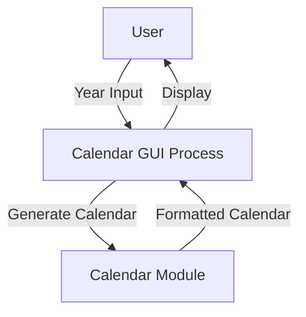

# 📅 Calendar GUI Application (Python Tkinter)

<p align="center">
  
  
  
  
  
</p>

<p align="center">
  🔗 <b>GitHub Repository:</b>  
  <a href="https://github.com/alok-kumar8765/Cool_Project_2">alok-kumar8765/Cool_Project_2</a>
</p>

---

<details>
<summary><h2>📌 Project Title</h2></summary>

### **Calendar GUI Application using Python & Tkinter**

A lightweight desktop GUI application that displays the **complete calendar of any given year** using Python’s built-in `calendar` module and `Tkinter` for the graphical interface.

</details>

---

<details>
<summary><h2>📝 Description</h2></summary>

This project provides a **simple, interactive, and beginner-friendly GUI calendar system**.  
Users enter a year, and the application dynamically generates and displays the **full yearly calendar** in a well-formatted GUI window.

**Key Focus Areas**
- GUI development with Tkinter  
- Event-driven programming  
- Python standard library usage  
- Desktop utility application  

</details>

---

<details>
<summary><h2>📚 Table of Contents</h2></summary>

1. Project Overview  
2. Features  
3. Technology Stack  
4. Code Explanation  
5. Application Flow  
6. Architecture Diagram  
7. Data Flow Diagram (DFD)  
8. Flow Diagram  
9. Use Cases  
10. Real-World Applications  
11. Pros & Cons  
12. SEO Keywords  
13. Future Enhancements  

</details>

---

<details>
<summary><h2>🚀 Features</h2></summary>

- ✅ User-friendly GUI interface  
- ✅ Dynamic calendar generation  
- ✅ Supports any valid year  
- ✅ Lightweight & fast execution  
- ✅ No external dependencies  
- ✅ Beginner-friendly Python project  

</details>

---

<details>
<summary><h2>🛠️ Technology Stack</h2></summary>

- **Language:** Python 3.x  
- **GUI Framework:** Tkinter  
- **Core Module:** calendar  
- **Platform:** Windows / Linux / macOS  

</details>

---

<details>
<summary><h2>🧩 Code Explanation</h2></summary>

### 🔹 Tkinter Module
Used to create the graphical interface window, labels, and layout.

### 🔹 Calendar Module
Python’s built-in module that generates formatted calendars.

### 🔹 `showCalender()` Function
- Initializes GUI window  
- Reads year input  
- Generates yearly calendar  
- Displays it inside a label widget  

### 🔹 GUI Components
- `Tk()` → Main window  
- `Label()` → Displays calendar  
- `grid()` → Layout management  

</details>

---

<details>
<summary><h2>🔄 Application Flow</h2></summary>

```mermaid
flowchart TD
    A[Start Application] --> B[User Enters Year]
    B --> C[Click Show Calendar]
    C --> D[Calendar Module Processes Year]
    D --> E[Calendar Displayed in GUI]
    E --> F[End]
````

</details>

---

<details>
<summary><h2>🏗️ Architecture Diagram</h2></summary>

```mermaid
graph LR
    User -->|Input Year| GUI[TKinter GUI]
    GUI --> CalendarModule[Python Calendar Module]
    CalendarModule --> GUI
    GUI -->|Display Output| User
```

</details>

---

<details>
<summary><h2>📊 Data Flow Diagram (DFD)</h2></summary>



</details>

---

<details>
<summary><h2>🎯 Use Cases</h2></summary>

* 📌 Students learning Python GUI
* 📌 Desktop utility tools
* 📌 Academic mini-projects
* 📌 Teaching event-driven programming
* 📌 Calendar visualization software

</details>

---

<details>
<summary><h2>🌍 Real-World Applications</h2></summary>

### Example Scenarios:

* 🏫 **Schools & Colleges:** Display academic year calendars
* 🏢 **Offices:** Quick reference for yearly planning
* 🧑‍💻 **Developers:** Base project for scheduling apps
* 📆 **Personal Use:** Offline yearly calendar viewer

</details>

---

<details>
<summary><h2>⚖️ Pros & Cons</h2></summary>

### ✅ Pros

* Simple & clean GUI
* No external libraries
* Easy to extend
* Fast execution

### ❌ Cons

* No input validation
* Static calendar display
* No month-wise navigation
* Limited styling options

</details>

---

<details>
<summary><h2>🔮 Future Enhancements</h2></summary>

* 📅 Month-wise calendar view
* 🎨 Improved UI styling
* 📆 Date highlighting
* 📝 Event reminders
* 🌐 Web-based version (Django / Flask)

</details>

---

<details>
<summary><h2>🔍 SEO Keywords</h2></summary>

Python Calendar GUI, Tkinter Calendar App, Python GUI Project, Desktop Calendar Application, Python Tkinter Example, Calendar Module Python, Beginner Python Project, GUI Programming Python

</details>

---

<details>
<summary><h2>👨‍💻 Author</h2></summary>

**Alok Kumar**
🔗 GitHub: [alok-kumar8765](https://github.com/alok-kumar8765)

</details>

---

<details>
<summary><h2>📜 License</h2></summary>

This project is licensed under the **MIT License** – free to use, modify, and distribute.

</details>

---

⭐ **If you like this project, don’t forget to give it a star on GitHub!** ⭐


---
