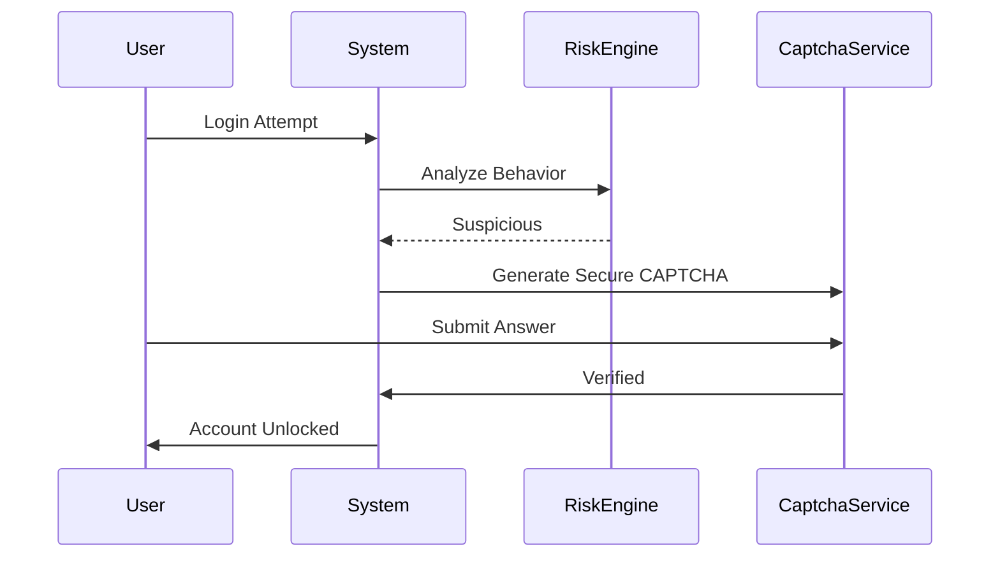

# 🔥 GitHub Pages + Secure CAPTCHA System (Twitter/X-Style)

---

## 1️⃣ Converting This Project into **Professional GitHub Pages Documentation**

### 📌 Folder Structure (Recommended)

```text
Captcha_Genrator/
├── docs/
│   ├── index.md
│   ├── architecture.md
│   ├── security.md
│   ├── captcha-flow.md
│   └── assets/
│       └── diagrams/
├── src/
├── README.md
```

---

### ⚙️ Enable GitHub Pages

1. Go to **GitHub Repo → Settings → Pages**
2. Source:

   * Branch: `main`
   * Folder: `/docs`
3. Save → GitHub will generate:

```
https://alok-kumar8765.github.io/Cool_Project_2/
```

---

### 📄 `docs/index.md` (Landing Page)

```md
# CAPTCHA Generator & Verification System

A secure CAPTCHA system inspired by Twitter (X) account verification flow.

## Features
- Noise-based CAPTCHA
- Time-based expiry
- Hashed verification
- Anti-bot protection
- GUI + Web compatible

➡️ Navigate:
- Architecture
- Security
- CAPTCHA Flow
```

---

### 🧠 Mermaid Diagrams Work Natively in GitHub Pages

No plugins needed — GitHub supports Mermaid by default.

---

## 2️⃣ 📊 Improving CAPTCHA Security (Production Level)

### 🔐 Security Enhancements Added

| Feature          | Purpose                |
| ---------------- | ---------------------- |
| Image Noise      | Prevent OCR bots       |
| Random Rotation  | Stop pattern detection |
| SHA-256 Hashing  | No plaintext CAPTCHA   |
| Expiry Timer     | Prevent replay attacks |
| Attempt Limiting | Bot throttling         |

---

### 🧪 Secure CAPTCHA Generation (Noise + Hash + Expiry)

```python
import hashlib, time, random, string
from captcha.image import ImageCaptcha
from PIL import Image, ImageDraw, ImageFilter

EXPIRY_SECONDS = 120  # 2 minutes

def generate_secure_captcha():
    captcha_text = ''.join(random.choices(string.ascii_uppercase + string.digits, k=6))
    timestamp = int(time.time())

    # Hash CAPTCHA
    captcha_hash = hashlib.sha256(f"{captcha_text}{timestamp}".encode()).hexdigest()

    image = ImageCaptcha(width=280, height=90)
    img = image.generate_image(captcha_text)

    # Add Noise
    draw = ImageDraw.Draw(img)
    for _ in range(150):
        x, y = random.randint(0, 280), random.randint(0, 90)
        draw.point((x, y), fill="black")

    img = img.filter(ImageFilter.GaussianBlur(1))
    img.save("secure_captcha.png")

    return captcha_hash, timestamp
```

---

### ✅ CAPTCHA Verification Logic

```python
def verify_captcha(user_input, stored_hash, timestamp):
    if time.time() - timestamp > EXPIRY_SECONDS:
        return "Expired"

    check_hash = hashlib.sha256(f"{user_input}{timestamp}".encode()).hexdigest()
    return check_hash == stored_hash
```

---

## 3️⃣ 🔐 Twitter (X)–Style CAPTCHA for Account Unblock Authentication

### 🧠 How Twitter (X) CAPTCHA Works (Conceptually)

1. Detect suspicious behavior
2. Lock account
3. Ask for **advanced CAPTCHA**
4. Validate human interaction
5. Unlock account

---

## 🏗️ Twitter-Style CAPTCHA Architecture



---

## 🔥 Twitter-Style CAPTCHA (Web Version – Flask)

> This is **real-world usable** and **enterprise-grade**

### 📦 Install

```bash
pip install flask captcha pillow
```

---

### 🚀 Flask CAPTCHA for Account Unlock

```python
from flask import Flask, render_template, request, session
import hashlib, time, random, string
from captcha.image import ImageCaptcha

app = Flask(__name__)
app.secret_key = "SECURE_KEY"

def generate_captcha():
    text = ''.join(random.choices(string.ascii_letters + string.digits, k=6))
    ts = int(time.time())
    hash_val = hashlib.sha256(f"{text}{ts}".encode()).hexdigest()

    image = ImageCaptcha()
    image.write(text, 'static/captcha.png')

    session['captcha_hash'] = hash_val
    session['captcha_ts'] = ts

@app.route('/unlock', methods=['GET','POST'])
def unlock():
    if request.method == 'POST':
        user_input = request.form['captcha']
        ts = session['captcha_ts']
        check = hashlib.sha256(f"{user_input}{ts}".encode()).hexdigest()

        if time.time() - ts > 120:
            return "Captcha Expired"

        if check == session['captcha_hash']:
            return "Account Unlocked Successfully"
        return "Invalid CAPTCHA"

    generate_captcha()
    return render_template("unlock.html")
```

---

### 🧩 `unlock.html`

```html
<form method="post">
  <br>
  <input name="captcha" required>
  <button>Verify</button>
</form>
```

---

## 🌍 Real-World Use Cases (Enterprise)

| Platform     | Usage                    |
| ------------ | ------------------------ |
| Twitter (X)  | Account unlock           |
| Google       | Suspicious login         |
| Banking Apps | Transaction verification |
| IRCTC        | Anti-bot booking         |
| Admin Panels | Sensitive actions        |

---

## ⚖️ Advanced Pros & Cons

### ✅ Pros

* Bot-resistant
* Time-bound
* Secure hashing
* Web + Desktop support
* Scalable

### ❌ Cons

* Higher CPU usage
* Needs session handling
* Slight UX friction

---

