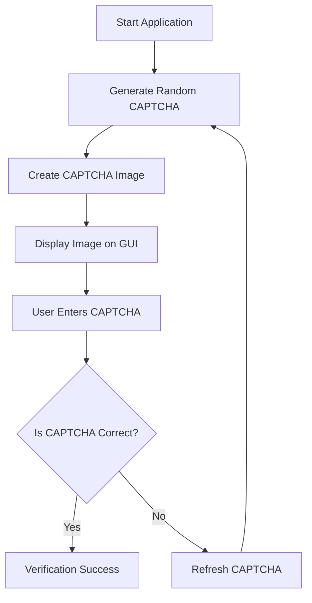
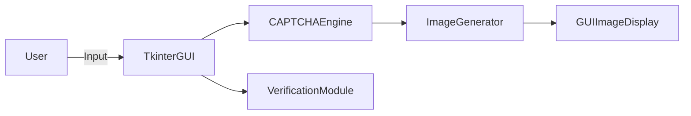
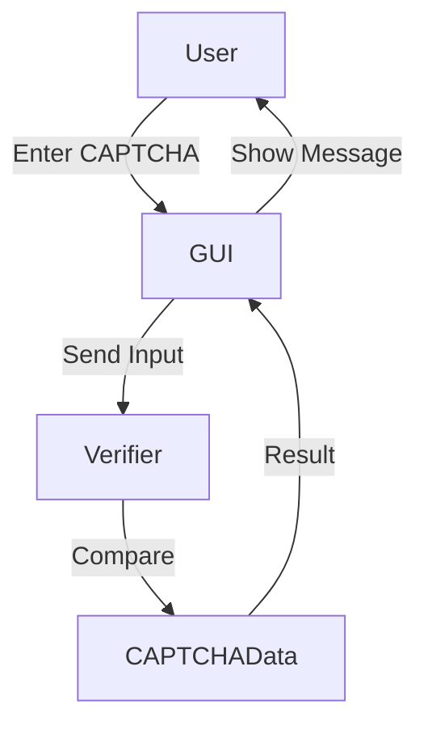

# 🔐 CAPTCHA Generator & Verifier (Python + Tkinter)

<p align="center">
  
  
  
  
  
  
</p>

---

## 📌 Project Title
**CAPTCHA Generator & Verifier using Python (Tkinter GUI)**

---

## 📖 Project Description
This project implements a **secure CAPTCHA generation and verification system** using **Python**, **Tkinter GUI**, and the **captcha** library.  
It generates a **random 6-digit CAPTCHA image**, displays it in a GUI window, and verifies user input to prevent **bot-based automation attacks**.

This project is ideal for:
- Desktop security tools
- Educational cybersecurity projects
- CAPTCHA system learning
- GUI-based Python applications

📁 **Repository Path**  
➡️ `Cool_Project_2/Captcha_Genrator`

---

<details>
<summary><h2>📚 Table of Contents</h2></summary>

- 📌 Project Overview  
- 🛠️ Tech Stack  
- ⚙️ Installation & Setup  
- ▶️ How It Works  
- 🧠 Application Flow  
- 🏗️ Architecture Diagram  
- 🔁 Data Flow Diagram (DFD)  
- 🔄 Process Flow Diagram  
- 📂 Code Explanation  
- ✅ Features  
- 🌍 Real World Use Cases  
- 📌 Examples  
- ⚖️ Pros & Cons  
- 🔐 Security Notes  
- 🚀 Future Enhancements  
- 📜 License  

</details>

---

<details>
<summary><h2>🛠️ Tech Stack</h2></summary>

- **Language:** Python 3.x  
- **GUI Framework:** Tkinter  
- **CAPTCHA Engine:** captcha (ImageCaptcha)  
- **Libraries Used:**
  - `tkinter`
  - `random`
  - `string`
  - `captcha`
  - `io.BytesIO`

</details>

---

<details>
<summary><h2>⚙️ Installation & Setup</h2></summary>

### Step 1: Install CAPTCHA Library
```bash
pip install captcha
````

### Step 2: Download Fonts

Download `.ttf` fonts and update the path in the code:

```python
ImageCaptcha(fonts=[
  'C:/path/font1.ttf',
  'C:/path/font2.ttf'
])
```

### Step 3: Run the Application

```bash
python captcha_generator.py
```

</details>

---

<details>
<summary><h2>▶️ How It Works</h2></summary>

1. Generates a **random 6-digit number**
2. Converts the number into a **CAPTCHA image**
3. Displays the image using **Tkinter GUI**
4. Accepts user input
5. Verifies input against generated CAPTCHA
6. Refreshes CAPTCHA on failure

</details>

---

<details>
<summary><h2>🧠 Application Flow</h2></summary>



</details>

---

<details>
<summary><h2>🏗️ Architecture Diagram</h2></summary>



</details>

---

<details>
<summary><h2>🔁 Data Flow Diagram (DFD)</h2></summary>



</details>

---

<details>
<summary><h2>📂 Code Explanation</h2></summary>

### CAPTCHA Generation

* Uses `randint(100000, 999999)`
* Generates numeric CAPTCHA
* Stored globally for validation

### GUI Components

* `Label` → Display CAPTCHA image
* `Text` → Input field
* `Button` → Submit & Refresh

### Verification Logic

* Converts user input to integer
* Compares with generated CAPTCHA
* Shows alert using `messagebox`

</details>

---

<details>
<summary><h2>✅ Features</h2></summary>

* ✔️ Random CAPTCHA generation
* ✔️ GUI-based verification
* ✔️ Auto refresh on failure
* ✔️ Secure numeric CAPTCHA
* ✔️ Lightweight & fast
* ✔️ Beginner-friendly code

</details>

---

<details>
<summary><h2>🌍 Real World Use Cases</h2></summary>

### 🔐 Security Systems

Prevent brute-force attacks in login systems.

### 🏫 Educational Tools

Teach CAPTCHA and GUI programming.

### 🖥️ Desktop Applications

Add human verification before sensitive actions.

### 🧪 Cybersecurity Labs

Demonstrate bot prevention mechanisms.

</details>

---

<details>
<summary><h2>📌 Example Scenario</h2></summary>

**Scenario:**
A desktop admin tool requires human verification before executing sensitive commands.

**Solution:**
Embed this CAPTCHA system before allowing access.

✔️ Blocks automation
✔️ Ensures human interaction

</details>

---

<details>
<summary><h2>⚖️ Pros & Cons</h2></summary>

### ✅ Pros

* Simple & lightweight
* Easy integration
* GUI-based
* Beginner friendly
* Offline compatible

### ❌ Cons

* Numeric CAPTCHA only
* No distortion/noise
* Desktop-only (not web-based)
* Limited brute-force protection

</details>

---

<details>
<summary><h2>🔐 Security Notes</h2></summary>

* Use **time limits** for attempts
* Add **rate limiting**
* Introduce **image noise**
* Encrypt CAPTCHA state for advanced use

</details>

---

<details>
<summary><h2>🚀 Future Enhancements</h2></summary>

* 🔡 Alphanumeric CAPTCHA
* 🎨 Distortion & noise
* 🌐 Web version (Django/Flask)
* ⏱️ Expiry timer
* 📊 Attempt tracking
* 🔐 Hash-based validation

</details>

---

<details>
<summary><h2>📜 License</h2></summary>

This project is licensed under the **MIT License**.
Feel free to use, modify, and distribute.

© 2026 **Alok Kumar**
🔗 [https://github.com/alok-kumar8765](https://github.com/alok-kumar8765)

</details>

---

⭐ **If you like this project, don't forget to star the repo!**


---
