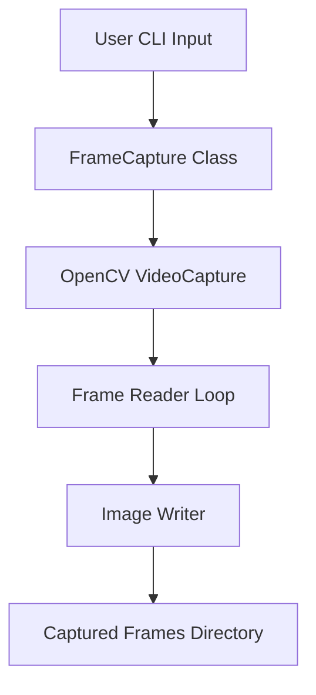
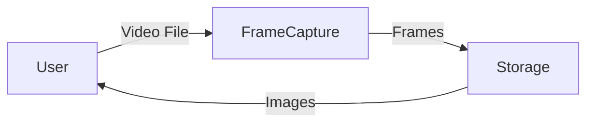
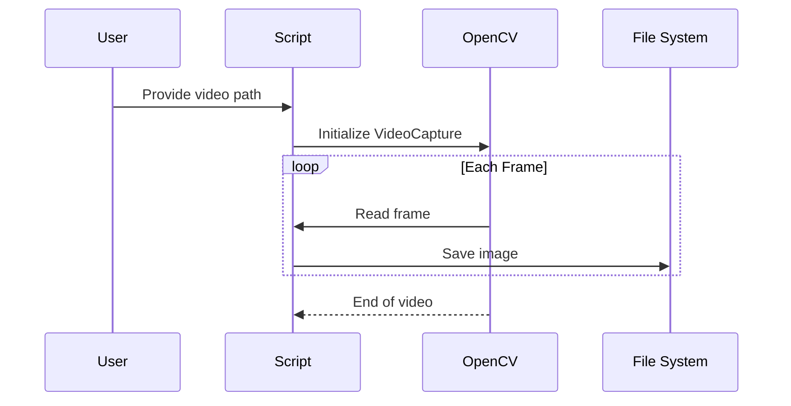

# 🎥 Capture Video Frames using Python & OpenCV  
<details open>
<summary><strong>Professional README Documentation</strong></summary>

---

## 🔖 Badges  


---

## 📌 Project Title  
**Capture Video Frames – Python OpenCV Utility**

---

## 📖 Description  
This project is a **lightweight, efficient Python utility** designed to **extract all frames from a video file** and store them as sequential image files using **OpenCV**.  

It is ideal for **computer vision preprocessing**, **AI/ML dataset generation**, **video analytics**, and **frame-level inspection**.

---

## 🚀 Key Features  
- 🎯 Frame-by-frame video extraction  
- 📂 Automatic directory management  
- ⚡ Fast & memory-efficient processing  
- 🧠 OpenCV powered  
- 🖥️ CLI-based execution  
- 🔄 Cross-platform support  

---

## 📑 Table of Contents  
<details>
<summary>Click to expand</summary>

1. Overview  
2. Tech Stack  
3. Installation  
4. How It Works  
5. Architecture Diagram  
6. Data Flow Diagram (DFD)  
7. Execution Flow Diagram  
8. Code Explanation  
9. Use Cases  
10. Real-World Examples  
11. Pros & Cons  
12. SEO Keywords  
13. Future Enhancements  

</details>

---

## 🧰 Tech Stack  
<details>
<summary>Expand</summary>

- **Language:** Python 3.x  
- **Library:** OpenCV (`cv2`)  
- **Modules:** os, shutil, sys  
- **Environment:** CLI / Local Machine  

</details>

---

## ⚙️ Installation  
<details>
<summary>Expand</summary>

```bash
pip install opencv-python
````

Clone repository:

```bash
git clone https://github.com/alok-kumar8765/Cool_Project_2.git
cd Cool_Project_2/Capture_Video_Frames
```

</details>

---

## ▶️ How to Run

<details>
<summary>Expand</summary>

```bash
python capture_frames.py sample_video.mp4
```

📂 Output:

```text
captured_frames/
 ├── frame0.jpg
 ├── frame1.jpg
 ├── frame2.jpg
 └── ...
```

</details>

---

## 🧠 How It Works

<details>
<summary>Expand</summary>

1. Accepts video file path as CLI argument
2. Initializes a clean output directory
3. Reads video frame-by-frame using OpenCV
4. Saves each frame as a `.jpg` image
5. Stops when video ends

</details>

---

## 🏗️ Architecture Diagram

<details>
<summary>Expand</summary>



</details>

---

## 📊 Data Flow Diagram (DFD – Level 0)

<details>
<summary>Expand</summary>



</details>

---

## 🔁 Execution Flow Diagram

<details>
<summary>Expand</summary>



</details>

---

## 🧩 Code Explanation

<details>
<summary>Expand</summary>

### `FrameCapture` Class

* Handles directory creation & cleanup
* Manages video frame extraction

### `__init__()`

* Deletes old output directory if exists
* Creates a fresh `captured_frames` folder

### `capture_frames()`

* Reads video frames using OpenCV
* Saves frames sequentially as JPEG images

### `__main__`

* Accepts CLI input
* Initializes class & starts extraction

</details>

---

## 🎯 Use Cases

<details>
<summary>Expand</summary>

* 📸 Dataset creation for AI/ML models
* 🧠 Face recognition preprocessing
* 🎥 Video analytics pipelines
* 🔍 Surveillance frame inspection
* 🧪 Computer vision experimentation

</details>

---

## 🌍 Real-World Examples

<details>
<summary>Expand</summary>

* **AI Training:** Extract frames from CCTV footage to train object detection models
* **Healthcare:** Analyze MRI or ultrasound videos frame-by-frame
* **Media Industry:** Video thumbnail generation
* **Security:** Motion analysis from surveillance videos

</details>

---

## ✅ Pros & ❌ Cons

<details>
<summary>Expand</summary>

### ✅ Pros

* Simple & easy to understand
* Fast execution
* Minimal dependencies
* Beginner-friendly
* Scalable for automation pipelines

### ❌ Cons

* No FPS control
* No frame skipping option
* No GUI
* No error handling for invalid files

</details>

---

## 🔮 Future Enhancements

<details>
<summary>Expand</summary>

* ⏱️ Frame rate control
* 🖼️ Image format selection
* 📦 Batch video processing
* 🧠 Frame filtering (blur, motion, face)
* 🖥️ GUI support
* ☁️ Cloud integration

</details>

---

## 🔍 SEO Keywords

<details>
<summary>Expand</summary>

Python OpenCV frame extraction, capture video frames Python, OpenCV video processing, frame extraction tool, computer vision preprocessing, Python video analytics, extract frames from video, AI dataset generator, OpenCV tutorial Python

</details>

---

## 👨‍💻 Author

**Alok Kumar**
🔗 GitHub: [https://github.com/alok-kumar8765](https://github.com/alok-kumar8765)

---

⭐ *If you find this project useful, consider giving it a star!*

</details>


---

