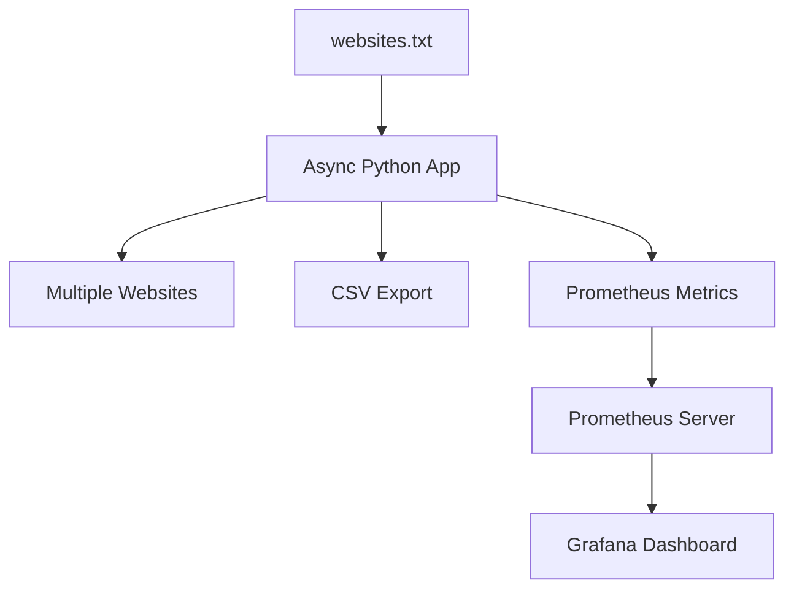

# 🚀 Advanced Website Connectivity Checker (Production Ready)


---

## 📦 1. Dockerized Version

## 🔹 Dockerfile

```
FROM python:3.11-slim

WORKDIR /app

COPY requirements.txt .
RUN pip install --no-cache-dir -r requirements.txt

COPY . .

CMD ["python", "main_async.py"]
```

## 🔹 requirements.txt

```
requests
aiohttp
prometheus-client
```

## 🔹 Build & Run

```
docker build -t website-checker .
docker run -v $(pwd):/app website-checker
```

- ✔ Portable
- ✔ CI/CD ready
- ✔ Works on any OS


---

## ⚡ 2. Async + Multithreaded Version (High Performance)

## 🔹 Async Website Checker (aiohttp)

```
import asyncio
import aiohttp
import csv
from prometheus_client import start_http_server, Counter

REQUEST_COUNT = Counter(
    'website_status_check_total',
    'Total website status checks',
    ['website', 'status']
)

async def check_website(session, website):
    try:
        async with session.get(website, timeout=5) as response:
            status = "working" if response.status == 200 else "not working"
    except Exception:
        status = "not working"

    REQUEST_COUNT.labels(website=website, status=status).inc()
    return website, status


async def main():
    with open("websites.txt") as f:
        websites = [line.strip() for line in f]

    async with aiohttp.ClientSession() as session:
        tasks = [check_website(session, site) for site in websites]
        results = await asyncio.gather(*tasks)

    with open("website_status.csv", "w", newline="") as fw:
        writer = csv.writer(fw)
        writer.writerow(["Website", "Status"])
        writer.writerows(results)


if __name__ == "__main__":
    start_http_server(8000)  # Prometheus metrics endpoint
    asyncio.run(main())
```

- ⚡ Why Async?

- 🚀 10x faster than sync

- 🧠 Non-blocking I/O

- 📈 Scales to thousands of URLs

- 💡 Ideal for DevOps & monitoring


---

## 📊 3. Prometheus + Grafana Monitoring


---

## 🔹 Prometheus Metrics Exposed

```
http://localhost:8000/metrics
```
Example metric:

> website_status_check_total{website="https://google.com",status="working"} 1


---

## 🔹 prometheus.yml

```
global:
  scrape_interval: 5s

scrape_configs:
  - job_name: "website_checker"
    static_configs:
      - targets: ["host.docker.internal:8000"]
```

---

## 🔹 Docker Compose (Monitoring Stack)

```
version: "3.8"

services:
  app:
    build: .
    ports:
      - "8000:8000"

  prometheus:
    image: prom/prometheus
    volumes:
      - ./prometheus.yml:/etc/prometheus/prometheus.yml
    ports:
      - "9090:9090"

  grafana:
    image: grafana/grafana
    ports:
      - "3000:3000"
```

Run:

```
docker-compose up
```

---

## 🔹 Grafana Dashboard

```
URL: http://localhost:3000
```

Default login:

```
admin / admin
```

Create Panel Query

```
sum by (status) (website_status_check_total)
```

- ✔ Live website uptime
- ✔ Failure trends
- ✔ SLA monitoring


---

## 🏗 Updated Architecture (Production)


---

## 🌍 Real-World Enterprise Use Cases

- 🏢 Company Infra Monitoring

- Monitor 500+ microservices

- Alert if any endpoint fails


## 🚀 DevOps CI/CD

- Pre-deployment health checks

- Auto rollback if site unreachable


## 🔐 Cybersecurity

- Detect DNS hijack / outage

- Verify SLA compliance


## 📈 SEO & Business

- Monitor landing pages uptime

- Prevent ranking loss due to downtime


---

## ✅ Pros (Advanced Version)

- Async + high performance

- Dockerized & cloud ready

- Observability with Grafana

- Scalable to thousands of URLs

- DevOps & SRE friendly


---

❌ Cons

- Requires Docker knowledge

- Grafana setup overhead

- Metrics storage cost at scale


---

## 🚀 Future Enhancements

- 🔔 Alertmanager (Slack / Email)

- 📦 Kubernetes Helm chart

- 🌐 REST API

- 🧠 AI-based downtime prediction

- ☁ AWS ECS / EKS deployment


---
n
