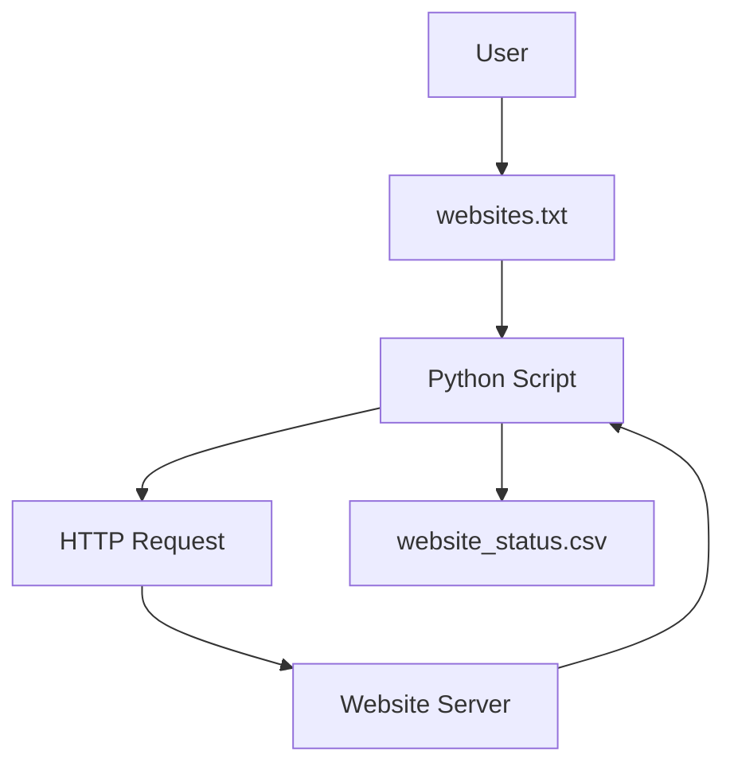

# 🌐 Website Connectivity Checker (Python)

<p align="center">
  
  
  
  
  
  
</p>

---

## 📌 Project Title
**Website Connectivity Checker using Python**

---

<details open>
<summary><h2>📖 Project Description</h2></summary>

This project is a **lightweight Python-based website monitoring tool** that checks the **connectivity status of multiple websites** and exports the results into a **CSV report**.

It reads website URLs from a text file, sends HTTP requests using the `requests` library, evaluates response status codes, and determines whether each website is **working or not working**.

✔ Simple  
✔ Fast  
✔ Beginner-friendly  
✔ Automation-ready  

</details>

---

<details>
<summary><h2>📚 Table of Contents</h2></summary>

- 🔍 Overview  
- 🧠 How It Works  
- 🏗 Architecture  
- 🔄 Flow Diagram  
- 📊 Data Flow Diagram (DFD)  
- 🛠 Tech Stack  
- 📂 Project Structure  
- ⚙️ Execution Steps  
- ✅ Output Example  
- 🌍 Real-World Use Cases  
- 📌 Pros & Cons  
- 🔐 Limitations  
- 🚀 Future Enhancements  

</details>

---

<details>
<summary><h2>🔍 Overview</h2></summary>

- Reads website URLs from `websites.txt`
- Sends HTTP GET requests
- Validates response status code
- Marks websites as **Working / Not Working**
- Saves results in `website_status.csv`

</details>

---

<details>
<summary><h2>🧠 How It Works (Explanation)</h2></summary>

1. Load website URLs from a text file
2. Loop through each URL
3. Send HTTP request using `requests.get()`
4. Check HTTP status code
5. Store results in a dictionary
6. Export results to CSV format

</details>

---

<details>
<summary><h2>🏗 System Architecture</h2></summary>



</details>

---

<details>
<summary><h2>🔄 Flow Diagram</h2></summary>

````mermaid
flowchart TD
    Start --> ReadFile
    ReadFile --> LoopURLs
    LoopURLs --> SendRequest
    SendRequest --> CheckStatus
    CheckStatus --> StoreResult
    StoreResult --> WriteCSV
    WriteCSV --> End
````

</details>

---

<details>
<summary><h2>📊 Data Flow Diagram (DFD - Level 0)</h2></summary>


</details>

---

<details>
<summary><h2>🛠 Tech Stack</h2></summary>

- Language: Python 3.x

## Libraries:

- requests – HTTP connectivity check

- csv – Data export


- Format: CSV

- Platform: Cross-platform


</details>

---

<details>
<summary><h2>📂 Project Structure</h2></summary>

```
Check_website_connectivity/
│
├── websites.txt
├── website_status.csv
└── main.py
```

</details>

---

<details>
<summary><h2>⚙️ Execution Steps</h2></summary>

```
pip install requests
python main.py
```

</details>

---

<details>
<summary><h2>✅ Output Example</h2></summary>

Website	Status

```
https://google.com	working
https://example123.com	not working
```

</details>

---

<details>
<summary><h2>🌍 Real-World Use Cases</h2></summary>
- 🖥 Server uptime monitoring

- 🔐 Security health checks

- 🚀 DevOps automation

- 📈 SEO website availability checks

- 🏢 Enterprise website audits


Example:
A DevOps team runs this script every morning to ensure all company websites are reachable before deployment.

</details>

---

<details>
<summary><h2>📌 Pros & Cons</h2></summary>
## ✅ Pros

- Simple & readable code

- Lightweight and fast

- Easy CSV reporting

- Beginner-friendly


## ❌ Cons

- No timeout handling

- No HTTPS validation

- No logging

- No retry mechanism


</details>

---

<details>
<summary><h2>🔐 Limitations</h2></summary>
- Only checks HTTP 200 status

- Cannot detect partial downtime

- No exception handling for invalid URLs


</details>

---

<details>
<summary><h2>🚀 Future Enhancements</h2></summary>
- Add retry & timeout support

- Multi-threaded URL checks

- Email alerts for downtime

- Logging & dashboard integration

- Docker support


</details>

---

<p align="center">
  <b>⭐ If you like this project, give it a star on GitHub!</b><br/>
  🔗 https://github.com/alok-kumar8765/Cool_Project_2
</p>

---

