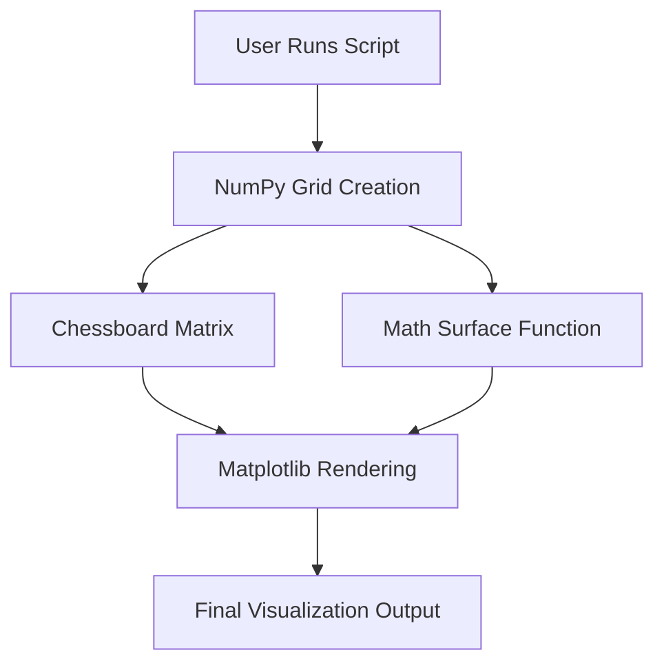
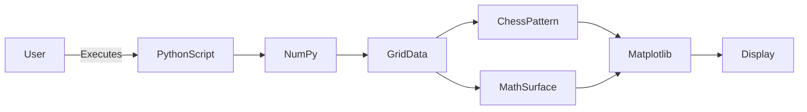
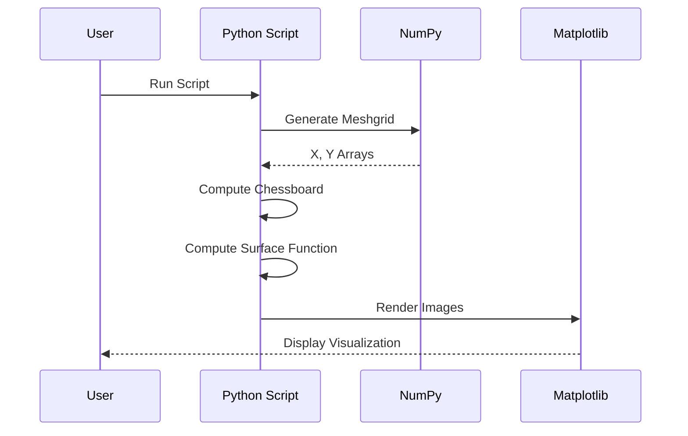

# ♟️ Chessboard Visualization with Python & Matplotlib  
### *Cool_Project_2 — Chessboard Module*

<p align="center">
  
  
  
  
  
  
</p>

---

<details open>
<summary><h2>📌 Project Overview</h2></summary>

### 🔹 Title
**Chessboard Visualization with Mathematical Surface Overlay**

### 🔹 Description
This project demonstrates how to **render a chessboard pattern using NumPy and Matplotlib**, combined with a **continuous mathematical surface function overlay**.  
It blends **discrete visualization (chessboard grid)** with **smooth analytical plotting**, making it ideal for **data visualization, scientific computing, and Python graphics learning**.

### 🔹 Key Highlights
- ♟️ Binary chessboard generation using modular arithmetic
- 📈 Continuous mathematical surface plotting
- 🎨 Layered transparency visualization
- 🧠 Mathematical + graphical fusion
- 🚀 Lightweight, fast, and beginner-friendly

</details>

---

<details>
<summary><h2>📚 Table of Contents</h2></summary>

1. 📌 Project Overview  
2. 🧠 Concept Explanation  
3. 🏗️ Architecture Diagram  
4. 🔄 Data Flow Diagram (DFD)  
5. ▶️ Execution Flow Diagram  
6. 🧩 Code Breakdown  
7. 🛠️ Tech Stack  
8. ✅ Pros & ❌ Cons  
9. 🌍 Real-World Use Cases  
10. 📌 Practical Examples  
11. 🚀 How to Run  
12. 📄 License  

</details>

---

<details>
<summary><h2>🧠 Concept Explanation</h2></summary>

This visualization consists of **two layered components**:

### 1️⃣ Chessboard Layer
- Created using NumPy’s `outer` addition
- Alternating black & white pattern via modulo `% 2`
- Rendered using `imshow()` with `binary_r` colormap

### 2️⃣ Mathematical Surface Layer
- Defined by a custom function:
```python
(1 - x/2 + x**5 + y**6) * exp(-(x² + y²))
````

* Represents a **Gaussian-like damped polynomial surface**
* Overlaid with transparency for visual blending

</details>

---

<details>
<summary><h2>🏗️ Architecture Diagram</h2></summary>



</details>

---

<details>
<summary><h2>🔄 Data Flow Diagram (DFD)</h2></summary>



</details>

---

<details>
<summary><h2>▶️ Execution Flow Diagram</h2></summary>



</details>

---

<details>
<summary><h2>🧩 Code Breakdown</h2></summary>

### 🔹 Grid Creation

* Uses `np.arange()` and `np.meshgrid()` for coordinate mapping

### 🔹 Chessboard Logic

* Alternating pattern using:

```python
np.add.outer(range(8), range(8)) % 2
```

### 🔹 Visualization

* `imshow()` for image rendering
* Alpha blending for overlay transparency
* `bilinear` interpolation for smooth visuals

</details>

---

<details>
<summary><h2>🛠️ Tech Stack</h2></summary>

* **Python 3.x**
* **NumPy** – Numerical computation
* **Matplotlib** – Data visualization
* **Mermaid.js** – Diagram rendering (GitHub supported)

</details>

---

<details>
<summary><h2>✅ Pros & ❌ Cons</h2></summary>

### ✅ Pros

* Lightweight and fast execution
* Excellent learning resource for visualization
* Combines discrete & continuous math
* Highly customizable visuals

### ❌ Cons

* Static (no interactivity)
* Not optimized for real-time rendering
* Limited to 2D visualization

</details>

---

<details>
<summary><h2>🌍 Real-World Use Cases</h2></summary>

* 📊 **Scientific Data Visualization**
* 🎓 **Teaching Mathematical Functions**
* 🤖 **AI / ML Feature Visualization**
* 🧠 **Pattern Recognition Demonstrations**
* 🎮 **Game Board Prototyping**

</details>

---

<details>
<summary><h2>📌 Practical Examples</h2></summary>

* Visualizing **probability distributions**
* Overlaying **heatmaps on grids**
* Demonstrating **Fourier / Gaussian functions**
* Teaching **NumPy broadcasting concepts**

</details>

---

<details>
<summary><h2>🚀 How to Run</h2></summary>

```bash
git clone https://github.com/alok-kumar8765/Cool_Project_2.git
cd Cool_Project_2/Chessboard
pip install numpy matplotlib
python chessboard.py
```

</details>

---

<details>
<summary><h2>📄 License</h2></summary>

This project is licensed under the **MIT License**
© 2025 **Alok Kumar**
GitHub: 👉 [https://github.com/alok-kumar8765](https://github.com/alok-kumar8765)

</details>

---

⭐ **If you found this project useful, please consider giving it a star!** ⭐


---

