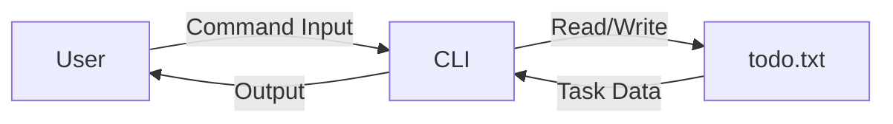

# 📝 CLI Todo Application (Python)

<p align="center">
  
  
  
  
  
  
</p>

<p align="center">
  <b>A lightweight, file-based Command Line Todo Manager built using Python & Click</b>
</p>

---

<details>
<summary><h2>📌 Table of Contents</h2></summary>

1. 📖 Project Overview  
2. 🚀 Features  
3. 🧠 How It Works  
4. 🏗️ System Architecture  
5. 🔄 Application Flow  
6. 📊 Data Flow Diagram (DFD)  
7. 🧩 Code Explanation  
8. 💻 Installation & Usage  
9. 🌍 Real-World Use Cases  
10. ✅ Pros & ❌ Cons  
11. 🔐 Limitations & Enhancements  
12. 📜 License  

</details>

---

<details>
<summary><h2>📖 Project Overview</h2></summary>

This **CLI Todo Application** is a simple yet powerful command-line productivity tool that allows users to:

- Add tasks
- View tasks
- Complete (delete) tasks
- Persist data using a local text file

The project demonstrates:
- Clean CLI design
- Context management using `click`
- File-based persistence
- Modular command structure

Ideal for **beginners, automation engineers, DevOps learners, and Python CLI enthusiasts**.

</details>

---

<details>
<summary><h2>🚀 Features</h2></summary>

- ✅ Interactive CLI using `click`
- 📂 Persistent storage using `todo.txt`
- 🆔 Auto-increment task IDs
- 🧠 Context-aware command handling
- 🔁 Simple CRUD operations
- 🧩 Minimal dependencies
- ⚡ Fast execution

</details>

---

<details>
<summary><h2>🧠 How It Works</h2></summary>

- The application uses **Click Groups** to organize commands
- Tasks are stored in a text file:
  - First line → latest task ID
  - Remaining lines → `ID```TASK`
- Data is loaded into memory at runtime
- All updates rewrite the file to maintain consistency

</details>

---

<details>
<summary><h2>🏗️ System Architecture</h2></summary>

```mermaid
graph TD
    User -->|CLI Command| Click_Framework
    Click_Framework --> Context_Manager
    Context_Manager --> File_System
    File_System --> todo.txt
    Context_Manager --> CLI_Output
````

**Components Explained:**

* **User**: Interacts via terminal
* **Click Framework**: Handles commands & options
* **Context Manager**: Stores runtime data
* **File System**: Persists tasks
* **CLI Output**: Displays responses

</details>

---

<details>
<summary><h2>🔄 Application Flow Diagram</h2></summary>

```mermaid
flowchart TD
    Start --> Read_File
    Read_File --> Load_Context
    Load_Context --> User_Command
    User_Command -->|Add| Write_File
    User_Command -->|List| Display_Tasks
    User_Command -->|Done| Update_File
    Write_File --> End
    Display_Tasks --> End
    Update_File --> End
```

</details>

---

<details>
<summary><h2>📊 Data Flow Diagram (DFD)</h2></summary>



</details>

---

<details>
<summary><h2>🧩 Code Explanation</h2></summary>

### 🔹 `todo()` – Main Group

* Initializes CLI group
* Loads tasks into context
* Reads from `todo.txt`

### 🔹 `tasks`

* Displays all stored tasks
* Reads from context memory

### 🔹 `add`

* Adds a new task
* Assigns unique ID
* Writes updated data to file

### 🔹 `done`

* Removes a task by ID
* Resets ID if list becomes empty
* Updates persistent storage

</details>

---

<details>
<summary><h2>💻 Installation & Usage</h2></summary>

### 📦 Install Dependencies

```bash
pip install click
```

### ▶️ Run Application

```bash
python todo.py
```

### 📌 Commands

```bash
python todo.py tasks
python todo.py add
python todo.py done
```

</details>

---

<details>
<summary><h2>🌍 Real-World Use Cases</h2></summary>

* 🧑‍💻 Developers managing daily coding tasks
* 🛠️ DevOps engineers tracking deployment steps
* 📚 Students managing assignments
* 🤖 Automation scripts with task queues
* 💡 Learning project for Python CLI development

**Example:**

```bash
$ python todo.py add
Enter task to add: Deploy backend service
```

</details>

---

<details>
<summary><h2>✅ Pros & ❌ Cons</h2></summary>

### ✅ Pros

* Lightweight & fast
* No database required
* Beginner-friendly
* Easy to extend
* Cross-platform

### ❌ Cons

* Single-user only
* No encryption
* Manual file handling
* No task priority or due dates

</details>

---

<details>
<summary><h2>🔐 Limitations & Future Enhancements</h2></summary>

### 🚧 Current Limitations

* Plain text storage
* No concurrency handling

### 🚀 Future Enhancements

* SQLite / JSON storage
* Task priority & deadlines
* Search & filter
* Export to CSV
* Cloud sync
* Dockerized CLI tool

</details>

---

<details>
<summary><h2>📜 License</h2></summary>

This project is licensed under the **MIT License**
© 2025 **Alok Kumar**

🔗 GitHub: [https://github.com/alok-kumar8765](https://github.com/alok-kumar8765)

</details>

---

<p align="center">
⭐ If you found this project useful, please star the repository!
</p>


---

