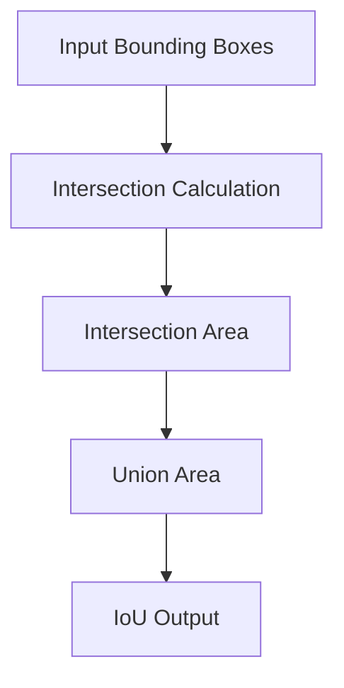
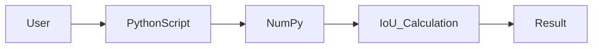
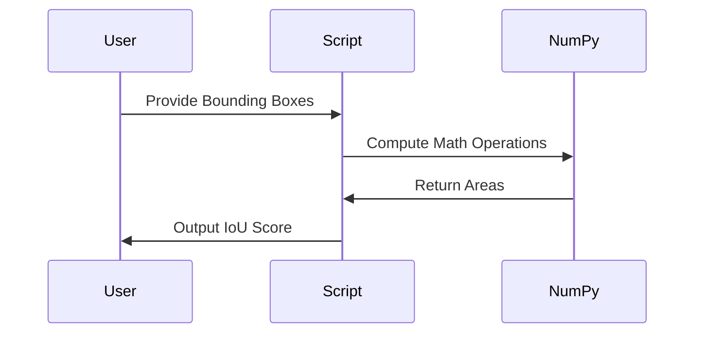

# 📐 Compute IoU (Intersection over Union) – Python Implementation

<p align="center">
  
  
  
  
  
  
</p>

---

## 🔍 Project Title
**Compute IoU (Intersection over Union) for Bounding Boxes**

---

<details>
<summary><strong>📖 Table of Contents (Click to Expand)</strong></summary>

- 📌 Project Overview  
- 🎯 Why IoU Matters  
- ⚙️ Installation  
- 🧠 Code Explanation  
- 🧮 Algorithm Breakdown  
- 📊 Data Flow Diagram (DFD)  
- 🏗 Architecture Diagram  
- 🔄 Execution Flow Diagram  
- 🧪 Example Usage  
- 🌍 Real-World Applications  
- 📌 Use Cases  
- ✅ Pros & ❌ Cons  
- 🚀 Performance Notes  
- 🔐 Best Practices  
- 📄 License  

</details>

---

<details>
<summary><strong>📌 Project Overview</strong></summary>

This module computes **Intersection over Union (IoU)** — a core evaluation metric used in **Computer Vision**, **Object Detection**, and **Deep Learning models** such as **YOLO, SSD, Faster R-CNN**, and more.

IoU measures the **overlap ratio** between a **predicted bounding box** and a **ground-truth bounding box**.

</details>

---

<details>
<summary><strong>🎯 Why IoU Matters</strong></summary>

✔ Determines detection accuracy  
✔ Used in model evaluation & benchmarking  
✔ Helps tune confidence thresholds  
✔ Essential for object detection pipelines  

**Formula:**

```

IoU = Area of Intersection / Area of Union

````

</details>

---

<details>
<summary><strong>⚙️ Installation</strong></summary>

```bash
pip install numpy
````

✔ Python 3.8+
✔ Lightweight
✔ No external dependencies beyond NumPy

</details>

---

<details>
<summary><strong>🧠 Code Explanation</strong></summary>

### Function Signature

```python
def Cal_IoU(GT_bbox, Pred_bbox):
```

### Input Format

```text
[x_min, y_min, x_max, y_max]
```

### Key Steps

* Compute intersection coordinates
* Calculate intersection area
* Compute total union area
* Return IoU score

</details>

---

<details>
<summary><strong>🧮 Algorithm Breakdown</strong></summary>

* 📍 Step 1: Find overlapping region
* 📍 Step 2: Calculate intersection area
* 📍 Step 3: Compute union area
* 📍 Step 4: Return IoU ratio

✔ Handles non-overlapping boxes
✔ Uses NumPy vectorization

</details>

---

<details>
<summary><strong>📊 Data Flow Diagram (DFD)</strong></summary>



</details>

---

<details>
<summary><strong>🏗 Architecture Diagram</strong></summary>



</details>

---

<details>
<summary><strong>🔄 Execution Flow Diagram</strong></summary>



</details>

---

<details>
<summary><strong>🧪 Example Usage</strong></summary>

```python
pred_bbox = np.array([40, 40, 100, 100])
gt_bbox = np.array([70, 80, 110, 130])

iou = Cal_IoU(pred_bbox, gt_bbox)
print(iou)
```

✔ Output: Floating-point IoU score
✔ Range: `0.0` → `1.0`

</details>

---

<details>
<summary><strong>🌍 Real-World Applications</strong></summary>

🔹 Object Detection Validation
🔹 Autonomous Vehicles
🔹 Medical Imaging (Tumor Detection)
🔹 Surveillance Systems
🔹 Face Recognition
🔹 Retail Shelf Analytics

**Example:**
If a self-driving car predicts a pedestrian box, IoU confirms how accurately the detection aligns with real position.

</details>

---

<details>
<summary><strong>📌 Use Cases</strong></summary>

✔ Model Evaluation
✔ Anchor Box Tuning
✔ Training Loss Calculation
✔ False Positive Analysis
✔ Dataset Quality Checks

</details>

---

<details>
<summary><strong>✅ Pros & ❌ Cons</strong></summary>

### ✅ Pros

* Simple & fast
* Industry-standard metric
* Lightweight implementation
* Easy integration

### ❌ Cons

* Sensitive to small localization errors
* Does not account for object class
* Poor indicator for small objects

</details>

---

<details>
<summary><strong>🚀 Performance Notes</strong></summary>

* Time Complexity: **O(1)**
* Space Complexity: **O(1)**
* NumPy optimized
* Suitable for batch processing with minor modifications

</details>

---

<details>
<summary><strong>🔐 Best Practices</strong></summary>

✔ Normalize bounding boxes
✔ Use consistent coordinate systems
✔ Handle edge cases (no overlap)
✔ Combine IoU with confidence scores

</details>

---

<details>
<summary><strong>📄 License</strong></summary>

This project is licensed under the **MIT License**
© 2025 **Alok Kumar**

🔗 GitHub: [https://github.com/alok-kumar8765/Cool_Project_2](https://github.com/alok-kumar8765/Cool_Project_2)

</details>

---

⭐ **If you found this useful, consider starring the repository!**


---

