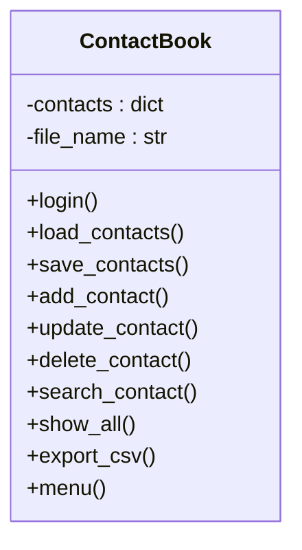
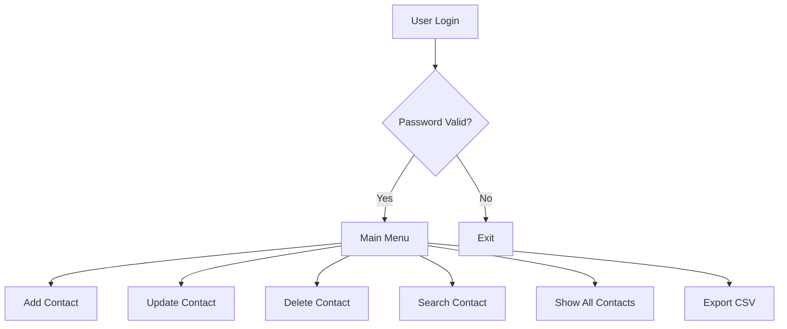

# 📇 Advanced Contact Book (OOP + File Storage + Security)

---

## 🔐 Default Password

```text
admin123
```

👉 You can change it inside the code.

---

## 📂 File Storage

* `contacts.json` → main data storage
* Auto-created on first run

---

## 🧠 Project Architecture (OOP)



---

## 🧩 Data Flow



---

## 🧑‍💻 FULL SOURCE CODE (`run.py`)

```python
import json
import csv
import os
import getpass

class ContactBook:
    def __init__(self, file_name="contacts.json"):
        self.file_name = file_name
        self.contacts = {}
        self.load_contacts()

    # 🔐 Login System
    def login(self):
        PASSWORD = "admin123"
        pwd = getpass.getpass("Enter Password: ")
        if pwd != PASSWORD:
            print("❌ Incorrect Password")
            exit()
        print("✅ Login Successful\n")

    # 📂 Load Contacts
    def load_contacts(self):
        if os.path.exists(self.file_name):
            with open(self.file_name, "r") as f:
                self.contacts = json.load(f)

    # 💾 Save Contacts
    def save_contacts(self):
        with open(self.file_name, "w") as f:
            json.dump(self.contacts, f, indent=4)

    # ➕ Add Contact
    def add_contact(self):
        name = input("Name: ").strip()
        phone = input("Phone Number: ").strip()

        if name in self.contacts:
            print("⚠ Contact already exists")
            return

        self.contacts[name] = phone
        self.save_contacts()
        print("✅ Contact Added")

    # 🔄 Update Contact
    def update_contact(self):
        name = input("Enter name to update: ")
        if name not in self.contacts:
            print("❌ Contact not found")
            return

        phone = input("Enter new phone number: ")
        self.contacts[name] = phone
        self.save_contacts()
        print("✅ Contact Updated")

    # ❌ Delete Contact
    def delete_contact(self):
        name = input("Enter name to delete: ")
        if name in self.contacts:
            del self.contacts[name]
            self.save_contacts()
            print("🗑 Contact Deleted")
        else:
            print("❌ Contact not found")

    # 🔍 Search Contact
    def search_contact(self):
        name = input("Enter name to search: ")
        if name in self.contacts:
            print(f"📞 {name} : {self.contacts[name]}")
        else:
            print("❌ Contact not found")

    # 📋 Show All Contacts
    def show_all(self):
        if not self.contacts:
            print("📭 No contacts available")
            return

        print("\nName\t\tPhone")
        print("-" * 30)
        for name, phone in self.contacts.items():
            print(f"{name}\t\t{phone}")

    # 📊 Export to CSV
    def export_csv(self):
        with open("contacts.csv", "w", newline="") as f:
            writer = csv.writer(f)
            writer.writerow(["Name", "Phone"])
            for name, phone in self.contacts.items():
                writer.writerow([name, phone])
        print("📁 Exported to contacts.csv")

    # 📜 Menu
    def menu(self):
        while True:
            print("""
1. Add Contact
2. Update Contact
3. Delete Contact
4. Search Contact
5. Show All Contacts
6. Export to CSV
7. Exit
""")
            choice = input("Choose option: ")

            if choice == "1":
                self.add_contact()
            elif choice == "2":
                self.update_contact()
            elif choice == "3":
                self.delete_contact()
            elif choice == "4":
                self.search_contact()
            elif choice == "5":
                self.show_all()
            elif choice == "6":
                self.export_csv()
            elif choice == "7":
                print("👋 Goodbye")
                break
            else:
                print("❌ Invalid choice")

# 🚀 Run Program
if __name__ == "__main__":
    app = ContactBook()
    app.login()
    app.menu()
```

---

## 📊 Storage Format Examples

### JSON (`contacts.json`)

```json
{
    "Rahul": "9876543210",
    "Neha": "9988776655"
}
```

### CSV (`contacts.csv`)

```csv
Name,Phone
Rahul,9876543210
Neha,9988776655
```

---

## ✅ Features Summary

* 🔐 Password-protected access
* 🧠 OOP-based clean architecture
* 📂 Persistent file storage
* 🔄 Update contact
* ❌ Delete contact
* 🔍 Search contact
* 📊 CSV export
* ⚡ Fast & beginner-friendly

---

## 🌍 Real-World Use Cases

* Personal contact manager
* Small business customer records
* Offline CRM prototype
* Python OOP practice project
* Interview-ready mini project

---

## 🔮 Possible Next Upgrades

* Password hashing (bcrypt)
* Role-based users
* Phone validation
* GUI (Tkinter)
* Web version (Django / Flask)
* EXE build for Windows

---

