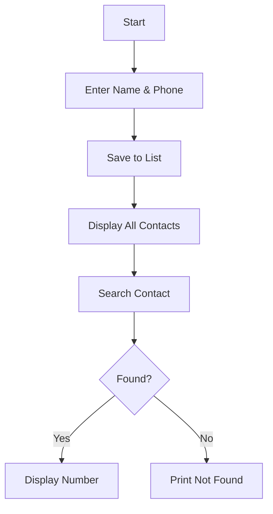

# 📇 Contact Book (Python CLI Project)

<!-- ================= BADGES ================= -->
<p align="center">
  <a href="https://github.com/alok-kumar8765/Cool_Project_2">
    
  </a>
  
  
  
</p>

---

## 📌 Project Title
**Contact Book – Simple Python CLI Application**

---

## 🧾 Project Description
A **lightweight command-line Contact Book application** built using **core Python**.  
It allows users to:
- Store contact names and phone numbers
- Display saved contacts in a tabular format
- Search contacts efficiently by name

This project demonstrates **basic data structures**, **user input handling**, and **search logic**, making it ideal for **Python beginners** and **interview preparation**.

---

<details>
<summary><h2>📚 Table of Contents</h2></summary>

- 📖 About the Project  
- ⚙️ How It Works  
- 🧠 Logic Explanation  
- 🧩 Data Flow Diagram (DFD)  
- 🏗 Architecture Diagram  
- 🔄 Program Flow Diagram  
- 🚀 Features  
- 🛠 Technologies Used  
- 📌 Use Cases  
- 🌍 Real-World Examples  
- ✅ Pros  
- ❌ Cons  
- 🔮 Future Improvements  

</details>

---

<details>
<summary><h2>📖 About the Project</h2></summary>

This Contact Book uses **two parallel lists** to store:
- Contact Names
- Phone Numbers  

The program:
1. Takes input from the user
2. Stores it in memory
3. Displays all contacts
4. Allows searching by name

No external libraries are required.

</details>

---

<details>
<summary><h2>⚙️ How It Works</h2></summary>

- User defines the number of contacts
- Inputs name and phone number
- Data is stored in lists
- Contacts are displayed
- User can search for a contact by name

</details>

---

<details>
<summary><h2>🧠 Logic Explanation</h2></summary>

- `names[]` → Stores contact names  
- `phone_numbers[]` → Stores corresponding phone numbers  
- Index-based mapping ensures name ↔ number association  
- Linear search is used for contact lookup  

Time Complexity:
- Insert: **O(1)**
- Search: **O(n)**

</details>

---

<details>
<summary><h2>🧩 Data Flow Diagram (DFD)</h2></summary>

```mermaid
graph TD
    A[User Input] --> B[Store in Lists]
    B --> C[Display Contacts]
    B --> D[Search Name]
    D --> E{Found?}
    E -->|Yes| F[Show Phone Number]
    E -->|No| G[Name Not Found]
````

</details>

---

<details>
<summary><h2>🏗 Architecture Diagram</h2></summary>

```mermaid
graph LR
    User --> CLI[Python CLI Interface]
    CLI --> Logic[Business Logic]
    Logic --> Storage[In-Memory Lists]
```

</details>

---

<details>
<summary><h2>🔄 Program Flow Diagram</h2></summary>



</details>

---

<details>
<summary><h2>🚀 Features</h2></summary>

* 📥 User-friendly input
* 📋 Tabular display format
* 🔍 Search functionality
* 🧠 Beginner-friendly logic
* ⚡ Fast execution
* 🐍 Pure Python (no dependencies)

</details>

---

<details>
<summary><h2>🛠 Technologies Used</h2></summary>

* Python 3.x
* Core Python (Lists, Loops, Conditionals)
* Command Line Interface (CLI)

</details>

---

<details>
<summary><h2>📌 Use Cases</h2></summary>

* Learning Python basics
* Practicing list operations
* Understanding search algorithms
* Interview coding practice
* Mini-project for students

</details>

---

<details>
<summary><h2>🌍 Real-World Examples</h2></summary>

* 📱 Personal phone directory
* 🏢 Small office contact list
* 🏫 Student record system (basic)
* 🧪 Prototype for larger CRM systems

**Example:**
A shop owner stores customer contact numbers for quick lookup.

</details>

---

<details>
<summary><h2>✅ Pros</h2></summary>

* Easy to understand
* No external libraries
* Clean and readable logic
* Ideal for beginners
* Fast execution

</details>

---

<details>
<summary><h2>❌ Cons</h2></summary>

* Data is not persistent (lost after program ends)
* Linear search (not optimized for large data)
* No validation for duplicate names
* CLI-based (no GUI)

</details>

---

<details>
<summary><h2>🔮 Future Improvements</h2></summary>

* Use dictionary for faster lookup
* Add file/database storage
* Implement delete & update features
* Add GUI (Tkinter / Web App)
* Add input validation
* Convert into REST API

</details>

---

## 👤 Author

**Alok Kumar**
🔗 GitHub: [alok-kumar8765](https://github.com/alok-kumar8765)

---

## ⭐ Support

If you like this project, please ⭐ star the repository to support the work!

---

---
