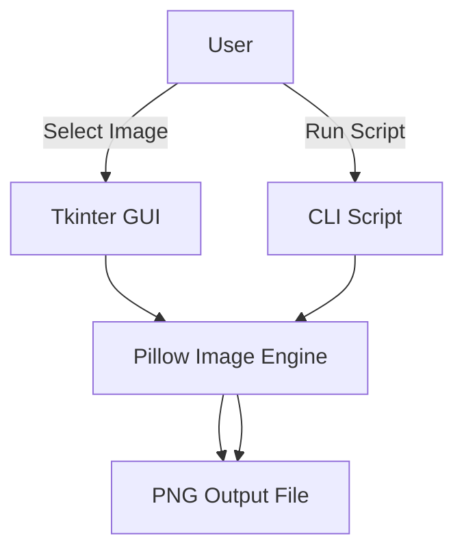
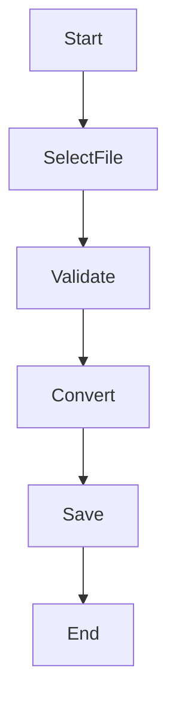

# 🖼️ JPEG to PNG Converter (GUI & Terminal Based)

<p align="center">
  
  
  
  
  
</p>

<p align="center">
  <b>Professional Image Conversion Tool using Python</b><br/>
  Convert JPEG images to PNG format using both <b>GUI</b> and <b>Terminal</b> approaches.
</p>

---

## 📌 Project Description

This project provides **two robust ways** to convert JPEG images into PNG format:

- 🖥️ **GUI-based Converter** (Tkinter)
- 🧾 **Terminal-based Converter** (CLI)

Built using **Python, Tkinter, and Pillow**, the project is lightweight, fast, beginner-friendly, and suitable for real-world automation and desktop utilities.

---

## 📚 Table of Contents

<details open>
<summary><b>Click to Expand / Collapse</b></summary>

1. 🔍 Overview  
2. ⚙️ Technologies Used  
3. 🗂️ Project Structure  
4. 🧠 Architecture Diagram  
5. 🔄 Data Flow Diagram (DFD)  
6. 🧭 Application Flow Diagram  
7. 🖥️ GUI Converter Explanation  
8. 🧾 Terminal Converter Explanation  
9. ✅ Features  
10. ❌ Limitations  
11. 🌍 Real-World Use Cases  
12. 📦 Example Scenarios  
13. 🚀 How to Run  
14. 🔮 Future Enhancements  
15. 🧑‍💻 Author  

</details>

---

## 🔍 Overview

<details>
<summary><b>Project Purpose</b></summary>

- Convert `.jpeg / .jpg` images to `.png`
- Provide both **interactive GUI** and **script-based CLI**
- Learn image processing using **Pillow**
- Demonstrate real-world Python desktop tooling

</details>

---

## ⚙️ Technologies Used

<details>
<summary><b>Tech Stack</b></summary>

- **Python 3.x**
- **Tkinter** – GUI Framework
- **Pillow (PIL)** – Image Processing Library
- **OS File Dialogs**

</details>

---

## 🗂️ Project Structure

<details>
<summary><b>Folder Layout</b></summary>

```text
Convert_JPEG_to_PNG/
│
├── converter_GUI.py        # GUI-based Image Converter
├── converter_terminal.py   # Terminal-based Image Converter
└── README.md               # Documentation
````

</details>

---

## 🧠 System Architecture (Mermaid)

<details>
<summary><b>Architecture Diagram</b></summary>



</details>

---

## 🔄 Data Flow Diagram (DFD)

<details>
<summary><b>DFD Level 1</b></summary>


</details>

---

## 🧭 Application Flow Diagram

<details>
<summary><b>Execution Flow</b></summary>



</details>

---

## 🖥️ GUI Converter (converter_GUI.py)

<details>
<summary><b>Explanation</b></summary>

### 🔹 Features

* Interactive window using **Tkinter**
* File selection dialog
* Save location selection
* Error handling if no file is selected

### 🔹 Key Components

* `Tk()` → Main window
* `Canvas()` → Layout container
* `filedialog.askopenfilename()` → Input JPEG
* `filedialog.asksaveasfilename()` → Output PNG
* `Pillow.Image.open()` → Image loader
* `Image.save()` → PNG generation

### 🔹 User Experience

1. Click **Import JPEG File**
2. Select image
3. Click **Convert JPEG to PNG**
4. Save converted image

</details>

---

## 🧾 Terminal Converter (converter_terminal.py)

<details>
<summary><b>Explanation</b></summary>

### 🔹 Purpose

Designed for **automation, scripting, batch processing**, and backend usage.

### 🔹 How It Works

* Reads JPEG from current directory
* Converts it into PNG format
* Saves output automatically

### 🔹 Ideal For

* CI/CD pipelines
* Backend services
* Cron jobs
* Bulk image processing

</details>

---

## ✅ Pros

<details>
<summary><b>Advantages</b></summary>

* ✔️ Simple & beginner-friendly
* ✔️ Cross-platform (Windows/Linux/macOS)
* ✔️ GUI + CLI flexibility
* ✔️ Lightweight & fast
* ✔️ No internet required

</details>

---

## ❌ Cons

<details>
<summary><b>Limitations</b></summary>

* ❌ No batch conversion (yet)
* ❌ No drag-and-drop support
* ❌ Limited to JPEG → PNG
* ❌ No image preview

</details>

---

## 🌍 Real-World Use Cases

<details>
<summary><b>Practical Applications</b></summary>

* 📸 Photographers converting images for web
* 🧑‍💻 Developers preparing assets
* 🏢 Offices standardizing image formats
* 🤖 Automation scripts for image pipelines
* 📚 Students learning GUI + PIL

</details>

---

## 📦 Example Scenarios

<details>
<summary><b>Examples</b></summary>

* Convert scanned documents to PNG
* Prepare transparent images for websites
* Automate image conversion before deployment
* Desktop utility for non-technical users

</details>

---

## 🚀 How to Run

<details>
<summary><b>Installation & Execution</b></summary>

### 🔧 Install Dependency

```bash
pip install pillow
```

### ▶️ Run GUI Version

```bash
python converter_GUI.py
```

### ▶️ Run Terminal Version

```bash
python converter_terminal.py
```

</details>

---

## 🔮 Future Enhancements

<details>
<summary><b>Planned Improvements</b></summary>

* Batch image conversion
* Drag & drop support
* More formats (BMP, TIFF, WEBP)
* Image preview
* Dark mode GUI
* Error logs

</details>

---

## 🧑‍💻 Author

<details open>
<summary><b>Developer Info</b></summary>

**Alok Kumar**
🔗 GitHub: [https://github.com/alok-kumar8765](https://github.com/alok-kumar8765)
📁 Repository: **Cool_Project_2**
⭐ If you like this project, give it a star!

</details>

---

<p align="center">
  <b>⭐ Simple • Fast • Professional • Pythonic ⭐</b>
</p>


---

