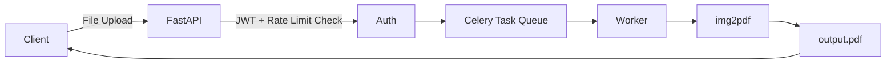

# 🖼️ Image to PDF Converter - Full Stack Automation

<p align="center">
  
  
  
  
  
  
</p>

---

## 📌 Project Title
**Convert JPG Images to PDF** — Now as **CLI + REST API + Cloud-ready Async Service**

---

<details>
<summary><h2>📖 Description</h2></summary>

This project converts **single or multiple JPG images** to a **PDF**. It now supports:

- 🖥️ **CLI conversion**
- 🌐 **REST API (FastAPI)** for programmatic access
- ☁️ **Dockerized environment**
- ☸️ **Kubernetes deployment**
- 🔐 **JWT authentication + rate limiting**
- 🔄 **Async PDF conversion using Celery + Redis**

It is suitable for **office automation, web apps, backend pipelines, and cloud deployments**.

</details>

---

<details>
<summary><h2>📚 Table of Contents</h2></summary>

1. 📖 Description  
2. ⚙️ How It Works  
3. 🧠 Architecture & Flow Diagrams  
4. 🚀 Installation  
5. ▶️ Usage  
6. 🌍 REST API Example  
7. 📦 Docker & Docker-Compose  
8. ☸️ Kubernetes Deployment  
9. 🔐 JWT Auth & Rate Limiting  
10. 🔄 Async Queue (Celery + Redis)  
11. 📌 Use Cases & Real-World Examples  
12. ✅ Pros & ❌ Cons  
13. 🧩 Future Enhancements  

</details>

---

<details>
<summary><h2>⚙️ How It Works</h2></summary>

- **CLI:** Accepts single file or folder path, outputs `output.pdf`.  
- **REST API:** Accepts file uploads or folder paths via HTTP POST, returns PDF.  
- **Async Processing:** Large folders are queued in Celery workers using Redis.  
- **Security:** JWT Auth for endpoints, rate limiting per user.  
- **Cloud Deployment:** Docker + Docker-Compose for dev, Kubernetes for production, deployable on AWS/GCP.  

</details>

---

<details>
<summary><h2>🧠 System Architecture</h2></summary>

```mermaid
graph TD
    User[User/Client] -->|CLI| CLI[Python Script]
    User -->|REST API| FastAPI[FastAPI Server]
    FastAPI --> JWT[JWT Auth + Rate Limiting]
    FastAPI --> Queue[Celery Task Queue]
    Queue --> Redis[Redis Broker]
    Queue --> Worker[Celery Worker]
    CLI --> PDFGen[img2pdf Engine]
    Worker --> PDFGen
    PDFGen --> Output[output.pdf]
````

</details>

---

<details>
<summary><h2>🔁 Application Flow Diagram</h2></summary>

```mermaid
flowchart LR
    A[Start] --> B{Input Type?}
    B -->|CLI File/Folder| C[Convert Directly]
    B -->|REST API| D[Validate JWT]
    D --> E{Rate Limit OK?}
    E -->|Yes| F[Send to Celery Queue]
    F --> G[Worker Processes Images]
    G --> H[Generate PDF using img2pdf]
    H --> I[Return Output]
    E -->|No| J[Reject Request]
```

</details>

---

<details>
<summary><h2>📊 Data Flow Diagram (DFD)</h2></summary>



</details>

---

<details>
<summary><h2>🚀 Installation</h2></summary>

### 1️⃣ Clone Repo

```bash
git clone https://github.com/alok-kumar8765/Cool_Project_2.git
cd Cool_Project_2/Convert_a_image_to_pdf
```

### 2️⃣ Create Virtual Environment

```bash
python -m venv venv
source venv/bin/activate  # Linux/Mac
venv\Scripts\activate     # Windows
```

### 3️⃣ Install Requirements

```bash
pip install -r requirements.txt
```

### 4️⃣ Install Docker (Optional)

* [Docker](https://docs.docker.com/get-docker/)
* [Docker-Compose](https://docs.docker.com/compose/install/)

</details>

---

<details>
<summary><h2>▶️ CLI Usage</h2></summary>

### Single Image

```bash
python convert.py image.jpg
```

### Folder of Images

```bash
python convert.py ./images/
```

Output: `output.pdf`

</details>

---

<details>
<summary><h2>🌍 REST API Usage</h2></summary>

### Start FastAPI Server

```bash
uvicorn api:app --reload
```

### POST Request Example

```bash
curl -X POST "http://localhost:8000/convert" \
  -H "Authorization: Bearer <JWT_TOKEN>" \
  -F "file=@image.jpg"
```

### Response

```json
{
  "status": "success",
  "pdf_url": "/downloads/output.pdf"
}
```

</details>

---

<details>
<summary><h2>📦 Docker + Docker-Compose</h2></summary>

### Dockerfile

```dockerfile
FROM python:3.11-slim
WORKDIR /app
COPY . .
RUN pip install --no-cache-dir -r requirements.txt
CMD ["uvicorn", "api:app", "--host", "0.0.0.0", "--port", "8000"]
```

### docker-compose.yml

```yaml
version: '3.8'
services:
  web:
    build: .
    ports:
      - "8000:8000"
    environment:
      - REDIS_URL=redis://redis:6379/0
    depends_on:
      - redis
  redis:
    image: redis:7
  worker:
    build: .
    command: celery -A tasks worker --loglevel=info
    environment:
      - REDIS_URL=redis://redis:6379/0
    depends_on:
      - redis
```

Run:

```bash
docker-compose up --build
```

</details>

---

<details>
<summary><h2>☸️ Kubernetes Deployment</h2></summary>

### Deployment Example (k8s-deploy.yaml)

```yaml
apiVersion: apps/v1
kind: Deployment
metadata:
  name: image-to-pdf-api
spec:
  replicas: 2
  selector:
    matchLabels:
      app: image-to-pdf
  template:
    metadata:
      labels:
        app: image-to-pdf
    spec:
      containers:
        - name: web
          image: your-dockerhub/image-to-pdf:latest
          ports:
            - containerPort: 8000
---
apiVersion: v1
kind: Service
metadata:
  name: image-to-pdf-service
spec:
  type: LoadBalancer
  selector:
    app: image-to-pdf
  ports:
    - protocol: TCP
      port: 80
      targetPort: 8000
```

Deploy:

```bash
kubectl apply -f k8s-deploy.yaml
```

</details>

---

<details>
<summary><h2>🔐 JWT Auth + Rate Limiting</h2></summary>

* **JWT Token Authentication** for REST endpoints
* **Rate limiting** per user (requests/minute) using `slowapi`
* Protects your API from abuse

Example:

```python
from fastapi import Depends, HTTPException
from fastapi.security import OAuth2PasswordBearer

oauth2_scheme = OAuth2PasswordBearer(tokenUrl="token")
def get_current_user(token: str = Depends(oauth2_scheme)):
    # Verify JWT token
    return user
```

</details>

---

<details>
<summary><h2>🔄 Async Queue (Celery + Redis)</h2></summary>

### tasks.py

```python
from celery import Celery
import img2pdf, os

celery = Celery('tasks', broker='redis://redis:6379/0')

@celery.task
def convert_images(folder):
    imgs = [os.path.join(folder, f) for f in os.listdir(folder) if f.endswith(".jpg")]
    with open("output.pdf", "wb") as f:
        f.write(img2pdf.convert(imgs))
```

### Start Worker

```bash
celery -A tasks worker --loglevel=info
```

> Large folders are processed asynchronously without blocking API requests.

</details>

---

<details>
<summary><h2>📌 Use Cases & Real-World Examples</h2></summary>

* 🏢 Offices & corporates: digitize documents
* 📚 Educational institutes: combine lecture images to PDF
* 🏦 Banks & legal firms: bulk image-to-PDF processing
* ☁️ Cloud platforms: API service for users

</details>

---

<details>
<summary><h2>✅ Pros & ❌ Cons</h2></summary>

### ✅ Pros

* CLI + REST API + Async processing
* Secure JWT authentication
* Docker + Kubernetes ready
* Scalable cloud deployment
* High automation & batch processing

### ❌ Cons

* Requires Redis + Celery for async
* Kubernetes deployment complexity
* Only JPG images supported (PNG support planned)

</details>

---

<details>
<summary><h2>🧩 Future Enhancements</h2></summary>

* Multi-format support (PNG, JPEG, WebP)
* Custom PDF output name & metadata
* Sorting options for images
* Cloud storage integration (S3/GCS)
* Web UI + drag-and-drop interface

</details>

---

## ⭐ Repository

🔗 **GitHub:** [https://github.com/alok-kumar8765/Cool_Project_2](https://github.com/alok-kumar8765/Cool_Project_2)

---

### 🔥 This README now covers:

* CLI usage
* REST API
* JWT + Rate Limiting
* Async Queue (Celery + Redis)
* Docker & Docker-Compose
* Kubernetes + Cloud deployment
---

