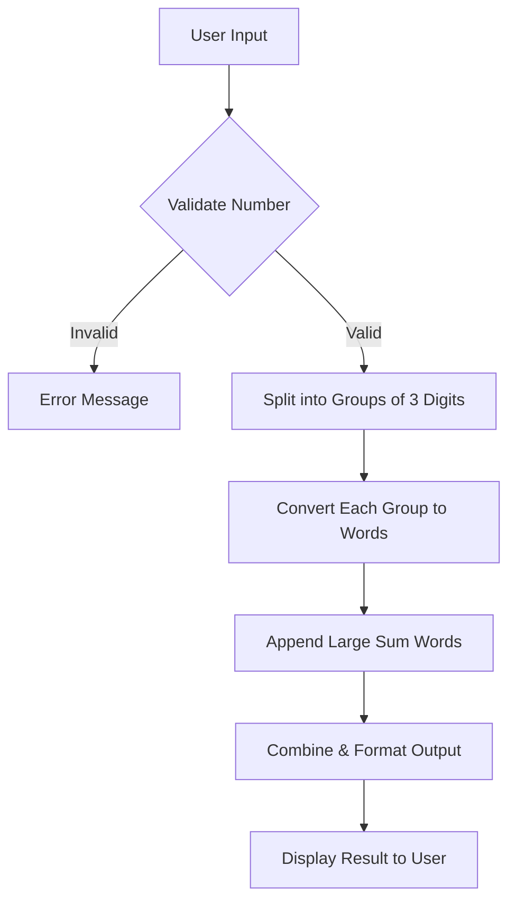
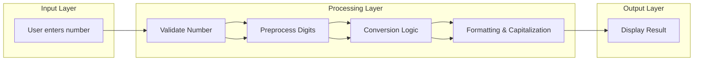
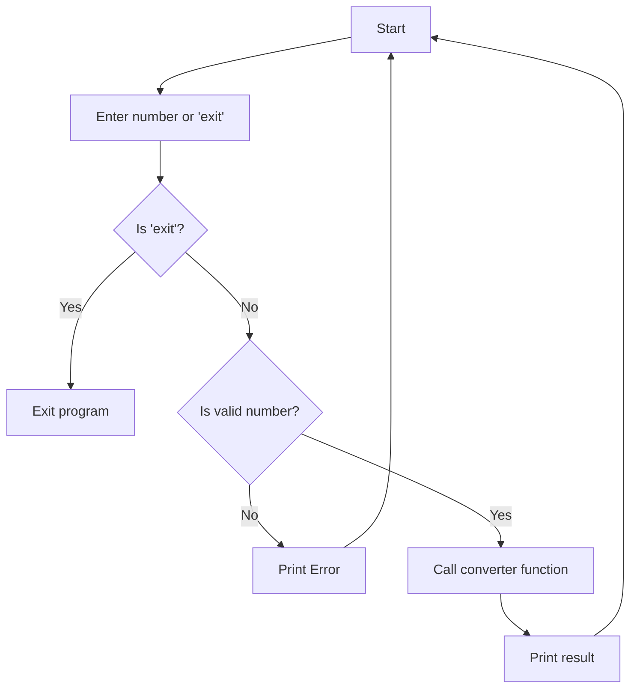

# 🔢 Convert Numbers to Words in Python

[](https://github.com/alok-kumar8765/Cool_Project_2)
[](https://github.com/alok-kumar8765/Cool_Project_2)
[](https://www.python.org/)
[](https://github.com/alok-kumar8765/Cool_Project_2/blob/main/LICENSE)

---

## 📖 Table of Contents
<details>
<summary>Click to expand</summary>

1. [Project Overview](#project-overview)  
2. [Features](#features)  
3. [Installation & Usage](#installation--usage)  
4. [Code Explanation](#code-explanation)  
5. [System Architecture & Diagrams](#system-architecture--diagrams)  
   - [DFD](#data-flow-diagram-dfd)  
   - [Architecture](#architecture-diagram)  
   - [Flow Diagram](#flow-diagram)  
6. [Pros & Cons](#pros--cons)  
7. [Real-world Use Cases](#real-world-use-cases)  
8. [License](#license)  

</details>

---

## 📝 Project Overview
Convert any numerical input into its **corresponding English words** using Python.  
This project handles:
- Single-digit, double-digit, triple-digit numbers
- Large numbers (up to nonillions)
- Negative numbers
- Grammatically correct formatting with "and" for readability

🔗 **GitHub Repository:** [Cool_Project_2](https://github.com/alok-kumar8765/Cool_Project_2/tree/main/Convert_numbers_to_word)

---

## ✨ Features
<details>
<summary>Click to expand</summary>

- ✅ Converts numbers to readable English words  
- ✅ Handles negative numbers gracefully  
- ✅ Supports very large numbers (thousand, million, billion...)  
- ✅ Continuous input until user exits  
- ✅ Error handling for invalid input  
- ✅ Python 3.x compatible  

</details>

---

## 💻 Installation & Usage
<details>
<summary>Click to expand</summary>

1. **Clone the repository**:

```bash
git clone https://github.com/alok-kumar8765/Cool_Project_2.git
cd Cool_Project_2/Convert_numbers_to_word
````

2. **Run the script**:

```bash
python convert_numbers_to_words.py
```

3. **Enter a number** to convert or type `exit` to quit:

```
Enter any number to convert it into words or 'exit' to stop: 12345
12345 --> Twelve thousand three hundred and forty five
```

</details>

---

## 🧩 Code Explanation

<details>
<summary>Click to expand</summary>

### Core Components

1. **Dictionaries**

```python
one_digit_words = {...}   # Maps digits 0-9 to words
two_digit_words = [...]   # Handles 10-12
large_sum_words = [...]   # Thousand, million, billion...
hundred = "hundred"
```

2. **Converter Logic**

* Handles negative numbers
* Splits number into groups of 3 digits
* Converts each group into words
* Correctly appends large number units (`thousand`, `million`)
* Adds grammatical "and" where appropriate
* Returns capitalized and formatted string

3. **User Interface**

* Interactive `while True` loop
* Validates input and displays results
* Graceful exit with `exit` keyword

</details>

---

## 🏗 System Architecture & Diagrams

### Data Flow Diagram (DFD)

<details>
<summary>Click to expand</summary>



</details>

### Architecture Diagram

<details>
<summary>Click to expand</summary>



</details>

### Flow Diagram

<details>
<summary>Click to expand</summary>



</details>

---

## ⚖️ Pros & Cons

<details>
<summary>Click to expand</summary>

### Pros

* Easy to understand and maintain
* Handles negative and large numbers
* Pure Python, no external dependencies
* Suitable for CLI and backend integration

### Cons

* Limited to English language
* Might be slower for extremely large numbers
* No GUI; only console interface

</details>

---

## 🌍 Real-world Use Cases

<details>
<summary>Click to expand</summary>

* **Banking Systems**: Convert amounts to words on cheques or invoices
* **Accounting Software**: Display total amounts in words
* **Voice Assistants**: Read numbers aloud in words
* **Educational Tools**: Teach students number-to-word conversion

**Example**:

```text
Input: 1500000
Output: One million five hundred thousand
```

</details>

---

## 📄 License

<details>
<summary>Click to expand</summary>

This project is licensed under the **MIT License**.
See the [LICENSE](https://github.com/alok-kumar8765/Cool_Project_2/blob/main/LICENSE) file for details.

</details>


---

