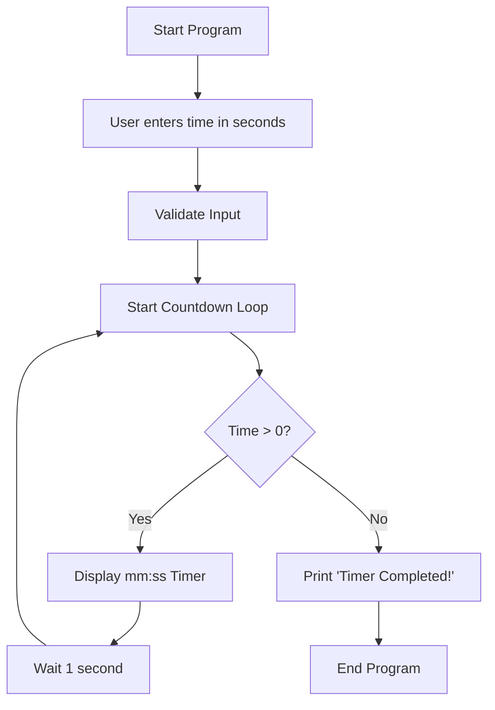
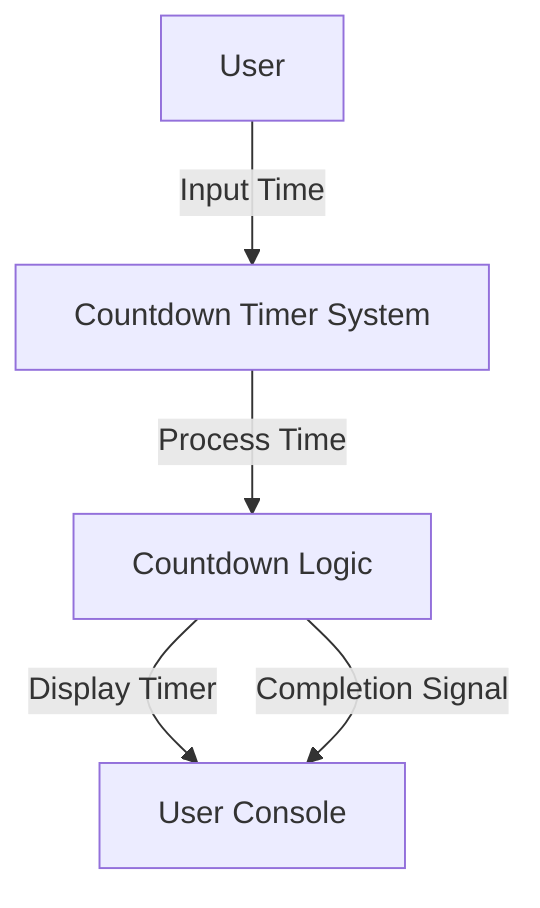
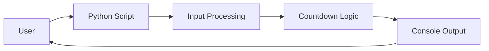

# ⏱ Countdown Timer

[](https://github.com/alok-kumar8765/Cool_Project_2/tree/main/Countdown_timer)
[](https://www.python.org/)
[](https://github.com/alok-kumar8765/Cool_Project_2/blob/main/LICENSE)
[](https://github.com/alok-kumar8765/Cool_Project_2)

---

## 📌 Table of Contents
<details>
<summary>Click to expand</summary>

1. [Project Description](#project-description)  
2. [Features](#features)  
3. [Installation](#installation)  
4. [Usage](#usage)  
5. [Code Explanation](#code-explanation)  
6. [Architecture & Diagrams](#architecture--diagrams)  
   - [Flow Diagram](#flow-diagram)  
   - [Data Flow Diagram (DFD)](#data-flow-diagram-dfd)  
   - [System Architecture](#system-architecture)  
7. [Pros & Cons](#pros--cons)  
8. [Use Cases & Real-World Applications](#use-cases--real-world-applications)  
9. [License](#license)

</details>

---

## 📝 Project Description
The **Countdown Timer** is a simple yet efficient Python-based timer that allows users to input a time duration in seconds and counts down in the console until the timer completes. This project is ideal for beginners to learn **Python programming, time management, and console output formatting**.

Key Highlights:
- Lightweight and easy to use
- Real-time countdown display
- Fully console-based, no external libraries required

---

## ⚡ Features
<details>
<summary>Click to expand</summary>

- User inputs countdown time in seconds
- Real-time console countdown with `mm:ss` format
- Alerts user when time completes
- Easy to extend (e.g., GUI integration)
- Works on any platform with Python installed

</details>

---

## 🛠 Installation
<details>
<summary>Click to expand</summary>

1. Clone the repository:

```bash
git clone https://github.com/alok-kumar8765/Cool_Project_2.git
cd Cool_Project_2/Countdown_timer
````

2. Ensure Python 3.x is installed:

```bash
python --version
```

3. Run the script:

```bash
python countdown_timer.py
```

</details>

---

## 🎯 Usage

<details>
<summary>Click to expand</summary>

1. Run the Python script.
2. Enter the countdown time in seconds when prompted.
3. Observe the live countdown in the console.
4. The timer displays `Timer completed!` once finished.

Example:

```text
Enter the time in seconds: 120
02:00
01:59
...
00:01
00:00
Timer completed!
```

</details>

---

## 🧩 Code Explanation

<details>
<summary>Click to expand</summary>

```python
import time

def countdown(t):
    while t:
        mins, secs = divmod(t, 60)  # Converts seconds to minutes and seconds
        timer = '{:02d}:{:02d}'.format(mins, secs)
        print(timer, end="\r")       # Prints in the same line
        time.sleep(1)               # Pauses for 1 second
        t -= 1

    print('Timer completed!')

t = input('Enter the time in seconds: ')
countdown(int(t))
```

**Explanation:**

* `divmod(t, 60)` converts seconds to `minutes:seconds`.
* `print(..., end="\r")` updates the timer in-place.
* `time.sleep(1)` ensures 1-second intervals.
* User input is converted to integer for countdown.

</details>

---

## 📊 Architecture & Diagrams

### Flow Diagram

<details>
<summary>Click to expand</summary>



</details>

### Data Flow Diagram (DFD)

<details>
<summary>Click to expand</summary>



</details>

### System Architecture

<details>
<summary>Click to expand</summary>



</details>

---

## ✅ Pros & Cons

<details>
<summary>Click to expand</summary>

**Pros:**

* Lightweight and simple
* Easy to understand and extend
* No external dependencies

**Cons:**

* Console-only, no GUI
* Single-threaded (blocks execution)
* No notification integration

</details>

---

## 🌍 Use Cases & Real-World Applications

<details>
<summary>Click to expand</summary>

**Use Cases:**

* Pomodoro technique for productivity
* Short-term cooking timers
* Workout interval timers
* Exam or study countdowns

**Real-World Example:**

* A student uses this timer to manage 25-minute focused study sessions and 5-minute breaks (Pomodoro Technique).

**Potential Enhancements:**

* GUI with Tkinter or PyQt
* Audio alert when timer ends
* Multiple simultaneous timers
* Web or mobile app integration

</details>

---

## 📄 License

<details>
<summary>Click to expand</summary>

This project is licensed under the **MIT License**. See the [LICENSE](https://github.com/alok-kumar8765/Cool_Project_2/blob/main/LICENSE) file for details.

</details>

---

