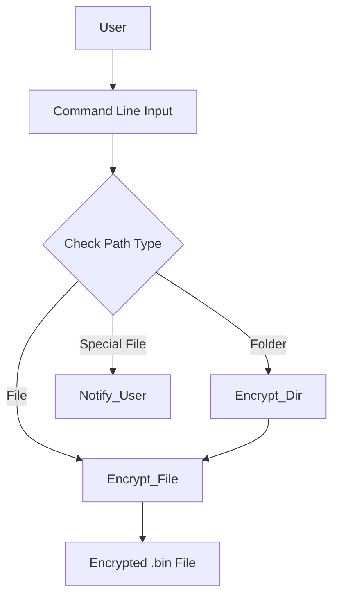
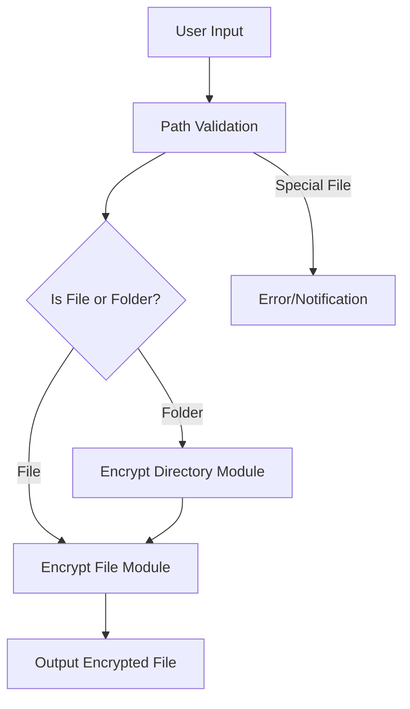
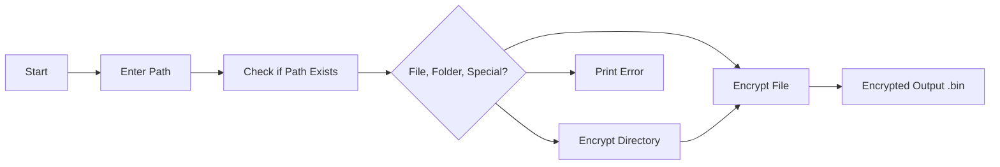

# 🔒 Cool Project 2 - File & Folder Encryption Script

[](https://github.com/alok-kumar8765/Cool_Project_2)
[](https://www.python.org/)
[](https://github.com/alok-kumar8765/Cool_Project_2/blob/main/LICENSE)
[](#)

---

## 📄 Table of Contents

<details>
<summary>Click to expand</summary>

1. [Project Description](#project-description)  
2. [Installation & Requirements](#installation--requirements)  
3. [Usage](#usage)  
4. [Code Explanation](#code-explanation)  
5. [Architecture & Flow](#architecture--flow)  
   - [DFD Diagram](#dfd-diagram)  
   - [Architecture Diagram](#architecture-diagram)  
   - [Flow Diagram](#flow-diagram)  
6. [Pros & Cons](#pros--cons)  
7. [Real World Use Cases & Examples](#real-world-use-cases--examples)  
8. [SEO Keywords](#seo-keywords)

</details>

---

## 📝 Project Description

This project provides a **Python-based solution to encrypt files and folders** using the **AES (Advanced Encryption Standard) CFB mode**.  
It can handle both individual files and entire directories recursively. The script ensures that sensitive data is securely encrypted and stored as `.bin` files.

**Key Features:**
- AES encryption with 16-byte key (AES-128)
- Recursive folder encryption
- Cross-platform compatible
- Easy-to-use command-line interface (CLI)

---

## ⚙️ Installation & Requirements

<details>
<summary>Click to expand</summary>

**Requirements:**
- Python 3.6+
- `pycryptodome` library

**Installation:**
```bash
# Clone the repository
git clone https://github.com/alok-kumar8765/Cool_Project_2.git
cd Cool_Project_2/Create_a_script_to_encrypt_files_and_folder

# Install dependencies
pip install pycryptodome
````

</details>

---

## 🚀 Usage

<details>
<summary>Click to expand</summary>

**Encrypt a file:**

```bash
python encrypt_script.py /path/to/your/file.txt
```

**Encrypt a folder:**

```bash
python encrypt_script.py /path/to/your/folder
```

* If the path is invalid or a special file (socket, FIFO, device file), the script will notify you.

</details>

---

## 💡 Code Explanation

<details>
<summary>Click to expand</summary>

1. **encrypt_file(path)**:

   * Reads the file content.
   * Generates a random IV.
   * Encrypts content using AES-CFB.
   * Writes encrypted content to a `.bin` file.

2. **encrypt_dir(path)**:

   * Walks through all files in the folder recursively.
   * Calls `encrypt_file` on each file.

3. **Main Logic**:

   * Checks if the input path is a file or folder.
   * Calls corresponding encryption function.
   * Handles invalid or special file types gracefully.

**Encryption Details:**

* Key size: 16 bytes (AES-128)
* Mode: CFB (Cipher Feedback)
* Output file: `[original_filename].bin`

</details>

---

## 🏗 Architecture & Flow

<details>
<summary>Click to expand</summary>

### DFD Diagram



### Architecture Diagram



### Flow Diagram



</details>

---

## ✅ Pros & Cons

<details>
<summary>Click to expand</summary>

**Pros:**

* Easy-to-use CLI tool
* Supports folder recursion
* Lightweight Python implementation
* Secure AES encryption
* Cross-platform compatibility

**Cons:**

* Fixed key (modify for production)
* Only encrypts text files properly (binary support can be added)
* No decryption script included yet
* May overwrite existing `.bin` files without prompt

</details>

---

## 🌍 Real World Use Cases & Examples

<details>
<summary>Click to expand</summary>

**Use Cases:**

* Encrypting sensitive documents before sharing
* Protecting confidential client data
* Securing logs in a server environment
* Backup file encryption

**Example Scenario:**

1. A financial company wants to secure payroll CSV files:

```bash
python encrypt_script.py /company/data/payroll.csv
```

2. A developer wants to secure a project folder before uploading to cloud:

```bash
python encrypt_script.py /home/user/project_folder
```

</details>

---

## 🔑 SEO Keywords

`Python AES encryption`, `File encryption Python`, `Encrypt folder Python`, `AES-CFB Python`, `Python CLI encryption`, `Secure files Python`, `Python data protection script`, `Encrypt text and binary files`, `Python security project`, `Alok Kumar GitHub projects`

---

**Repository Link:** [GitHub - Cool_Project_2](https://github.com/alok-kumar8765/Cool_Project_2/tree/main/Create_a_script_to_encrypt_files_and_folder)
**Author:** Alok Kumar
**License:** MIT


---

