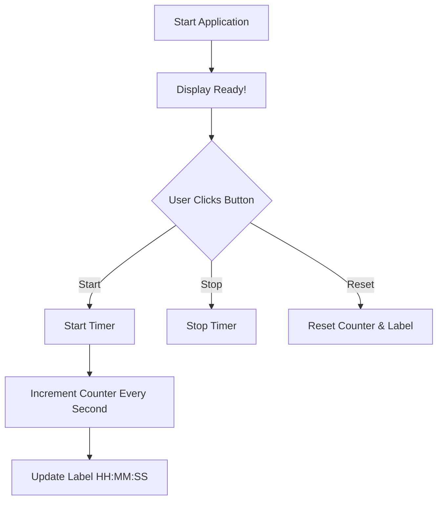

# 🕒 Cool Stopwatch Project

[](https://github.com/alok-kumar8765/Cool_Project_2) 
[](https://github.com/alok-kumar8765/Cool_Project_2) 
[](https://github.com/alok-kumar8765/Cool_Project_2/issues) 
[](https://github.com/alok-kumar8765/Cool_Project_2)  

> A simple and interactive stopwatch built using Python's Tkinter library with Start, Stop, and Reset functionalities.

---

## 📖 Table of Contents

<details>
<summary>Click to expand</summary>

1. [Project Overview](#project-overview)  
2. [Features](#features)  
3. [Installation](#installation)  
4. [Usage](#usage)  
5. [Code Explanation](#code-explanation)  
6. [Architecture & Flow](#architecture--flow)  
7. [Mermaid Diagrams](#mermaid-diagrams)  
8. [Pros & Cons](#pros--cons)  
9. [Real-world Use Cases](#real-world-use-cases)  
10. [Contributing](#contributing)  
11. [License](#license)  

</details>

---

## 📝 Project Overview

This project is a **Graphical User Interface (GUI) stopwatch** that allows users to start, stop, and reset a timer. It is designed with **Python Tkinter** and provides a clear and intuitive interface.  

- **Language**: Python  
- **GUI Library**: Tkinter  
- **Functionality**: Start, Stop, Reset  
- **GitHub Repo**: [Cool_Project_2](https://github.com/alok-kumar8765/Cool_Project_2/tree/main/Create_a_simple_stopwatch)

---

## ✨ Features

<details>
<summary>Click to expand</summary>

- Simple and clean GUI  
- Start, Stop, and Reset timer  
- Displays time in `HH:MM:SS` format  
- Initial display shows `Ready!`  
- Buttons dynamically enable/disable based on state  
- Lightweight and easy to use  

</details>

---

## 💻 Installation

<details>
<summary>Click to expand</summary>

1. Clone the repository:
```bash
git clone https://github.com/alok-kumar8765/Cool_Project_2.git
````

2. Navigate to the project directory:

```bash
cd Cool_Project_2/Create_a_simple_stopwatch
```

3. Run the Python script:

```bash
python stopwatch.py
```

> Make sure Python 3.x is installed on your system. Tkinter comes pre-installed with standard Python distributions.

</details>

---

## 🚀 Usage

<details>
<summary>Click to expand</summary>

1. Open the application by running the Python file.
2. Click **Start** to begin the timer.
3. Click **Stop** to pause the timer.
4. Click **Reset** to reset the timer back to `00:00:00`.
5. The buttons will automatically enable/disable to prevent misuse.

</details>

---

## 🧩 Code Explanation

<details>
<summary>Click to expand</summary>

* `counter_label(label)` → Updates the label every second using `label.after(1000, count)`
* `Start(label)` → Starts the stopwatch and disables the start button
* `Stop()` → Stops the stopwatch and enables the start button
* `Reset(label)` → Resets the counter and label
* `Tkinter` → Used for GUI components: Label, Button, Frame, and Main Window
* Global variables:

  * `counter` → keeps track of elapsed seconds
  * `running` → tracks if stopwatch is active

</details>

---

## 🏗️ Architecture & Flow

<details>
<summary>Click to expand</summary>

**Components**:

* **Tkinter GUI**: Main window, label, buttons
* **Logic Module**: Counter increment and time formatting
* **Control Module**: Start, Stop, Reset button actions

**Data Flow**:

1. User clicks **Start**
2. Counter begins incrementing every second
3. Label updates via `after()` method
4. User can **Stop** or **Reset**
5. Button states are dynamically managed

</details>

---

## 🖋️ Mermaid Diagrams

<details>
<summary>Click to expand</summary>

### Flow Diagram



### Architecture Diagram

```mermaid
graph LR
    GUI[GUI (Tkinter)] --> Logic[Logic Module (Counter)]
    GUI --> Control[Control Module (Start/Stop/Reset)]
    Logic --> Label[Time Display Label]
    Control --> Buttons[Start/Stop/Reset Buttons]
```

### DFD (Data Flow Diagram)

```mermaid
graph TD
    User[User] --> GUI[GUI Input (Buttons)]
    GUI --> Control[Control Logic]
    Control --> Counter[Counter Logic]
    Counter --> GUI[Update Label Display]
```

</details>

---

## ⚖️ Pros & Cons

<details>
<summary>Click to expand</summary>

**Pros**:

* Simple to use and lightweight
* No external dependencies required
* Easy to customize and extend

**Cons**:

* Only works on desktop with Tkinter support
* No lap functionality
* No persistent storage of timer

</details>

---

## 🌍 Real-world Use Cases

<details>
<summary>Click to expand</summary>

* Fitness apps for tracking workouts
* Productivity tools for Pomodoro technique
* Educational use for teaching time and event handling
* Laboratory or industrial tasks needing simple timing functions

**Example**:

* A user wants to time a 30-minute study session. They open the stopwatch, start it, and monitor elapsed time.

</details>

---

## 🤝 Contributing

<details>
<summary>Click to expand</summary>

1. Fork the repository
2. Create your branch (`git checkout -b feature-name`)
3. Commit your changes (`git commit -m 'Add feature'`)
4. Push to the branch (`git push origin feature-name`)
5. Open a Pull Request

</details>

---

## 📄 License

<details>
<summary>Click to expand</summary>

This project is licensed under the **MIT License**. See the [LICENSE](https://github.com/alok-kumar8765/Cool_Project_2/blob/main/LICENSE) file for details.

</details>


---

