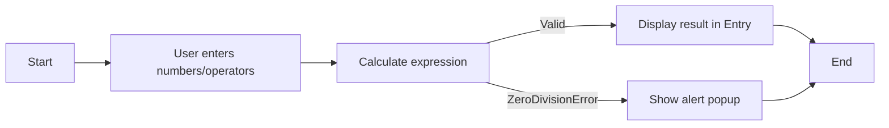

# 🧮 Cool Calculator App

[](https://github.com/alok-kumar8765/Cool_Project_2)
[](https://www.python.org/)
[]()
[](https://github.com/alok-kumar8765/Cool_Project_2/blob/main/LICENSE)

A simple **desktop calculator application** built using **Python Tkinter**, designed for easy arithmetic operations with a user-friendly GUI.  

---

## 📖 Table of Contents
<details>
<summary>Click to expand</summary>

1. [Project Description](#project-description)  
2. [Features](#features)  
3. [Installation](#installation)  
4. [Usage](#usage)  
5. [Architecture & Design](#architecture--design)  
6. [Flow Diagrams](#flow-diagrams)  
7. [Pros & Cons](#pros--cons)  
8. [Real World Use Cases](#real-world-use-cases)  
9. [Contributing](#contributing)  
10. [License](#license)  

</details>

---

## 📝 Project Description
<details>
<summary>Click to expand</summary>

The **Cool Calculator App** is a desktop GUI calculator that allows users to perform standard arithmetic operations such as:

- Addition, Subtraction, Multiplication, Division  
- Exponentiation  
- Decimal calculations  
- Input correction via Backspace and Clear buttons  

It handles exceptions such as **division by zero**, providing alert pop-ups for invalid operations.  

**Technologies used:**
- Python 3.x
- Tkinter (GUI)
- functools.partial for button binding

</details>

---

## ⚙️ Features
<details>
<summary>Click to expand</summary>

- User-friendly **graphical interface**  
- Responsive button layout for digits and operators  
- **Clear**, **Backspace**, and **Quit** functionality  
- Handles errors like **division by zero** gracefully  
- **Exponentiation** and decimal support  
- Simple, lightweight, and fast

</details>

---

## 🛠 Installation
<details>
<summary>Click to expand</summary>

**Step 1:** Clone the repository  
```bash
git clone https://github.com/alok-kumar8765/Cool_Project_2.git
````

**Step 2:** Navigate to project directory

```bash
cd Cool_Project_2/Create_calculator_app
```

**Step 3:** Run the application

```bash
python calculator.py
```

*Ensure Python 3.x is installed on your system.*

</details>

---

## ▶️ Usage

<details>
<summary>Click to expand</summary>

* Launch the app with `python calculator.py`.
* Enter numbers and operators using the GUI buttons.
* Use **`=`** to compute, **`C`** to clear, and **`<-`** to remove last input.
* For division by zero, a popup alerts the user.
* Click **Quit** to close the application.

</details>

---

## 🏗 Architecture & Design

<details>
<summary>Click to expand</summary>

**Core components:**

1. **GUI Layer** – Tkinter Entry & Button widgets
2. **Controller Functions** – `get_input`, `backspace`, `clear`, `calc`, `popupmsg`
3. **Event Binding** – functools.partial used to bind buttons to functions

**System Flow (DFD Level 1):**

```mermaid
flowchart TD
    User --> GUI[Calculator GUI]
    GUI --> Input[Get Input]
    GUI --> Control[Control Buttons: Clear, Backspace]
    Input --> Processor[Calculator Logic (eval)]
    Processor --> Output[Display Result]
    Processor --> ErrorHandler[Popup for Invalid Operations]
```

**Architecture Diagram:**

```mermaid
graph TD
    A[User] --> B[GUI Layer (Tkinter)]
    B --> C[Controller Functions]
    C --> D[Calculator Engine]
    D --> E[Output Display]
    D --> F[Error Handling Module]
```

---

## 🔄 Flow Diagram

<details>
<summary>Click to expand</summary>



</details>

---

## ✅ Pros & Cons

<details>
<summary>Click to expand</summary>

**Pros:**

* Lightweight, simple, and fast
* Cross-platform Python GUI
* Easy to understand and extend
* Minimal dependencies

**Cons:**

* Limited to desktop use
* Basic functionality (no scientific operations like sin, cos)
* No memory/history feature

</details>

---

## 🌐 Real World Use Cases

<details>
<summary>Click to expand</summary>

**Use Cases:**

* Basic arithmetic for students and office tasks
* Quick desktop calculator without installing large software
* Learning tool for Python GUI and Tkinter development

**Example:**
A student can calculate homework problems quickly using the GUI instead of using online calculators.

</details>

---

## 🤝 Contributing

<details>
<summary>Click to expand</summary>

Contributions are welcome!

1. Fork the repository
2. Create a feature branch
3. Commit changes with clear messages
4. Push to GitHub
5. Open a Pull Request

</details>

---

## 📜 License

<details>
<summary>Click to expand</summary>

This project is licensed under the **MIT License**. See [LICENSE](https://github.com/alok-kumar8765/Cool_Project_2/blob/main/LICENSE) for details.

</details>


---
