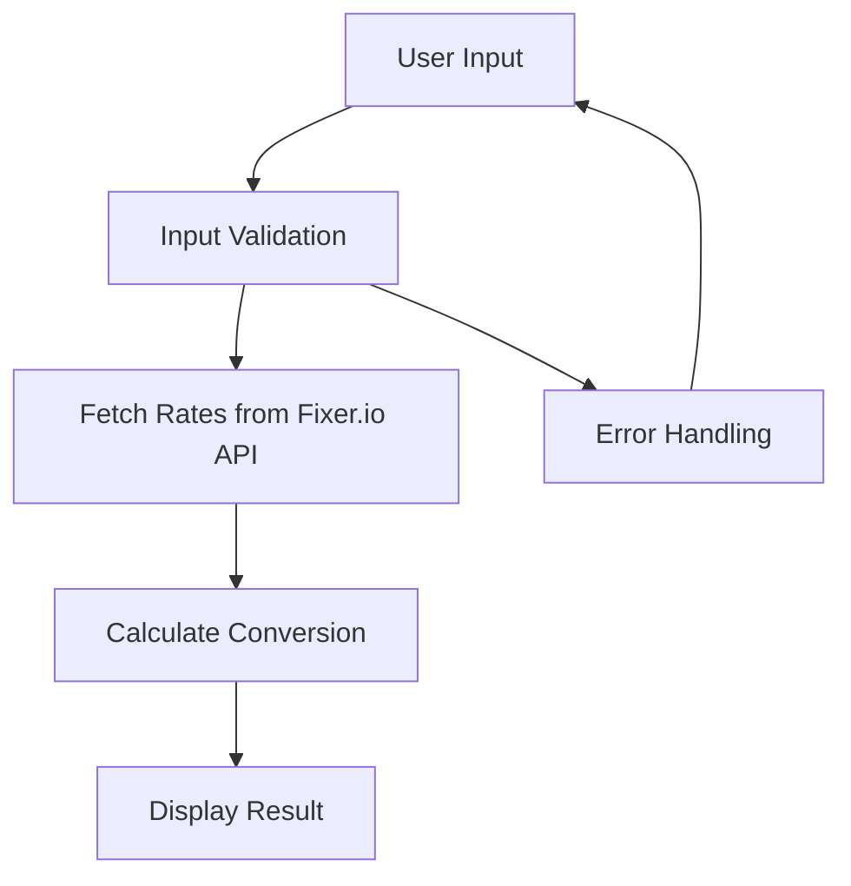
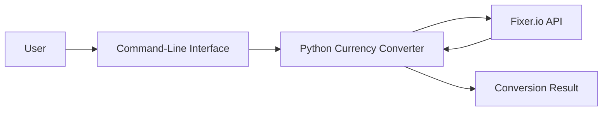
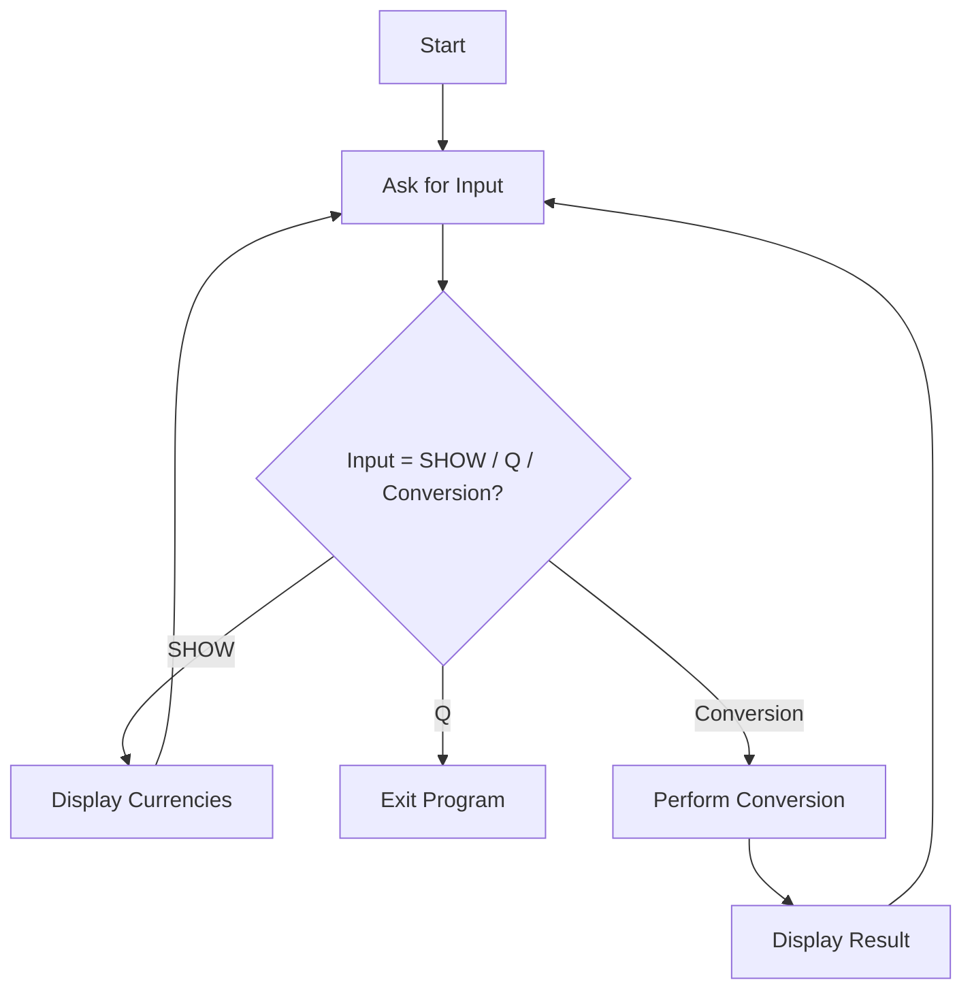

# 💱 Currency Converter – Real-Time Exchange Rates


## 🔗 Repository Link
[Cool_Project_2 - Currency Converter](https://github.com/alok-kumar8765/Cool_Project_2/tree/main/Currency_converter)

---

## 📖 Table of Contents
<details>
<summary>Click to Expand</summary>

1. [Project Description](#project-description)  
2. [Features](#features)  
3. [Installation](#installation)  
4. [Usage](#usage)  
5. [Supported Currencies](#supported-currencies)  
6. [Architecture & Flow](#architecture--flow)  
7. [Diagrams](#diagrams)  
   - [DFD](#data-flow-diagram)  
   - [System Architecture](#system-architecture)  
   - [Program Flow](#program-flow)  
8. [Pros & Cons](#pros--cons)  
9. [Real-World Use Cases](#real-world-use-cases)  
10. [SEO Keywords](#seo-keywords)

</details>

---

## 📝 Project Description
<details>
<summary>Click to Expand</summary>

This **Currency Converter** is a Python-based program that allows you to convert one currency to another using **real-time exchange rates**. It fetches the latest rates from [Fixer.io](https://fixer.io) API and calculates the conversion instantly.  

**Key Highlights:**  
- Fetches live currency exchange rates.  
- Supports a wide range of global currencies including cryptocurrencies (like BTC).  
- Easy command-line interface for user input.  
- Handles invalid inputs gracefully.  

</details>

---

## ✨ Features
<details>
<summary>Click to Expand</summary>

- ✅ Real-time currency conversion using `fixer.io` API  
- ✅ Supports 150+ world currencies  
- ✅ Command-line interaction with options: SHOW, QUIT  
- ✅ Error handling for incorrect inputs  
- ✅ Simple, readable, and modular Python code  

</details>

---

## 💻 Installation
<details>
<summary>Click to Expand</summary>

1. Clone the repository:  
```bash
git clone https://github.com/alok-kumar8765/Cool_Project_2.git
````

2. Navigate to the project directory:

```bash
cd Cool_Project_2/Currency_converter
```

3. Install required Python packages:

```bash
pip install requests
```

4. Run the program:

```bash
python currency_converter.py
```

</details>

---

## 🚀 Usage

<details>
<summary>Click to Expand</summary>

1. Run the script: `python currency_converter.py`
2. Input format:

```
<amount> <from_currency_code> <to_currency_code>
```

Example:

```
100 USD INR
```

3. Special Commands:

* `SHOW` – Displays all supported currencies
* `Q` – Quit the program

</details>

---

## 🌐 Supported Currencies

<details>
<summary>Click to Expand</summary>

The program supports **150+ currencies** including:
`USD, INR, EUR, GBP, JPY, AUD, CAD, BTC, AED, NZD, SGD` and many more.
Use the `SHOW` command in the program to view the complete list.

</details>

---

## 🏗 Architecture & Flow

<details>
<summary>Click to Expand</summary>

**High-Level Architecture:**

1. User inputs amount and currency codes
2. Program fetches real-time rates from Fixer.io API
3. Conversion calculation performed
4. Result displayed to the user

**Technology Stack:**

* Python 3.8+
* Requests library for HTTP requests
* JSON for parsing API response

</details>

---

## 📊 Diagrams

<details>
<summary>Click to Expand</summary>

### Data Flow Diagram



### System Architecture



### Program Flow



</details>

---

## ⚖️ Pros & Cons

<details>
<summary>Click to Expand</summary>

**Pros:**

* Real-time exchange rates
* Wide currency support
* Simple CLI interface
* Easy to extend for GUI or web app

**Cons:**

* Requires internet access
* API key must be valid
* Limited error handling for advanced edge cases

</details>

---

## 🌍 Real-World Use Cases

<details>
<summary>Click to Expand</summary>

* Travel: Instantly calculate currency conversion while abroad
* E-commerce: Price conversion for global users
* Finance: Quick evaluation of investment across currencies
* Cryptocurrency trading: Conversion between fiat and crypto (BTC supported)

**Example:**

```
Input: 50 USD INR
Output: 50 USD amounts to 4,140.25 INR today
```

</details>

---

## 🔑 SEO Keywords

<details>
<summary>Click to Expand</summary>

Currency Converter, Python Currency Converter, Real-Time Exchange Rate, Currency Conversion Tool, Python Projects, CLI Python Project, Forex Converter, Fixer.io API, Currency Exchange, Global Currency Converter, Cryptocurrency Conversion

</details>


---
