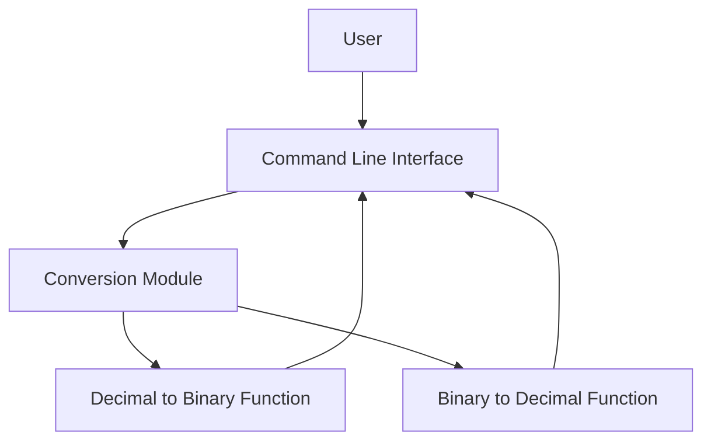
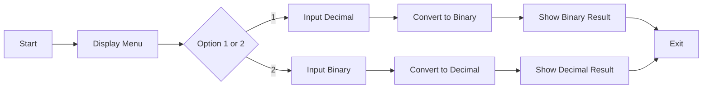

# Decimal & Binary Converter 🧮

[](https://github.com/alok-kumar8765/Cool_Project_2) 
[](https://github.com/alok-kumar8765/Cool_Project_2/stargazers) 
[](https://github.com/alok-kumar8765/Cool_Project_2/issues) 
[](https://github.com/alok-kumar8765/Cool_Project_2/blob/main/LICENSE)

---

## 📖 Table of Contents
<details>
<summary>Click to Expand</summary>

1. [Project Overview](#project-overview)  
2. [Features](#features)  
3. [Installation & Usage](#installation--usage)  
4. [Code Explanation](#code-explanation)  
5. [Architecture & Flow](#architecture--flow)  
    - [DFD](#data-flow-diagram)  
    - [System Architecture](#system-architecture)  
    - [Flow Diagram](#flow-diagram)  
6. [Pros & Cons](#pros--cons)  
7. [Use Cases & Real World Examples](#use-cases--real-world-examples)  
8. [License](#license)  

</details>

---

## 📝 Project Overview
This project is a **Decimal to Binary and Binary to Decimal converter** built using **Python**. It provides a simple, interactive CLI interface to convert numbers between decimal and binary systems.  

**Key Highlights:**  
- User-friendly input selection  
- Error handling for invalid inputs  
- Instant conversion output  
- Lightweight and easy-to-understand code  

**GitHub Repo:** [Cool_Project_2](https://github.com/alok-kumar8765/Cool_Project_2/tree/main/Decimal_to_binary_convertor_and_vice_versa)  

---

## ⚡ Features
<details>
<summary>Click to Expand</summary>

- Convert decimal numbers to binary format.  
- Convert binary numbers to decimal format.  
- Handles invalid options and input errors gracefully.  
- CLI-based interactive menu for easy usage.  
- Minimalist and efficient Python implementation.  

</details>

---

## 💻 Installation & Usage
<details>
<summary>Click to Expand</summary>

**Requirements:**  
- Python 3.x installed  

**Steps to Run:**  

```bash
# Clone the repository
git clone https://github.com/alok-kumar8765/Cool_Project_2.git

# Navigate to the project folder
cd Cool_Project_2/Decimal_to_binary_convertor_and_vice_versa

# Run the Python script
python converter.py
````

**Usage Example:**

```
Choose an option: 
 1. Decimal to binary 
 2. Binary to decimal
 Option: 1
Input your decimal number:
Decimal: 10
Binary: 1010
```

</details>

---

## 🧩 Code Explanation

<details>
<summary>Click to Expand</summary>

```python
try:
    menu = int(input("Choose an option: \n 1. Decimal to binary \n 2. Binary to decimal\n Option: "))
    if menu < 1 or menu > 2:
        raise ValueError
    if menu == 1:
        dec = int(input("Input your decimal number:\nDecimal: "))
        print("Binary: {}".format(bin(dec)[2:]))
    elif menu == 2:
        binary = input("Input your binary number:\n Binary: ")
        print("Decimal: {}".format(int(binary, 2)))
except ValueError:
    print ("please choose a valid option")
```

**Explanation:**

* Prompts user to select conversion option (decimal→binary or binary→decimal).
* Validates user input (must be 1 or 2).
* Converts decimal to binary using `bin()` function (removes `0b` prefix).
* Converts binary to decimal using `int(binary, 2)`.
* Handles invalid inputs with `ValueError`.

</details>

---

## 🏗 Architecture & Flow

### Data Flow Diagram

<details>
<summary>Click to Expand</summary>

```mermaid
flowchart TD
    A[Start] --> B[Show Menu Options]
    B --> C{User Selects Option}
    C -->|1| D[Input Decimal Number]
    C -->|2| E[Input Binary Number]
    D --> F[Convert to Binary using bin()]
    E --> G[Convert to Decimal using int()]
    F --> H[Display Binary Result]
    G --> I[Display Decimal Result]
    H --> J[End]
    I --> J[End]
```

</details>

### System Architecture

<details>
<summary>Click to Expand</summary>



</details>

### Flow Diagram

<details>
<summary>Click to Expand</summary>



</details>

---

## ✅ Pros & Cons

<details>
<summary>Click to Expand</summary>

**Pros:**

* Lightweight and simple.
* Easy to understand and modify.
* Fast conversion for small and large numbers.
* Minimal dependencies (pure Python).

**Cons:**

* Only supports decimal and binary conversions.
* CLI-only, no GUI interface.
* Limited error handling for non-numeric binary inputs.

</details>

---

## 🌍 Use Cases & Real World Examples

<details>
<summary>Click to Expand</summary>

**Use Cases:**

* Educational tool for learning binary and decimal systems.
* Quick conversions for software developers and programmers.
* Embedded system debugging requiring binary representation.
* Base conversion tasks in computer science exercises.

**Real World Example:**

* Microcontroller programming often requires binary inputs; this tool allows developers to quickly convert decimal sensor readings to binary for debugging.

</details>

---

## 📜 License

<details>
<summary>Click to Expand</summary>

This project is licensed under the MIT License. See the [LICENSE](https://github.com/alok-kumar8765/Cool_Project_2/blob/main/LICENSE) file for details.

</details>


---

