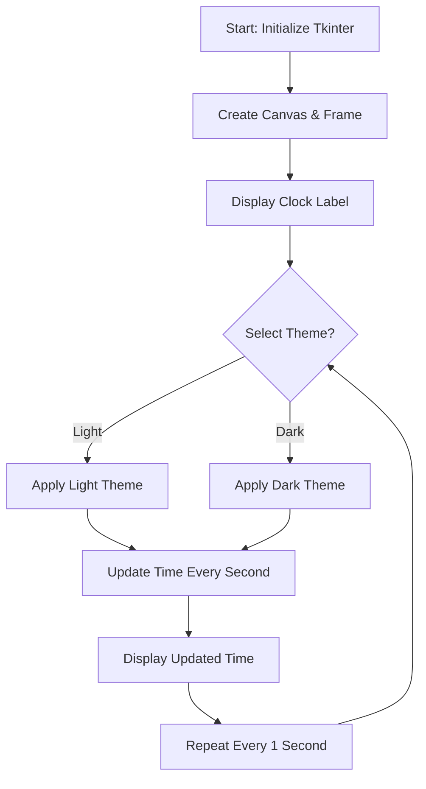
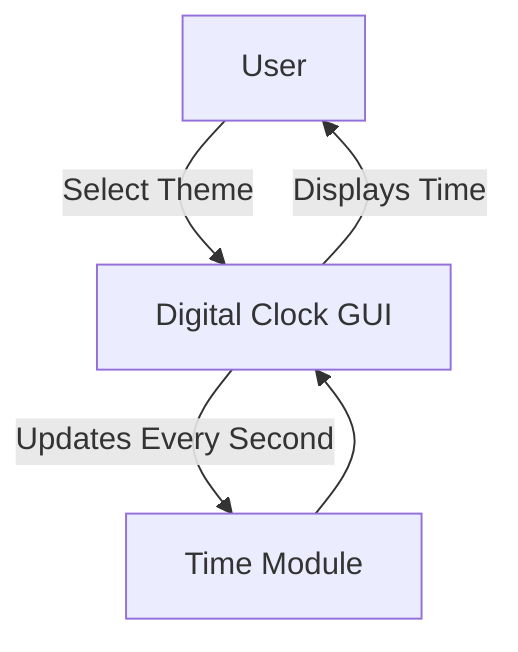
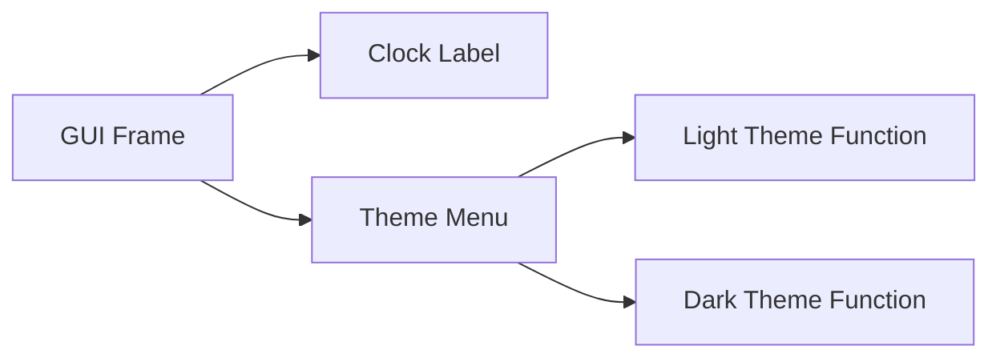

# 🕒 Digital Clock GUI Application


[](https://github.com/alok-kumar8765/Cool_Project_2/tree/main/Digital_clock)

---

## 📖 Table of Contents
<details>
<summary>Click to expand</summary>

1. [Project Overview](#-project-overview)  
2. [Features](#-features)  
3. [Installation & Usage](#-installation--usage)  
4. [Code Explanation](#-code-explanation)  
5. [Architecture & Flow](#-architecture--flow)  
6. [Pros & Cons](#-pros--cons)  
7. [Use Cases & Real World Applications](#-use-cases--real-world-applications)  
8. [Contribution & License](#-contribution--license)

</details>

---

## 📌 Project Overview
<details>
<summary>Click to expand</summary>

The **Digital Clock GUI Application** is a lightweight, interactive desktop clock built using **Python** and **Tkinter**.  
It displays real-time time in **12-hour format** with **AM/PM**, featuring **dark and light themes**.  

This project is ideal for beginners to understand **Tkinter GUI programming**, **dynamic label updates**, and **theme customization**.  

**SEO Keywords:** Python Digital Clock, Tkinter Clock, GUI Clock Application, Real-time Clock, Desktop Clock Python

</details>

---

## ✨ Features
<details>
<summary>Click to expand</summary>

- Real-time digital clock display (HH:MM:SS AM/PM)  
- **Theme switcher:** Light and Dark modes  
- Dynamic time updates every second using `after()`  
- Responsive Tkinter GUI  
- Easy to extend with alarms or custom formats  

</details>

---

## 💻 Installation & Usage
<details>
<summary>Click to expand</summary>

### Requirements
- Python 3.x
- Tkinter (usually pre-installed with Python)
  
### Steps to Run
1. Clone the repository:
   ```bash
   git clone https://github.com/alok-kumar8765/Cool_Project_2.git
````

2. Navigate to the Digital Clock folder:

   ```bash
   cd Cool_Project_2/Digital_clock
   ```
3. Run the script:

   ```bash
   python digital_clock.py
   ```
4. Switch themes via the **Theme menu** on the top menu bar.

</details>

---

## 🧩 Code Explanation

<details>
<summary>Click to expand</summary>

* **Tkinter GUI Setup**: Initializes `Tk()`, `Canvas`, and `Frame` to hold clock labels.
* **Dynamic Clock Update**: Uses `strftime()` from `time` module to get current time.
* **Theme Functions**: `light_theme()` and `dark_theme()` update background and label colors.
* **Menu Integration**: `Menu` widget allows switching between light and dark themes.
* **Recursive Time Update**: `.after(1000, time)` updates the clock every 1 second.

---

**Key Functions**

| Function        | Purpose                          |
| --------------- | -------------------------------- |
| `time()`        | Updates clock label every second |
| `light_theme()` | Switches GUI to light theme      |
| `dark_theme()`  | Switches GUI to dark theme       |

</details>

---

## 🏗️ Architecture & Flow

<details>
<summary>Click to expand</summary>

### Architecture Diagram



### Data Flow Diagram (DFD Level 0)



### Component Diagram



</details>

---

## ✅ Pros & Cons

<details>
<summary>Click to expand</summary>

### Pros

* Lightweight and beginner-friendly
* Easy to customize themes
* Real-time dynamic updates
* No external dependencies besides Python

### Cons

* Limited to desktop environments
* No advanced features like alarms or notifications
* Minimal error handling for edge cases

</details>

---

## 🌍 Use Cases & Real World Applications

<details>
<summary>Click to expand</summary>

* **Desktop Clock**: Personal use for desktops or kiosks
* **Learning GUI Development**: Beginner-friendly project for Python Tkinter
* **Time Tracker**: Can be extended for productivity apps
* **Themed Dashboard Widgets**: Embed clock in Python-based dashboards

**Example Real-world Scenario**
A developer can integrate this digital clock into a **Python-based dashboard** for office monitoring, providing real-time time visibility along with system metrics.

</details>

---

## 🤝 Contribution & License

<details>
<summary>Click to expand</summary>

* Contributions are welcome!
* Fork the repo, make improvements, and create a pull request.
* Licensed under **MIT License**

**GitHub Repo:** [alok-kumar8765/Cool_Project_2](https://github.com/alok-kumar8765/Cool_Project_2/tree/main/Digital_clock)

</details>

---

**SEO-Optimized Description:**
Digital Clock Python Tkinter, Real-time GUI Clock, Desktop Clock Python, Python Clock App, Light/Dark Theme Clock, Beginner GUI Project.


---

