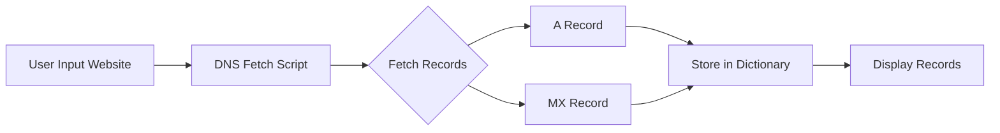
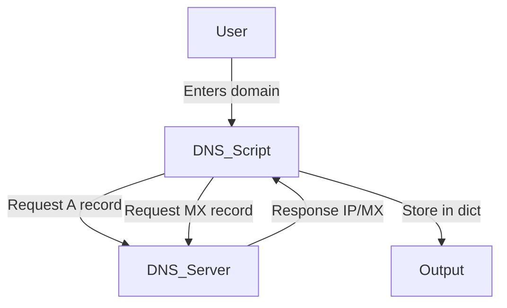

# 🌐 Cool Project 2 - DNS Record Fetcher

[](https://github.com/alok-kumar8765/Cool_Project_2)  
[](https://github.com/alok-kumar8765/Cool_Project_2/blob/main/LICENSE)  
[](https://github.com/alok-kumar8765/Cool_Project_2/issues)  
[](https://www.python.org/)  

## 📖 Table of Contents
<details>
<summary>Click to Expand</summary>

1. [Project Description](#project-description)  
2. [Features](#features)  
3. [Installation](#installation)  
4. [Usage](#usage)  
5. [Code Explanation](#code-explanation)  
6. [Architecture & Flow Diagrams](#architecture--flow-diagrams)  
7. [Pros & Cons](#pros--cons)  
8. [Real-World Use Cases](#real-world-use-cases)  
9. [SEO Keywords & Optimization](#seo-keywords--optimization)  

</details>

---

## 📝 Project Description
This is a **Python-based DNS Record Fetcher** that allows users to fetch `A` and `MX` records of any website. The tool uses the `dns.resolver` module to extract DNS information and displays it in a structured format.  

**Key Points:**  
- Fetches IP addresses (`A` record) and mail servers (`MX` record)  
- Stores data in a Python dictionary for structured access  
- Easy to use via command-line interface  

**Repo Link:** [Cool_Project_2 - Dns_record](https://github.com/alok-kumar8765/Cool_Project_2/tree/main/Dns_record)

---

## ✨ Features
<details>
<summary>Click to Expand</summary>

- Simple command-line DNS lookup tool  
- Fetches **A records** (IPv4 addresses)  
- Fetches **MX records** (mail exchange servers)  
- Stores DNS info in a **Python dictionary**  
- Modular code structure for easy updates  
- Lightweight and dependency-minimal  

</details>

---

## 🛠 Installation
<details>
<summary>Click to Expand</summary>

1. Clone the repository:
```bash
git clone https://github.com/alok-kumar8765/Cool_Project_2.git
````

2. Navigate to the DNS record folder:

```bash
cd Cool_Project_2/Dns_record
```

3. Install dependencies:

```bash
pip install dnspython
```

4. Run the program:

```bash
python dns_fetcher.py
```

</details>

---

## 🚀 Usage

<details>
<summary>Click to Expand</summary>

1. Run the script.
2. Enter the website domain when prompted, e.g., `example.com`.
3. Output will display DNS records in key-value format:

Example Output:

```
('MX_Record', 1) = 10 mail.example.com.
A_Record_IP = 93.184.216.34
```

</details>

---

## 🧩 Code Explanation

<details>
<summary>Click to Expand</summary>

* **Importing Modules:** `import dns.resolver`
* **DNS Dictionary:** Stores `A` and `MX` records.
* **Fetching 'A' Record:** `dns.resolver.resolve(website, 'A')` → gets IP address.
* **Fetching 'MX' Records:** `dns.resolver.resolve(website, 'MX')` → stores all mail servers in a list.
* **Storing Records:**

  * `dns_record['A_Record_IP'] = <IP>`
  * `dns_record['MX_Record', i+1] = <MX server>`
* **Displaying Records:** Iterates over dictionary and prints results.

</details>

---

## 🏗 Architecture & Flow Diagrams

<details>
<summary>Click to Expand</summary>

### 1️⃣ System Architecture (Mermaid)



### 2️⃣ Data Flow Diagram (DFD)



### 3️⃣ Workflow Diagram


</details>

---

## ✅ Pros & Cons

<details>
<summary>Click to Expand</summary>

### Pros

* Lightweight and fast
* Easy to understand and modify
* No database required
* Works on any Python-supported OS

### Cons

* Limited to `A` and `MX` records (can be extended)
* Command-line only (no GUI/web interface)
* No error handling for invalid domains (can be improved)

</details>

---

## 🌍 Real-World Use Cases

<details>
<summary>Click to Expand</summary>

* **Network Administration:** Quickly verify DNS settings of company domains
* **Email Deliverability:** Check MX records for email servers
* **Cybersecurity:** Identify possible phishing or spoofed domains
* **IT Support:** Troubleshoot website connectivity issues
* **Learning Tool:** Educational example for Python DNS modules

**Example:**
A sysadmin wants to confirm the MX records of `example.com` to ensure emails route correctly. Running this tool provides a quick verification.

</details>

---
