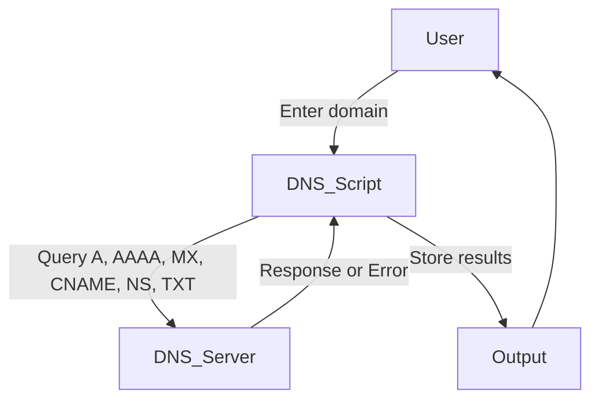

# 🌐 Cool Project 2 - Advanced DNS Record Fetcher

[](https://github.com/alok-kumar8765/Cool_Project_2)  
[](https://github.com/alok-kumar8765/Cool_Project_2/blob/main/LICENSE)  
[](https://github.com/alok-kumar8765/Cool_Project_2/issues)  
[](https://www.python.org/)  

## 📖 Table of Contents
<details>
<summary>Click to Expand</summary>

1. [Project Description](#project-description)  
2. [Features](#features)  
3. [Installation](#installation)  
4. [Usage](#usage)  
5. [Code Explanation](#code-explanation)  
6. [Architecture & Flow Diagrams](#architecture--flow-diagrams)  
7. [Pros & Cons](#pros--cons)  
8. [Real-World Use Cases](#real-world-use-cases)  
9. [SEO Keywords & Optimization](#seo-keywords--optimization)  

</details>

---

## 📝 Project Description
This is an **advanced Python-based DNS Record Fetcher** that allows users to fetch multiple DNS record types (`A`, `AAAA`, `MX`, `CNAME`, `NS`, `TXT`) for any website with **automatic error handling**.  

**Repo Link:** [Cool_Project_2 - Dns_record](https://github.com/alok-kumar8765/Cool_Project_2/tree/main/Dns_record)

---

## ✨ Features
<details>
<summary>Click to Expand</summary>

- Fetches `A` (IPv4) and `AAAA` (IPv6) records  
- Fetches `MX` (Mail Exchange), `CNAME`, `NS`, and `TXT` records  
- Automatic error handling for invalid domains, timeouts, or missing records  
- Stores records in a **Python dictionary** for easy programmatic access  
- Lightweight, command-line based, minimal dependencies (`dnspython`)  
- Extensible for additional DNS record types  

</details>

---

## 🛠 Installation
<details>
<summary>Click to Expand</summary>

```bash
git clone https://github.com/alok-kumar8765/Cool_Project_2.git
cd Cool_Project_2/Dns_record
pip install dnspython
python dns_fetcher_extended.py
````

</details>

---

## 🚀 Usage

<details>
<summary>Click to Expand</summary>

1. Run the script:

```bash
python dns_fetcher_extended.py
```

2. Enter the domain, e.g., `example.com`.

**Sample Output:**

```
DNS Records for example.com:
A: ['93.184.216.34']
AAAA: ['2606:2800:220:1:248:1893:25c8:1946']
MX: ['mx.example.com']
CNAME: None
NS: ['a.iana-servers.net.', 'b.iana-servers.net.']
TXT: ['v=spf1 -all']
```

</details>

---

## 🧩 Code Explanation

<details>
<summary>Click to Expand</summary>

* **Function `fetch_dns_records()`**: Fetches multiple DNS record types and handles errors.
* **Record Types Supported**: `A`, `AAAA`, `MX`, `CNAME`, `NS`, `TXT`.
* **Error Handling**:

  * `NXDOMAIN`: Domain does not exist
  * `NoAnswer`: Record type not found
  * `Timeout`: Query timed out
  * Other exceptions caught and logged
* **Dictionary Output**: Key = record type, Value = list of results or error message

</details>

---

## 🏗 Architecture & Flow Diagrams

<details>
<summary>Click to Expand</summary>

### 1️⃣ System Architecture


### 2️⃣ Data Flow Diagram (DFD)



### 3️⃣ Workflow Diagram


</details>

---

## ✅ Pros & Cons

<details>
<summary>Click to Expand</summary>

### Pros

* Supports multiple DNS types
* Automatic error handling
* Easy to extend to other DNS types
* Lightweight, no heavy dependencies

### Cons

* CLI only, no GUI
* DNS queries can be slow for large records
* Requires internet connection

</details>

---

## 🌍 Real-World Use Cases

<details>
<summary>Click to Expand</summary>

* **Network Administration:** Verify domain DNS settings
* **Email Verification:** Check MX records before sending emails
* **Cybersecurity:** Detect misconfigured or spoofed domains
* **IT Troubleshooting:** Check site connectivity issues
* **Educational Tool:** Learn Python DNS module usage

**Example:**
A network admin wants to validate SPF TXT records for `example.com` to ensure email deliverability. Using this tool provides instant results.

</details>

---
1. Automatically handle invalid domains, network errors, or missing records.
2. Fetch **extended DNS record types**: `A`, `AAAA` (IPv6), `MX`, `CNAME`, `NS`, and `TXT`.
3. Keep the output structured and clear.
4. Update the README accordingly with diagrams and explanations.

Here’s the **enhanced Python script with error handling and extended DNS types**:

```python
# dns_fetcher_extended.py
import dns.resolver

def fetch_dns_records(website):
    """
    Fetches DNS records of a website including A, AAAA, MX, CNAME, NS, and TXT.
    
    Parameters:
        website (str): Domain name of the website.
    
    Returns:
        dict: Dictionary containing DNS records.
    """
    dns_record = {}
    record_types = ['A', 'AAAA', 'MX', 'CNAME', 'NS', 'TXT']

    for rtype in record_types:
        try:
            answers = dns.resolver.resolve(website, rtype)
            if rtype == 'MX':
                dns_record[rtype] = [str(r.exchange) for r in answers]
            elif rtype == 'TXT':
                dns_record[rtype] = [b''.join(r.strings).decode() for r in answers]
            else:
                dns_record[rtype] = [r.to_text() for r in answers]
        except dns.resolver.NoAnswer:
            dns_record[rtype] = None
        except dns.resolver.NXDOMAIN:
            dns_record[rtype] = f"Domain {website} does not exist"
            break
        except dns.resolver.Timeout:
            dns_record[rtype] = "Query timed out"
        except Exception as e:
            dns_record[rtype] = f"Error: {e}"

    return dns_record

def main():
    website = input("Enter the name of the website (e.g., example.com): ")
    records = fetch_dns_records(website)

    print(f"\nDNS Records for {website}:\n")
    for rtype, values in records.items():
        print(f"{rtype}: {values}")

if __name__ == "__main__":
    main()
```

✅ **Key Improvements**:

* Handles invalid domains (`NXDOMAIN`)
* Handles network timeouts (`Timeout`)
* Handles missing record types (`NoAnswer`)
* Fetches additional DNS types: `AAAA`, `CNAME`, `NS`, `TXT`
* Returns structured dictionary for easy use

---
