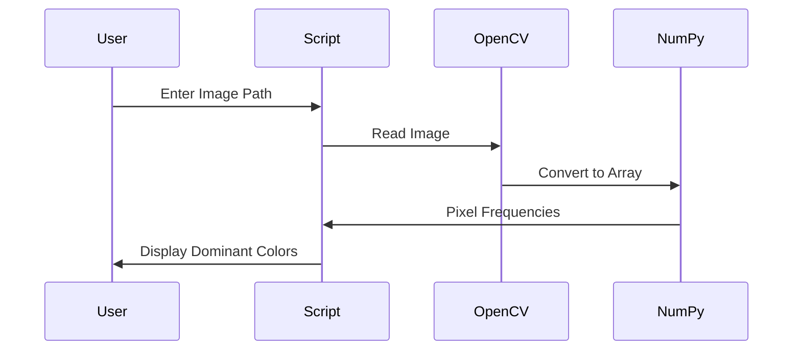

# 🎨 Dominant Color Detection using OpenCV & NumPy

<p align="center">
  
  
  
  
  
</p>

---

## 📌 Project Title
**Dominant Color Detection from Image using Python (OpenCV + NumPy)**

---

## 🧠 Project Description
<details>
<summary><b>Click to expand</b></summary>

This project detects the **most dominant pixel intensities** present in an image using **OpenCV** and **NumPy**.  
It reads an image from a user-provided path, analyzes pixel distribution, identifies the **top 3 most frequent pixel values**, and visually displays:

- Combined dominant tone
- Single dominant grayscale color

The project is lightweight, beginner-friendly, and ideal for **computer vision fundamentals**, **image analysis**, and **color processing** tasks.

</details>

---

## 📂 Repository Structure
<details>
<summary><b>Click to expand</b></summary>

```

Cool_Project_2/
└── Dominant_color/
├── dominant_color.py
└── README.md

````

</details>

---

## 📖 Table of Contents
<details>
<summary><b>Click to expand</b></summary>

1. Introduction  
2. Features  
3. Tech Stack  
4. How It Works  
5. Data Flow Diagram (DFD)  
6. System Architecture  
7. Execution Flow Diagram  
8. Code Explanation  
9. Real-World Use Cases  
10. Pros & Cons  
11. Example Output  
12. Installation & Usage  
13. Future Enhancements  

</details>

---

## ✨ Features
<details>
<summary><b>Click to expand</b></summary>

- ✅ Reads image dynamically from user input
- ✅ Extracts pixel-level frequency
- ✅ Detects **Top 3 dominant colors**
- ✅ Displays dominant tone visually
- ✅ Generates grayscale dominant color
- ✅ Lightweight & fast execution
- ✅ No external ML models required

</details>

---

## 🛠 Tech Stack
<details>
<summary><b>Click to expand</b></summary>

- **Python 3**
- **OpenCV (cv2)**
- **NumPy**
- **Mermaid (for diagrams)**

</details>

---

## ⚙️ How It Works
<details>
<summary><b>Click to expand</b></summary>

1. User inputs image path
2. Image is read using OpenCV
3. Image converted to NumPy array
4. Unique pixel values counted
5. Most frequent pixel intensities extracted
6. Visual representation generated

</details>

---

## 🧾 Data Flow Diagram (DFD)
<details>
<summary><b>Click to expand</b></summary>

```mermaid
flowchart TD
    A[User Inputs Image Path] --> B[Read Image using OpenCV]
    B --> C[Convert Image to NumPy Array]
    C --> D[Extract Unique Pixel Values]
    D --> E[Count Pixel Frequency]
    E --> F[Sort by Dominance]
    F --> G[Display Dominant Colors]
````

</details>

---

## 🏗 System Architecture

<details>
<summary><b>Click to expand</b></summary>

```mermaid
graph LR
    User -->|Path Input| OpenCV
    OpenCV --> NumPy
    NumPy --> FrequencyAnalysis
    FrequencyAnalysis --> Visualization
```

</details>

---

## 🔄 Execution Flow Diagram

<details>
<summary><b>Click to expand</b></summary>



</details>

---

## 🧩 Code Explanation

<details>
<summary><b>Click to expand</b></summary>

* `cv2.imread()` → Reads the image
* `np.unique()` → Finds unique pixel values & counts
* `sorted()` → Sorts by frequency
* Top 3 values represent **dominant tones**
* Blank images created to visualize detected colors

</details>

---

## 🌍 Real-World Use Cases

<details>
<summary><b>Click to expand</b></summary>

### 🔹 Image Processing

* Background color detection
* Theme extraction for UI/UX

### 🔹 E-Commerce

* Auto-tag product colors
* Color-based search filters

### 🔹 Medical Imaging

* Tissue tone detection
* X-ray grayscale analysis

### 🔹 Security & Surveillance

* Lighting condition analysis
* Scene brightness detection

</details>

---

## 👍 Pros & 👎 Cons

<details>
<summary><b>Click to expand</b></summary>

### ✅ Pros

* Simple & fast
* No ML dependency
* Beginner friendly
* Real-time execution

### ❌ Cons

* Pixel-based (no clustering)
* Not ideal for complex images
* No RGB channel separation

</details>

---

## 🖼 Example Output

<details>
<summary><b>Click to expand</b></summary>

* **Tone Window:** Combined dominant pixel tones
* **Color Window:** Single most dominant grayscale color
* **Console Output:** Top 3 pixel values

</details>

---

## 🚀 Installation & Usage

<details>
<summary><b>Click to expand</b></summary>

```bash
pip install opencv-python numpy
```

```bash
python dominant_color.py
```

Enter full image path when prompted.

</details>

---

## 🔮 Future Enhancements

<details>
<summary><b>Click to expand</b></summary>

* 🔹 K-Means color clustering
* 🔹 RGB dominant extraction
* 🔹 GUI interface
* 🔹 Batch image processing
* 🔹 Web & API integration

</details>

---

## 👨‍💻 Author

**Alok Kumar**
🔗 GitHub: [https://github.com/alok-kumar8765](https://github.com/alok-kumar8765)

---

## ⭐ Support

If you like this project, **give it a star ⭐** and share it 🚀


---
