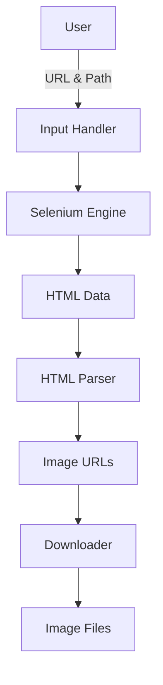

# 📸 Download Images from Website using Selenium & BeautifulSoup  

<p align="center">
  
  
  
  
  
  
</p>

---

<details>
<summary><strong>📌 Project Overview</strong></summary>

## 🔹 Title
**Automated Image Downloader from Websites**

## 🔹 Description
This project is a **Python-based web automation and scraping utility** that automatically downloads **all images from a given website URL** using **Selenium**, **BeautifulSoup**, and **Requests**.

It is especially useful for:
- Websites with **dynamic content**
- Images loaded via **JavaScript**
- Automation-based scraping where traditional requests fail

📂 **Repository Path**  
`Cool_Project_2/Download_images_from_website`

</details>

---

<details>
<summary><strong>📑 Table of Contents</strong></summary>

- 📌 Project Overview  
- ⚙️ Technologies Used  
- 🧠 How It Works  
- 🔄 Flow Diagram  
- 🏗️ System Architecture  
- 📊 Data Flow Diagram (DFD)  
- 📁 Folder Structure  
- 🚀 Installation & Usage  
- ✅ Features  
- ⚠️ Limitations  
- 📈 Real-World Use Cases  
- 🧪 Practical Examples  
- 👍 Pros & 👎 Cons  
- 🔐 Ethical & Legal Notes  

</details>

---

<details>
<summary><strong>⚙️ Technologies Used</strong></summary>

- **Python 3.x**
- **Selenium WebDriver**
- **BeautifulSoup (bs4)**
- **Requests**
- **ChromeDriver**
- **HTML Parsing**
- **Automation & Web Scraping**

</details>

---

<details>
<summary><strong>🧠 How This Script Works (Step-by-Step)</strong></summary>

1. User provides:
   - ChromeDriver path
   - Target website URL
2. Selenium launches Chrome browser
3. JavaScript-rendered HTML is extracted
4. BeautifulSoup parses `` tags
5. Image URLs are collected
6. Images are downloaded using Requests
7. Files are stored in a local `output/` directory

✔ Handles `.jpg`, `.jpeg`, `.png`, `.gif` formats  
✔ Works on JavaScript-heavy websites  

</details>

---

<details>
<summary><strong>🔄 Flow Diagram</strong></summary>

```mermaid
flowchart TD
    A[User Inputs Path & URL] --> B[Launch Selenium Browser]
    B --> C[Load Web Page]
    C --> D[Extract HTML DOM]
    D --> E[Parse IMG Tags]
    E --> F[Download Images]
    F --> G[Save to Output Folder]
    G --> H[Process Completed]
````

</details>

---

<details>
<summary><strong>🏗️ System Architecture</strong></summary>

```mermaid
graph LR
    User --> Selenium
    Selenium --> Browser
    Browser --> HTML_DOM
    HTML_DOM --> BeautifulSoup
    BeautifulSoup --> Image_Links
    Image_Links --> Requests
    Requests --> Local_Storage
```

</details>

---

<details>
<summary><strong>📊 Data Flow Diagram (DFD)</strong></summary>



</details>

---

<details>
<summary><strong>📁 Folder Structure</strong></summary>

```
Download_images_from_website/
│
├── output/
│   ├── 1.jpg
│   ├── 2.png
│   └── ...
│
├── image_downloader.py
└── README.md
```

</details>

---

<details>
<summary><strong>🚀 Installation & Usage</strong></summary>

### 🔹 Install Dependencies

```bash
pip install selenium requests beautifulsoup4 lxml
```

### 🔹 Download ChromeDriver

* Match Chrome version
* Add path during runtime

### 🔹 Run Script

```bash
python image_downloader.py
```

### 🔹 Input Example

```text
Enter Path : C:\chromedriver\chromedriver.exe
Enter URL  : https://example.com
```

</details>

---

<details>
<summary><strong>✅ Key Features</strong></summary>

* ✔ JavaScript-rendered image support
* ✔ Automated browser handling
* ✔ Multiple image format support
* ✔ Dynamic content scraping
* ✔ Lightweight & extensible
* ✔ Beginner-friendly

</details>

---

<details>
<summary><strong>⚠️ Limitations</strong></summary>

* ❌ Does not handle lazy-loaded images perfectly
* ❌ No multithreading (slower for large sites)
* ❌ No duplicate image detection
* ❌ Requires ChromeDriver compatibility

</details>

---

<details>
<summary><strong>📈 Real-World Use Cases</strong></summary>

### 🔹 Digital Marketing

Download banner images for competitor analysis.

### 🔹 Data Science

Collect image datasets for ML training.

### 🔹 Web Archiving

Backup static resources from legacy websites.

### 🔹 E-commerce

Extract product images for testing/demo environments.

</details>

---

<details>
<summary><strong>🧪 Practical Example</strong></summary>

**Scenario:**
You want to download all images from a photography portfolio website that loads images dynamically.

**Solution:**
This script renders the page fully using Selenium and extracts images seamlessly.

</details>

---

<details>
<summary><strong>👍 Pros & 👎 Cons</strong></summary>

### ✅ Pros

* Handles JS-heavy websites
* Simple & readable code
* Modular function-based design
* Easily extendable

### ❌ Cons

* High resource usage (browser-based)
* Slower than pure requests scraping
* Not headless by default

</details>

---

<details>
<summary><strong>🔐 Ethical & Legal Considerations</strong></summary>

* ⚠ Always respect **robots.txt**
* ⚠ Do not scrape copyrighted or private content
* ⚠ Use responsibly for educational & research purposes only

</details>

---

<p align="center">
<strong>⭐ If you find this project useful, consider starring the repository!</strong><br>
🔗 <a href="https://github.com/alok-kumar8765/Cool_Project_2">GitHub Repository</a>
</p>


---

