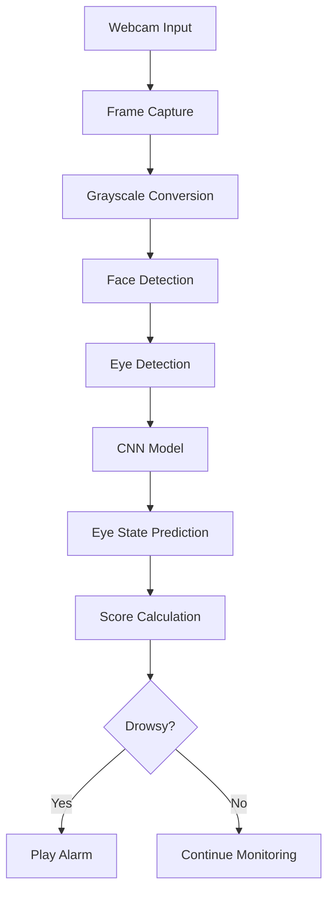
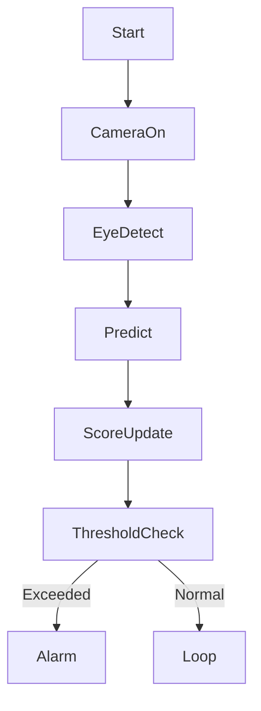

# 🚗 Driver Drowsiness Detection System using Deep Learning & OpenCV

<p align="center">
  
  
  
  
  
  
  
</p>

---

## 📌 Project Overview

<details>
<summary><b>🔽 Description</b></summary>

This project implements a **real-time Driver Drowsiness Detection System** using **Computer Vision**, **Convolutional Neural Networks (CNN)**, and **OpenCV**.  
The system monitors a driver's eye state (Open/Closed) through a webcam feed and triggers an **audio alarm** when prolonged eye closure is detected — helping prevent road accidents caused by fatigue.

</details>

---

## 📚 Table of Contents

<details>
<summary><b>🔽 Expand Index</b></summary>

1. Project Description  
2. System Features  
3. Technology Stack  
4. Folder Structure  
5. Workflow Explanation  
6. Data Flow Diagram (DFD)  
7. System Architecture  
8. Model Training Pipeline  
9. Runtime Detection Flow  
10. Mermaid Diagrams  
11. Real-World Use Cases  
12. Advantages & Limitations  
13. Future Enhancements  
14. How to Run  
15. SEO Keywords  

</details>

---

## ✨ Key Features

<details>
<summary><b>🔽 Features</b></summary>

- 🎯 Real-time face & eye detection  
- 🧠 CNN-based eye state classification  
- 🔊 Audio alert on drowsiness detection  
- 📸 Automatic image capture on alert  
- 📈 Score-based fatigue tracking  
- ⚡ Lightweight & fast inference  
- 🧪 Modular training & inference pipeline  

</details>

---

## 🧰 Technology Stack

<details>
<summary><b>🔽 Tech Stack</b></summary>

- **Programming Language:** Python  
- **Computer Vision:** OpenCV  
- **Deep Learning:** Keras (TensorFlow backend)  
- **Model Type:** Convolutional Neural Network (CNN)  
- **Audio Alert:** Pygame Mixer  
- **Dataset:** Eye images (Open / Closed)  
- **Model Format:** `.h5`  

</details>

---

## 📂 Project Structure

<details>
<summary><b>🔽 Directory Layout</b></summary>

```text
Drowsiness detection/
│
├── drowsiness detection.py   # Real-time detection script
├── model.py                  # CNN training script
├── models/
│   └── cnnCat2.h5             # Trained CNN model
├── data/
│   ├── train/
│   └── valid/
├── haar cascade files/
│   ├── haarcascade_frontalface_alt.xml
│   ├── haarcascade_lefteye_2splits.xml
│   └── haarcascade_righteye_2splits.xml
├── alarm.wav
└── README.md
````

</details>

---

## 🔄 System Workflow Explanation

<details>
<summary><b>🔽 Step-by-Step Flow</b></summary>

1. Capture live video from webcam
2. Convert frame to grayscale
3. Detect face using Haar Cascade
4. Detect left & right eyes
5. Resize eye images to 24×24
6. Normalize and feed into CNN
7. Predict eye state (Open / Closed)
8. Increment score if eyes are closed
9. Trigger alarm if score exceeds threshold

</details>

---

## 📊 Data Flow Diagram (DFD)

<details>
<summary><b>🔽 DFD (Mermaid)</b></summary>



</details>

---

## 🏗️ System Architecture

<details>
<summary><b>🔽 Architecture Diagram</b></summary>


</details>

---

## 🧠 Model Training Pipeline

<details>
<summary><b>🔽 CNN Training Flow</b></summary>


</details>

---

## 🚦 Runtime Detection Logic

<details>
<summary><b>🔽 Detection Flow</b></summary>



</details>

---

## 🌍 Real-World Applications

<details>
<summary><b>🔽 Use Cases</b></summary>

* 🚗 **Driver Monitoring Systems** in cars & trucks
* 🚆 **Railway engine driver alert systems**
* 🏭 **Industrial machine operator safety**
* 🧠 **Fatigue monitoring in night shifts**
* 🎓 **Academic & research projects**

**Example:**
A logistics company installs this system in trucks to alert drivers during long overnight routes, reducing accident rates significantly.

</details>

---

## ✅ Pros & ❌ Cons

<details>
<summary><b>🔽 Advantages</b></summary>

* ✔ Real-time detection
* ✔ No external hardware required
* ✔ Lightweight CNN model
* ✔ Easy to deploy
* ✔ Cost-effective safety solution

</details>

<details>
<summary><b>🔽 Limitations</b></summary>

* ❌ Performance affected in low light
* ❌ Requires clear face visibility
* ❌ Webcam-dependent
* ❌ Not emotion-aware

</details>

---

## 🚀 Future Enhancements

<details>
<summary><b>🔽 Improvements</b></summary>

* Infrared camera support
* Mobile & embedded deployment
* Yawning detection integration
* Head-pose estimation
* Cloud-based analytics dashboard

</details>

---

## ▶️ How to Run the Project

<details>
<summary><b>🔽 Execution Steps</b></summary>

```bash
pip install opencv-python keras tensorflow pygame numpy
python model.py
python drowsiness\ detection.py
```

</details>

---

## 🔍 SEO Keywords

<details>
<summary><b>🔽 Keywords</b></summary>

Driver Drowsiness Detection, Deep Learning CNN Project, OpenCV Eye Detection, Python Computer Vision, Real Time Fatigue Detection, Haar Cascade Eye Detection, AI Road Safety System

</details>

---

## 👨‍💻 Author

**Alok Kumar**
🔗 GitHub: [https://github.com/alok-kumar8765](https://github.com/alok-kumar8765)

---

⭐ *If you found this project useful, please star the repository to support future work!*


---

