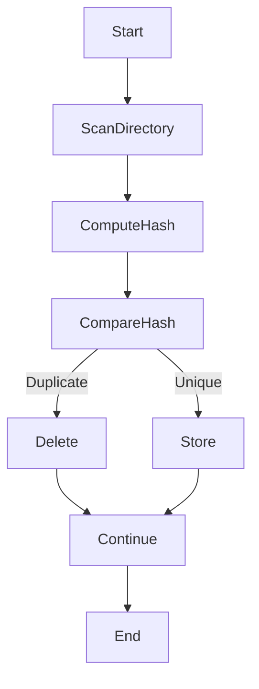

# 🚀 Duplicate Files Remover (Python)

<details open>
<summary><strong>📌 Project Overview</strong></summary>

A **lightweight, efficient, and secure Python utility** that automatically detects and removes **duplicate files** from a directory using **MD5 hash comparison**.  
This project ensures **storage optimization**, **data cleanliness**, and **system efficiency** by safely identifying identical files without relying on filenames.

🔗 **Repository**: https://github.com/alok-kumar8765/Cool_Project_2  
📁 **Module Path**: `Duplicate files remover`

</details>

---

## 🏷️ Badges

<details open>
<summary><strong>📊 Project Status & Metadata</strong></summary>


</details>

---

## 📑 Table of Contents

<details open>
<summary><strong>🔍 Expand Index</strong></summary>

1. Project Description  
2. Features  
3. How It Works  
4. Code Explanation  
5. Data Flow Diagram (DFD)  
6. System Architecture  
7. Execution Flow Diagram  
8. Real-World Use Cases  
9. Example Scenarios  
10. Pros & Cons  
11. Security Considerations  
12. Performance Notes  
13. Future Enhancements  

</details>

---

## 📝 Project Description

<details>
<summary><strong>📌 Description</strong></summary>

The **Duplicate Files Remover** scans the current working directory, computes **MD5 hashes** of files, and removes duplicates by comparing their hash values.

✔ Prevents redundant storage  
✔ Works efficiently with large files  
✔ Minimal memory footprint  
✔ No third-party dependencies  

</details>

---

## ✨ Features

<details>
<summary><strong>🌟 Key Highlights</strong></summary>

- 🔐 Hash-based duplicate detection (MD5)
- ⚡ Memory-efficient chunk reading
- 🗑️ Automatic duplicate deletion
- 📂 Works on all file types
- 🧠 Filename-independent comparison
- 🖥️ Cross-platform support (Windows/Linux/Mac)

</details>

---

## ⚙️ How It Works

<details>
<summary><strong>🧩 Core Logic</strong></summary>

1. Scan current directory files  
2. Read each file in fixed-size blocks  
3. Generate MD5 hash  
4. Compare hash against existing entries  
5. Delete file if hash already exists  
6. Print deleted file names  

</details>

---

## 🧠 Code Explanation

<details>
<summary><strong>📜 Detailed Breakdown</strong></summary>

### `hashFile(filename)`
- Reads files in **64KB chunks**
- Prevents memory overflow for large files
- Generates unique MD5 hash

### `hashMap`
- Dictionary storing `{hash: filename}`
- Enables O(1) lookup

### `deletedFiles`
- Tracks removed duplicate files
- Used for logging and output

### Main Execution
- Iterates through directory
- Deletes files with matching hash values

</details>

---

## 📊 Data Flow Diagram (DFD)

<details>
<summary><strong>📈 DFD (Mermaid)</strong></summary>

```mermaid
graph TD
    A[Start Program] --> B[List Files]
    B --> C[Read File in Blocks]
    C --> D[Generate MD5 Hash]
    D --> E{Hash Exists?}
    E -->|Yes| F[Delete File]
    E -->|No| G[Store Hash]
    F --> H[Log Deleted File]
    G --> I[Continue]
    H --> J[End]
    I --> J
````

</details>

---

## 🏗️ System Architecture

<details>
<summary><strong>🏛️ Architecture Diagram</strong></summary>

```mermaid
graph LR
    User --> PythonScript
    PythonScript --> FileSystem
    FileSystem --> HashEngine
    HashEngine --> DuplicateDetector
    DuplicateDetector --> FileDeletion
```

</details>

---

## 🔄 Execution Flow Diagram

<details>
<summary><strong>🔁 Program Flow</strong></summary>



</details>

---

## 🌍 Real-World Use Cases

<details>
<summary><strong>🏢 Practical Applications</strong></summary>

* 📦 Cleaning backup folders
* 🖥️ Optimizing storage servers
* ☁️ Cloud sync duplicate removal
* 📷 Removing duplicate media files
* 🏢 Enterprise file system maintenance

</details>

---

## 🧪 Example Scenarios

<details>
<summary><strong>📂 Example</strong></summary>

### Before:

```
report.pdf
report_copy.pdf
image.png
image(1).png
```

### After:

```
report.pdf
image.png
```

🗑️ Duplicate files removed automatically.

</details>

---

## ✅ Pros & ❌ Cons

<details>
<summary><strong>⚖️ Advantages & Limitations</strong></summary>

### ✅ Pros

* Fast and accurate
* Low memory usage
* Simple and readable code
* No external dependencies

### ❌ Cons

* Uses MD5 (collision risk, minimal for files)
* Operates only on current directory
* No dry-run mode

</details>

---

## 🔐 Security Considerations

<details>
<summary><strong>🛡️ Safety Notes</strong></summary>

* Ensure correct directory before execution
* Run with backup if files are critical
* MD5 is safe for file comparison (not cryptography)

</details>

---

## ⚡ Performance Notes

<details>
<summary><strong>🚀 Efficiency</strong></summary>

* Time Complexity: **O(n)**
* Space Complexity: **O(n)**
* Handles large files safely via chunking

</details>

---

## 🔮 Future Enhancements

<details>
<summary><strong>🧩 Improvements</strong></summary>

* SHA-256 hashing support
* Recursive directory scanning
* GUI interface
* Dry-run preview mode
* Logging to file
* Restore deleted files option

</details>

---

## 👨‍💻 Author

<details open>
<summary><strong>✍️ Developer</strong></summary>

**Alok Kumar**
🔗 GitHub: [https://github.com/alok-kumar8765](https://github.com/alok-kumar8765)

⭐ If you find this useful, consider starring the repository!

</details>


---

