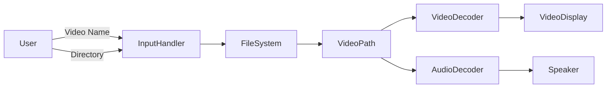

# 🎬 EasyVideoPlayer — Python Video & Audio Player

<p align="center">
  
  
  
  
  
</p>

<p align="center">
A lightweight, terminal-driven Python video player that automatically locates a video file and plays synchronized video and audio using OpenCV and FFpyPlayer.
</p>

---

<details>
<summary><strong>📌 Table of Contents</strong></summary>

- 🔍 Project Overview  
- 🚀 Features  
- 🧠 How It Works  
- 🏗️ System Architecture  
- 🔄 Application Flow Diagram  
- 📊 Data Flow Diagram (DFD)  
- 🧩 Code Explanation  
- 💡 Real-World Use Cases  
- 🧪 Example Scenarios  
- ✅ Pros & ❌ Cons  
- ⚙️ Installation & Setup  
- ▶️ Usage Instructions  
- 📦 Dependencies  
- 🔐 Limitations & Notes  
- 📈 Future Enhancements  
- 🧑‍💻 Author  

</details>

---

<details>
<summary><strong>🔍 Project Overview</strong></summary>

**EasyVideoPlayer** is a Python-based command-line video player that:
- Searches for a video file across directories
- Automatically sets the working directory
- Plays video frames using **OpenCV**
- Plays synchronized audio using **FFpyPlayer**

It is ideal for **learning multimedia handling**, **computer vision pipelines**, and **audio-video synchronization** in Python.

</details>

---

<details>
<summary><strong>🚀 Features</strong></summary>

- 🔎 Recursive video file search  
- 🎞️ Smooth video playback using OpenCV  
- 🔊 Audio playback using FFpyPlayer  
- ⌨️ Keyboard-controlled exit (`q` key)  
- 🧠 Simple, readable, beginner-friendly code  
- 💻 Cross-platform (Windows, Linux, macOS)  

</details>

---

<details>
<summary><strong>🧠 How It Works</strong></summary>

1. User provides:
   - Video file name
   - Possible directory location
2. Program recursively searches the directory tree
3. Working directory switches to the video’s location
4. OpenCV reads and displays video frames
5. FFpyPlayer handles audio playback in sync
6. Playback ends when video finishes or user presses `q`

</details>

---

<details>
<summary><strong>🏗️ System Architecture</strong></summary>

```mermaid
graph TD
    User -->|Inputs Video Name & Directory| CLI
    CLI --> FileSearch
    FileSearch -->|Path Found| VideoLoader
    VideoLoader --> OpenCV
    VideoLoader --> FFpyPlayer
    OpenCV --> DisplayScreen
    FFpyPlayer --> AudioOutput
````

</details>

---

<details>
<summary><strong>🔄 Application Flow Diagram</strong></summary>

```mermaid
flowchart TD
    A[Start Program]
    B[User Inputs Video Name]
    C[User Inputs Directory]
    D[Search Video Recursively]
    E{Video Found?}
    F[Set Working Directory]
    G[Play Video Frames]
    H[Play Audio Frames]
    I{User Presses Q or EOF?}
    J[Release Resources]
    K[Exit Program]

    A --> B --> C --> D --> E
    E -->|Yes| F --> G --> H --> I
    I -->|Yes| J --> K
    E -->|No| K
```

</details>

---

<details>
<summary><strong>📊 Data Flow Diagram (DFD)</strong></summary>



</details>

---

<details>
<summary><strong>🧩 Code Explanation</strong></summary>

### 🔹 File Search Logic

* Uses `os.walk()` to recursively search directories
* Returns the first matching video file path

### 🔹 Video Playback

* `cv2.VideoCapture()` reads video frames
* `cv2.imshow()` displays frames in real-time

### 🔹 Audio Playback

* `MediaPlayer()` extracts and plays audio frames
* Ensures synchronization with video

### 🔹 Exit Handling

* Press **`q`** to quit playback safely
* Releases all system resources cleanly

</details>

---

<details>
<summary><strong>💡 Real-World Use Cases</strong></summary>

* 🎓 **Learning Multimedia Programming**
* 🧪 **Testing Video Processing Pipelines**
* 📹 **Quick Video Preview Tool**
* 🤖 **Computer Vision Preprocessing**
* 🖥️ **Offline Video Playback in Scripts**

</details>

---

<details>
<summary><strong>🧪 Example Scenarios</strong></summary>

* Searching a movie stored deep inside folders
* Playing recorded CCTV footage
* Previewing dataset videos before ML training
* Educational demos for OpenCV learners

</details>

---

<details>
<summary><strong>✅ Pros & ❌ Cons</strong></summary>

### ✅ Pros

* Simple and lightweight
* No GUI framework required
* Easy to modify and extend
* Excellent for beginners

### ❌ Cons

* No playlist support
* No pause/seek controls
* Limited error handling
* Terminal-based input only

</details>

---

<details>
<summary><strong>⚙️ Installation & Setup</strong></summary>

```bash
pip install opencv-python ffpyplayer
```

✔ Python 3.8 or higher recommended

</details>

---

<details>
<summary><strong>▶️ Usage Instructions</strong></summary>

```bash
python main.py
```

**Input Example**

```
Name of the video file that you want to play: sample.mp4
Directory that may contain the video: /
```

Press **`q`** to exit playback.

</details>

---

<details>
<summary><strong>📦 Dependencies</strong></summary>

* `opencv-python`
* `ffpyplayer`
* `os`
* `pathlib`

</details>

---

<details>
<summary><strong>🔐 Limitations & Notes</strong></summary>

* Audio-video sync may vary on low-end systems
* Large directory scans may be slow
* No exception handling for missing files (can be extended)

</details>

---

<details>
<summary><strong>📈 Future Enhancements</strong></summary>

* ⏯️ Pause / Resume support
* ⏩ Seek & playback controls
* 📂 Playlist management
* 🖼️ GUI using PyQt or Tkinter
* 🚀 Performance optimization

</details>

---

<details>
<summary><strong>🧑‍💻 Author</strong></summary>

**Alok Kumar**
🔗 GitHub: [alok-kumar8765](https://github.com/alok-kumar8765)
📦 Repository:
➡️ [https://github.com/alok-kumar8765/Cool_Project_2/tree/main/EasyVideoPlayer](https://github.com/alok-kumar8765/Cool_Project_2/tree/main/EasyVideoPlayer)

</details>

---

⭐ **If you find this project useful, don’t forget to star the repository!**
🚀 Happy Coding!


---

