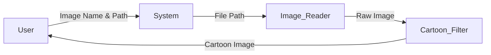

# 🎨 Easy Cartoonify – Image Cartoonization using OpenCV

<p align="center">
  
  
  
  
  
  
</p>

---

<details open>
<summary><h2>📌 Project Overview</h2></summary>

**Easy Cartoonify** is a lightweight **Python + OpenCV** based image processing tool that converts real images into **cartoon-style visuals**.  
It allows users to **search images dynamically from directories**, apply **multiple cartoon styles**, and preview results instantly.

🔹 Built for **beginners & enthusiasts** in Computer Vision  
🔹 No dataset or training required  
🔹 Uses OpenCV’s advanced **edge-preserving stylization**

</details>

---

<details>
<summary><h2>📚 Table of Contents</h2></summary>

- 📌 Project Overview  
- 🚀 Features  
- 🧠 How It Works  
- 🏗 Architecture Diagram  
- 🔄 Application Flow Diagram  
- 📊 Data Flow Diagram (DFD)  
- 🧩 Code Explanation  
- 🛠 Installation & Usage  
- 🌍 Real-World Use Cases  
- ✅ Pros & ❌ Cons  
- 📦 Future Enhancements  
- 👨‍💻 Author  

</details>

---

<details>
<summary><h2>🚀 Features</h2></summary>

- 🔍 Auto-search image from any directory
- 🖼 Supports **multiple cartoon styles**
- ⚡ Real-time image preview
- 🧠 Uses OpenCV stylization filters
- 🪶 Lightweight & beginner-friendly
- 💻 Works on Windows / Linux / macOS

</details>

---

<details>
<summary><h2>🧠 How It Works</h2></summary>

1. User inputs **image name**
2. User provides **directory path**
3. Script searches recursively using `os.walk()`
4. Image loaded via `cv2.imread()`
5. User selects cartoon style
6. OpenCV applies stylization
7. Result is displayed on screen

</details>

---

<details>
<summary><h2>🏗 Architecture Diagram</h2></summary>

```mermaid
graph TD
    User -->|Inputs Image Name| CLI
    CLI --> File_Search
    File_Search --> Image_Loader
    Image_Loader --> Cartoon_Processor
    Cartoon_Processor --> Output_Display
````

</details>

---

<details>
<summary><h2>🔄 Application Flow Diagram</h2></summary>

```mermaid
flowchart TD
    A[Start] --> B[User Inputs Image Name]
    B --> C[User Inputs Directory]
    C --> D[Search Image]
    D --> E{Style Selection}
    E -->|Style 1| F[Apply Cartoon Style 1]
    E -->|Style 2| G[Apply Cartoon Style 2]
    F --> H[Display Image]
    G --> H[Display Image]
    H --> I[End]
```

</details>

---

<details>
<summary><h2>📊 Data Flow Diagram (DFD)</h2></summary>



</details>

---

<details>
<summary><h2>🧩 Code Explanation</h2></summary>

### 🔹 Image Search Logic

* Uses `os.walk()` to recursively find files
* Returns **absolute image path**
* Eliminates manual file location issues

### 🔹 Image Processing

* `cv2.stylization()` applies cartoon effect
* Parameters:

  * `sigma_s` → spatial smoothness
  * `sigma_r` → color sensitivity

### 🔹 User Interaction

* Command-line driven
* Style selection via numeric input

</details>

---

<details>
<summary><h2>🛠 Installation & Usage</h2></summary>

### 📥 Install Dependencies

```bash
pip install opencv-python
```

### ▶ Run Script

```bash
python cartoonify.py
```

### 📝 Input Example

```text
Image Name: photo.jpg
Directory: /
Style: 1
```

</details>

---

<details>
<summary><h2>🌍 Real-World Use Cases</h2></summary>

* 🎭 Cartoon avatars for social media
* 🎮 Game character design prototypes
* 📱 Mobile photo filter applications
* 🎨 Digital art & NFT preprocessing
* 🧒 Kids learning computer vision concepts

**Example:**
A content creator converts profile photos into cartoon avatars for Instagram reels.

</details>

---

<details>
<summary><h2>✅ Pros & ❌ Cons</h2></summary>

### ✅ Pros

* No ML model training required
* Fast execution
* Minimal dependencies
* Cross-platform
* Beginner-friendly

### ❌ Cons

* Limited cartoon styles
* No image saving (display only)
* CLI-based (no GUI)

</details>

---

<details>
<summary><h2>📦 Future Enhancements</h2></summary>

* 💾 Save output image automatically
* 🖱 GUI using Tkinter / PyQt
* 🎚 Adjustable sliders for effects
* 📱 Android / Web integration
* 🤖 AI-based cartoon generation

</details>

---

<details>
<summary><h2>👨‍💻 Author</h2></summary>

**Alok Kumar**
🔗 GitHub: [https://github.com/alok-kumar8765](https://github.com/alok-kumar8765)
📁 Repository: `Cool_Project_2 / Easy_cartoonify`

⭐ If you like this project, don’t forget to star the repo!

</details>

---

<p align="center">
<b>🚀 Easy Cartoonify — Simple. Fast. Creative.</b>
</p>


---

