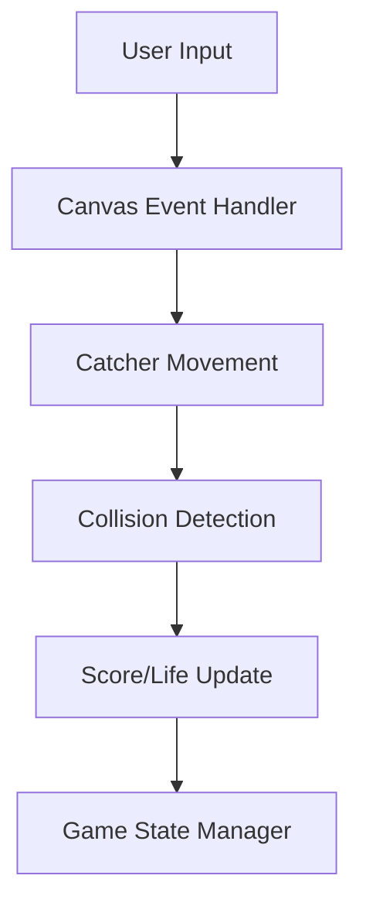
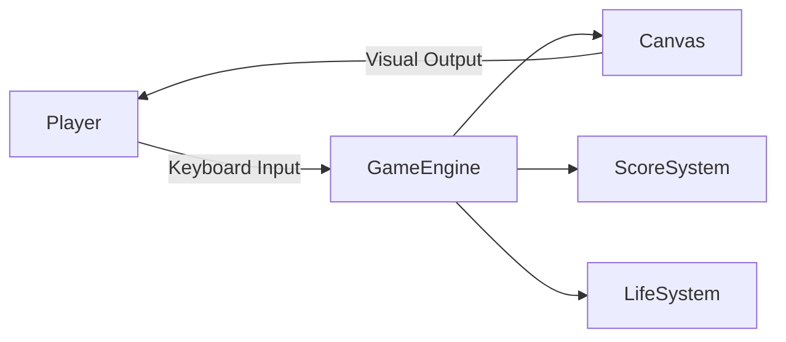
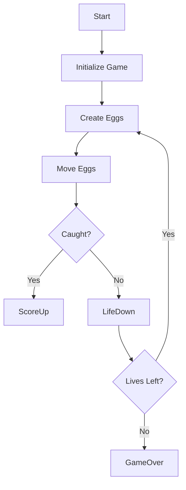

# 🥚 Egg Catcher Game – Python Tkinter Arcade Game

<p align="center">
  
  
  
  
  
</p>

---

## 📌 Project Overview

<details>
<summary><strong>📖 Description</strong></summary>

**Egg Catcher Game** is a classic **2D arcade-style desktop game** built using **Python and Tkinter**.  
The player controls a catcher using keyboard arrows to catch falling eggs while avoiding misses.  
The game dynamically increases difficulty, tracks score, manages lives, and ends gracefully.

This project demonstrates:
- Event-driven programming
- GUI development with Tkinter
- Game loops & collision detection
- Real-time difficulty scaling

</details>

---

## 📑 Table of Contents

<details>
<summary><strong>📚 Expand Table of Contents</strong></summary>

1. Project Overview  
2. Features  
3. Tech Stack  
4. Installation & Run  
5. Game Controls  
6. Game Logic Explanation  
7. Architecture Diagram  
8. Data Flow Diagram (DFD)  
9. Game Flow Diagram  
10. Mermaid Diagrams  
11. Use Cases  
12. Real-World Applications  
13. Pros & Cons  
14. Future Enhancements  
15. License & Author  

</details>

---

## ✨ Features

<details>
<summary><strong>🚀 Core Features</strong></summary>

- 🎮 Interactive keyboard-based gameplay  
- 🥚 Random egg generation with color cycling  
- 📈 Dynamic difficulty scaling  
- ❤️ Life tracking system  
- 🧠 Collision detection logic  
- 🖼️ Smooth Tkinter canvas rendering  
- 🧾 Scoreboard & game-over popup  

</details>

---

## 🛠️ Tech Stack

<details>
<summary><strong>🧰 Technologies Used</strong></summary>

- **Language:** Python 3  
- **GUI Library:** Tkinter  
- **Concepts:** Event Loop, Canvas Drawing, OOP-like Functions  
- **IDE:** VS Code / PyCharm  
- **Platform:** Windows / Linux / macOS  

</details>

---

## ⚙️ Installation & Execution

<details>
<summary><strong>📦 How to Run</strong></summary>

```bash
git clone https://github.com/alok-kumar8765/Cool_Project_2.git
cd "Cool_Project_2/Egg Catcher Game"
python egg_catcher.py
````

✔ Python 3.x required
✔ No external dependencies

</details>

---

## 🎮 Game Controls

<details>
<summary><strong>⌨️ Keyboard Controls</strong></summary>

| Key           | Action             |
| ------------- | ------------------ |
| ⬅ Left Arrow  | Move catcher left  |
| ➡ Right Arrow | Move catcher right |

</details>

---

## 🧠 Game Logic Explanation

<details>
<summary><strong>🧩 Core Logic</strong></summary>

* Eggs are generated at random X positions
* Eggs fall at increasing speed
* Catcher collision checks occur every 100ms
* Score increases on catch
* Life decreases on missed egg
* Game ends when lives reach zero

</details>

---

## 🏗️ Architecture Diagram

<details>
<summary><strong>🏛️ System Architecture (Mermaid)</strong></summary>



</details>

---

## 🔄 Data Flow Diagram (DFD)

<details>
<summary><strong>📊 DFD Level 0</strong></summary>



</details>

---

## 🎯 Game Flow Diagram

<details>
<summary><strong>🔁 Gameplay Flow</strong></summary>



</details>

---

## 💼 Use Cases

<details>
<summary><strong>📌 Practical Use Cases</strong></summary>

* Python GUI learning project
* College mini-project
* Interview demo project
* Game logic & collision practice
* Tkinter event handling demo

</details>

---

## 🌍 Real-World Applications

<details>
<summary><strong>🌐 Where This Applies</strong></summary>

* Educational game development
* Desktop-based training simulations
* Beginner-friendly game engines
* Gamified learning applications

**Example:**
Used as a **training game** to teach reflex improvement or keyboard coordination.

</details>

---

## ⚖️ Pros & Cons

<details>
<summary><strong>✅ Pros</strong></summary>

* Simple & beginner-friendly
* No external libraries required
* Clean, readable logic
* Cross-platform

</details>

<details>
<summary><strong>❌ Cons</strong></summary>

* Limited graphics
* Single-level gameplay
* No sound effects
* No mobile support

</details>

---

## 🔮 Future Enhancements

<details>
<summary><strong>🚧 Planned Improvements</strong></summary>

* Sound effects & background music
* Multiple levels
* Power-ups & obstacles
* Score persistence
* Mobile support using Kivy

</details>

---

## 👨‍💻 Author & Repository

<details>
<summary><strong>👤 Developer Info</strong></summary>

* **Author:** Alok Kumar
* **GitHub:** [alok-kumar8765](https://github.com/alok-kumar8765)
* **Repository:** Cool_Project_2
* **Project:** Egg Catcher Game

</details>

---

## 📜 License

<details>
<summary><strong>📄 License Information</strong></summary>

This project is licensed under the **MIT License**.
Feel free to use, modify, and distribute with attribution.

</details>

---

⭐ **If you like this project, don’t forget to star the repository!** ⭐


---

