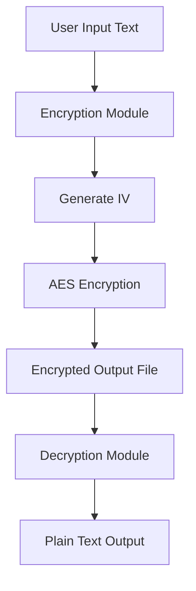
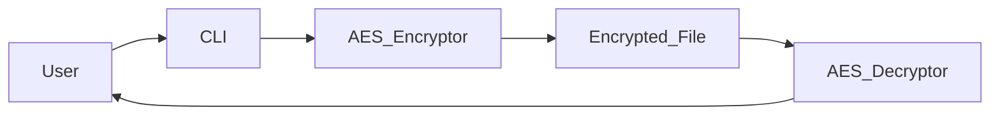
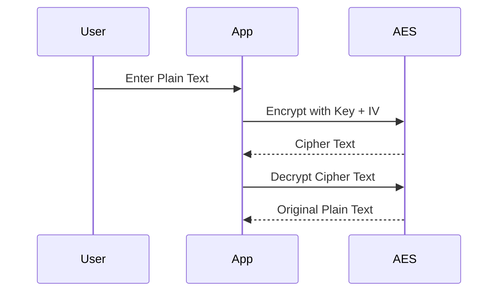

# 🔐 AES Text Encryption & Decryption using Python (CFB Mode)

<p align="center">
  
  
  
  
  
</p>

---

## 📌 Project Title
**Secure Text Encryption & Decryption using AES (CFB Mode) in Python**

---

## 📖 Project Description
This project demonstrates a **secure implementation of AES (Advanced Encryption Standard)** using **CFB (Cipher Feedback) mode** in Python.  
It allows users to **encrypt and decrypt plaintext securely** via the command line, using a **random Initialization Vector (IV)** to ensure strong cryptographic protection.

The project is ideal for:
- Secure messaging
- Data protection
- Learning cryptography fundamentals
- Backend security utilities

---

## 📂 Repository Structure
```text
Encrypt_and_decrypt_text/
│── encrypt_decrypt.py
│── encrypted.bin
│── README.md
````

---

## 📑 Table of Contents

<details>
<summary>Click to Expand</summary>

1. 📌 Project Overview
2. ⚙️ How It Works
3. 🧠 Cryptography Concepts Used
4. 🔁 Data Flow Diagram (DFD)
5. 🏗️ System Architecture
6. 🔄 Encryption & Decryption Flow
7. ▶️ Usage Instructions
8. 🌍 Real World Applications
9. 📦 Use Cases
10. ✅ Pros & ❌ Cons
11. 🔐 Security Best Practices
12. 📌 Conclusion

</details>

---

## ⚙️ How It Works

<details>
<summary>Click to Expand</summary>

* Takes plaintext as a **command-line argument**
* Uses **AES-128 encryption**
* Generates a **random IV** for every encryption
* Encrypts text using **CFB mode**
* Saves encrypted output to `encrypted.bin`
* Decrypts ciphertext using the same key & IV

</details>

---

## 🧠 Cryptography Concepts Used

<details>
<summary>Click to Expand</summary>

* **AES (Advanced Encryption Standard)**
* **CFB Mode (Cipher Feedback)**
* **Initialization Vector (IV)**
* **Symmetric Key Encryption**
* **Hexadecimal Encoding**

</details>

---

## 🔁 Data Flow Diagram (DFD)

<details>
<summary>Click to Expand</summary>



</details>

---

## 🏗️ System Architecture

<details>
<summary>Click to Expand</summary>



</details>

---

## 🔄 Encryption & Decryption Flow

<details>
<summary>Click to Expand</summary>



</details>

---

## ▶️ Usage Instructions

<details>
<summary>Click to Expand</summary>

### 🔧 Prerequisites

```bash
pip install pycryptodome
```

### ▶️ Run the Script

```bash
python encrypt_decrypt.py "Hello Secure World"
```

### 📤 Output

* Encrypted file: `encrypted.bin`
* Encrypted hex output
* Decrypted plaintext

</details>

---

## 🌍 Real World Applications

<details>
<summary>Click to Expand</summary>

* 🔐 Secure messaging systems (WhatsApp-like encryption)
* 🏦 Banking transaction protection
* 📁 File encryption tools
* 🖥️ Secure backend APIs
* 🔑 Password vault systems

**Example:**
Encrypting sensitive API tokens before storing them in a database.

</details>

---

## 📦 Use Cases

<details>
<summary>Click to Expand</summary>

* Encrypting confidential user data
* Secure inter-service communication
* Protecting logs & backups
* Learning cryptography implementation
* Secure DevOps pipelines

</details>

---

## ✅ Pros & ❌ Cons

<details>
<summary>Click to Expand</summary>

### ✅ Pros

* Strong AES encryption
* Random IV enhances security
* Simple CLI usage
* Industry-standard cryptography
* Fast performance

### ❌ Cons

* Hardcoded key (not production-safe)
* No key management system
* No authentication (HMAC missing)
* CLI-only interface

</details>

---

## 🔐 Security Best Practices

<details>
<summary>Click to Expand</summary>

* ❌ Avoid hardcoding encryption keys
* ✅ Use environment variables
* ✅ Add HMAC for integrity
* ✅ Rotate keys periodically
* ✅ Store IV securely with ciphertext

</details>

---

## 📌 Conclusion

<details>
<summary>Click to Expand</summary>

This project is a **clean, beginner-friendly, and secure demonstration of AES encryption** in Python.
It follows cryptographic best practices like **random IV usage** and **symmetric encryption**, making it ideal for **learning, demos, and small-scale secure applications**.

🚀 Perfect foundation for building:

* Secure file lockers
* Encrypted APIs
* Authentication systems

</details>

---

### ⭐ If you find this useful, don't forget to star the repo!

🔗 **GitHub:** [https://github.com/alok-kumar8765/Cool_Project_2](https://github.com/alok-kumar8765/Cool_Project_2)


---

