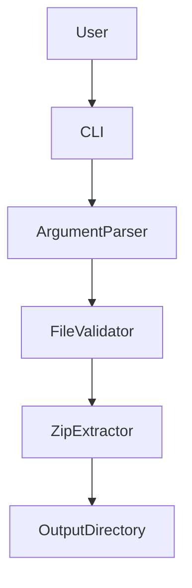
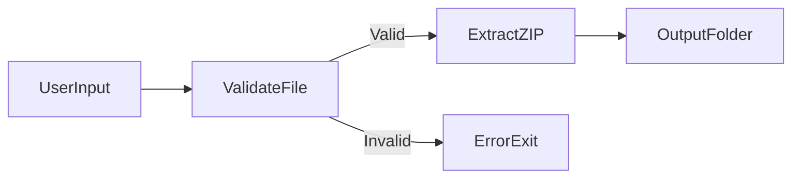
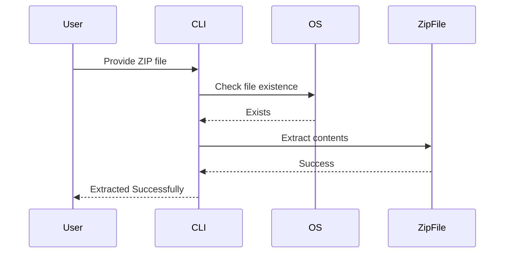

# 🚀 Cool Project 2 – ZIP File Extractor (CLI Tool)

<p align="center">
  <b>A lightweight, production-ready Python CLI utility to extract ZIP files securely and efficiently.</b>
</p>

<p align="center">
  <a href="https://github.com/alok-kumar8765/Cool_Project_2">
    
  </a>
  
  
  
  
</p>

---

## 📌 Project Overview

<details>
<summary><b>📖 Description</b></summary>

This project provides a **command-line based ZIP file extraction tool** built using **Python standard libraries**.  
It allows users to safely extract ZIP archives into a structured folder using a **simple CLI interface**.

The tool is ideal for:
- Developers
- DevOps engineers
- Automation scripts
- File processing pipelines

It validates file existence, ensures ZIP integrity, and extracts contents into a **dedicated directory** automatically.

</details>

---

## 📑 Table of Contents

<details>
<summary><b>🔍 Expand Index</b></summary>

1. Project Features  
2. Technology Stack  
3. Installation  
4. Usage (CLI)  
5. Code Explanation  
6. Architecture Diagram  
7. Data Flow Diagram (DFD)  
8. Execution Flow Diagram  
9. Use Cases  
10. Real World Examples  
11. Pros & Cons  
12. SEO Keywords  

</details>

---

## ✨ Features

<details>
<summary><b>⚙️ Core Features</b></summary>

- ✅ Command Line Interface (CLI)
- ✅ ZIP file validation
- ✅ Automatic folder creation
- ✅ Uses Python standard libraries only
- ✅ Error handling for missing files
- ✅ Cross-platform (Windows/Linux/Mac)

</details>

---

## 🧰 Technology Stack

<details>
<summary><b>🛠️ Tech Used</b></summary>

- **Language:** Python 3.x  
- **Libraries:**  
  - `os` – filesystem operations  
  - `zipfile` – ZIP handling  
  - `argparse` – CLI argument parsing  
  - `sys` – system exit handling  

</details>

---

## 🖥️ Installation

<details>
<summary><b>⬇️ Setup Instructions</b></summary>

```bash
git clone https://github.com/alok-kumar8765/Cool_Project_2.git
cd Cool_Project_2/Extract_zip_files
````

✔️ No external dependencies required.

</details>

---

## ▶️ Usage (CLI)

<details>
<summary><b>🚀 Run the Tool</b></summary>

```bash
python extract.py --zippedfile sample.zip
```

### Parameters

* `--zippedfile` or `-l` : Path to ZIP file (Required)

</details>

---

## 🧠 Code Explanation

<details>
<summary><b>🧩 How It Works</b></summary>

1. Parses command-line arguments using `argparse`
2. Validates ZIP file existence
3. Checks `.zip` extension
4. Creates a folder with ZIP name
5. Extracts contents safely
6. Prints extraction status

</details>

---

## 🏗️ System Architecture

<details>
<summary><b>📐 Architecture Diagram</b></summary>



</details>

---

## 🔄 Data Flow Diagram (DFD)

<details>
<summary><b>📊 DFD Level 1</b></summary>



</details>

---

## 🔁 Execution Flow

<details>
<summary><b>🔀 Program Flow Diagram</b></summary>



</details>

---

## 🎯 Use Cases

<details>
<summary><b>📌 Common Use Cases</b></summary>

* Automated backup extraction
* DevOps deployment pipelines
* Bulk ZIP processing
* Data ingestion systems
* CLI utilities for sysadmins

</details>

---

## 🌍 Real World Example

<details>
<summary><b>🌐 Practical Scenario</b></summary>

**Example:**
A DevOps engineer receives daily ZIP logs from servers.
This tool is used in a cron job to automatically extract logs into structured directories for monitoring and analysis.

</details>

---

## ⚖️ Pros & Cons

<details>
<summary><b>✅ Pros</b></summary>

* Lightweight and fast
* No third-party dependencies
* Secure ZIP handling
* Easy to integrate into scripts

</details>

<details>
<summary><b>❌ Cons</b></summary>

* No GUI support
* No password-protected ZIP handling
* No progress bar for large files

</details>

---

## 🔍 SEO Keywords

<details>
<summary><b>📈 Optimized Keywords</b></summary>

* Python ZIP extractor
* CLI ZIP extraction tool
* Python automation script
* ZIP file handling Python
* File extraction command line
* Python DevOps utilities

</details>

---

## 👨‍💻 Author

<details>
<summary><b>👤 Maintainer</b></summary>

**Alok Kumar**
🔗 GitHub: [https://github.com/alok-kumar8765](https://github.com/alok-kumar8765)

</details>

---

⭐ **If you find this project useful, consider giving it a star!**


---
