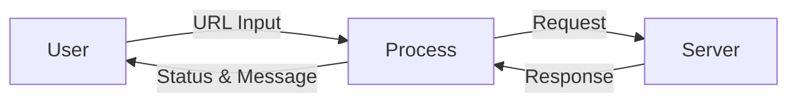

# 🚀 Fetch HTTP Status Code using Python

<p align="center">
  
  
  
  
</p>

<p align="center">
  <strong>A lightweight Python utility to fetch HTTP status codes for any URL or API endpoint with human-friendly messages and emoji feedback.</strong>
</p>

---

<details>
<summary>📌 Table of Contents</summary>

- 📖 Project Overview  
- 🎯 Features  
- 🧠 How It Works  
- 🧩 Code Explanation  
- 🏗 Architecture Diagram  
- 🔁 Flow Diagram  
- 📊 Data Flow Diagram (DFD)  
- 🛠 Tech Stack  
- 📌 Use Cases  
- 🌍 Real-World Examples  
- ⚖ Pros & Cons  
- 🚀 How to Run  
- 🔒 Error Handling  
- 📈 SEO Keywords  
- 🤝 Contribution  
- 📜 License  

</details>

---

<details>
<summary>📖 Project Overview</summary>

This project is a **Python-based HTTP status checker** that takes a URL or API endpoint as input and returns:

- HTTP Status Code  
- Human-readable response message  
- Visual emoji feedback (👍 / 👎)  

It helps developers **quickly validate APIs, URLs, and services** without heavy tools.

</details>

---

<details>
<summary>🎯 Features</summary>

- ✅ Fetch HTTP status codes
- 🔍 Detects invalid URLs
- ⚠ Handles HTTP & URL errors gracefully
- 😊 Emoji-based response feedback
- 🪶 Lightweight & fast
- 💻 Beginner-friendly Python script

</details>

---

<details>
<summary>🧠 How It Works</summary>

1. User enters a URL or API endpoint  
2. Python sends an HTTP request  
3. Server responds with a status code  
4. Script displays:
   - Status Code
   - Reason message
   - Emoji feedback

</details>

---

<details>
<summary>🧩 Code Explanation</summary>

- `urllib.request.urlopen()` → Sends HTTP request  
- `HTTPError` → Handles server-side errors (404, 500, etc.)  
- `URLError` → Handles connection or invalid URL errors  
- `emoji.emojize()` → Adds visual feedback  

This ensures **clean, readable, and informative output**.

</details>

---

<details>
<summary>🏗 Architecture Diagram</summary>

```mermaid
graph TD
    User -->|Enter URL| Python_Script
    Python_Script -->|HTTP Request| Web_Server
    Web_Server -->|HTTP Response| Python_Script
    Python_Script -->|Status + Emoji| User
````

</details>

---

<details>
<summary>🔁 Flow Diagram</summary>

```mermaid
flowchart TD
    A[Start] --> B[Enter URL]
    B --> C[Send HTTP Request]
    C --> D{Response Type}
    D -->|Success| E[Print Status Code 👍]
    D -->|HTTP Error| F[Print Error Code 👎]
    D -->|URL Error| G[Print Connection Error 👎]
    E --> H[End]
    F --> H
    G --> H
```

</details>

---

<details>
<summary>📊 Data Flow Diagram (DFD)</summary>



</details>

---

<details>
<summary>🛠 Tech Stack</summary>

* 🐍 Python 3.x
* 🌐 urllib (standard library)
* 😊 emoji package

</details>

---

<details>
<summary>📌 Use Cases</summary>

* API health checking
* URL validation
* Backend service monitoring
* Debugging REST APIs
* Learning HTTP fundamentals

</details>

---

<details>
<summary>🌍 Real-World Examples</summary>

🔹 **API Testing**

> Check if your backend API returns `200 OK` before deployment.

🔹 **Website Monitoring**

> Detect broken links returning `404`.

🔹 **DevOps Validation**

> Verify microservices availability during CI/CD.

🔹 **Student Learning Tool**

> Understand HTTP status behavior practically.

</details>

---

<details>
<summary>⚖ Pros & Cons</summary>

### ✅ Pros

* Simple & beginner-friendly
* No heavy dependencies
* Clear error handling
* Emoji-enhanced output

### ❌ Cons

* CLI-based only
* No async support
* No timeout customization
* No headers/auth support

</details>

---

<details>
<summary>🚀 How to Run</summary>

```bash
pip install emoji
python fetch_status_code.py
```

Then enter:

```text
https://api.github.com
```

</details>

---

<details>
<summary>🔒 Error Handling</summary>

* **HTTPError** → Handles HTTP failures like 404, 500
* **URLError** → Handles DNS failure, no internet, invalid URL

Ensures the program never crashes unexpectedly.

</details>

---

<details>
<summary>📈 SEO Keywords</summary>

* Python HTTP Status Code Checker
* Fetch HTTP Status Python
* API Status Validator
* URL Health Checker
* Python Networking Script
* HTTP Error Handling Python

</details>

---

<details>
<summary>🤝 Contribution</summary>

Contributions are welcome!
Feel free to fork, enhance, and submit a pull request.

</details>

---

<details>
<summary>📜 License</summary>

This project is licensed under the **MIT License**.
Free to use, modify, and distribute.

</details>

---

<p align="center">
  ⭐ If you found this project useful, please star the repository! ⭐  
  <br/>
  <strong>Author:</strong> <a href="https://github.com/alok-kumar8765">Alok Kumar</a>
</p>


---

