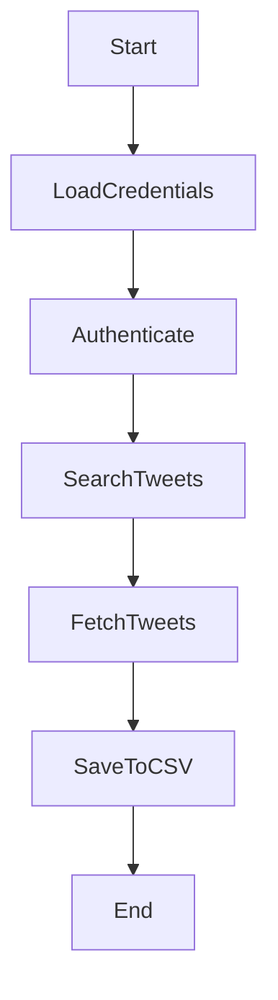

# 🐦 Twitter Hashtag Data Fetcher & CSV Exporter  
### *Fetch and Store Tweets using Tweepy (Python)*

<p align="center">
  
  
  
  
</p>

<p align="center">
  <b>Repository:</b> <a href="https://github.com/alok-kumar8765/Cool_Project_2">alok-kumar8765/Cool_Project_2</a><br>
  <b>Module:</b> Fetch_and_store_tweets
</p>

---

<details open>
<summary><h2>📌 Project Overview</h2></summary>

This project demonstrates a **Python-based Twitter data collection system** that fetches **real-time and historical tweets** using the **Twitter API (via Tweepy)** and stores them in a **CSV file** for further analysis.

It is designed for:
- Data analytics
- Social media monitoring
- Sentiment analysis
- Trend tracking
- Academic and research purposes

The script authenticates with Twitter, searches tweets based on a **hashtag or keyword**, and persistently stores tweet timestamps and text into a structured CSV dataset.

</details>

---

<details>
<summary><h2>📚 Table of Contents</h2></summary>

- Project Description  
- Features  
- Tech Stack  
- Code Explanation  
- Data Flow Diagram (DFD)  
- System Architecture  
- Execution Flow Diagram  
- Setup & Configuration  
- Real-World Use Cases  
- Advantages & Limitations  
- Security & Best Practices  
- Future Enhancements  

</details>

---

<details>
<summary><h2>✨ Key Features</h2></summary>

- 🔐 Secure Twitter API authentication using OAuth
- 🔍 Hashtag-based tweet search
- 🌍 Language-specific filtering (English)
- 📅 Historical tweet fetching support
- ⏳ Rate-limit safe execution
- 📁 CSV-based persistent storage
- ⚡ Lightweight & easy to integrate
- 📊 Ready for analytics and ML pipelines

</details>

---

<details>
<summary><h2>🛠 Tech Stack</h2></summary>

- **Programming Language:** Python 3.x  
- **API Library:** Tweepy  
- **Data Storage:** CSV  
- **Platform:** Twitter Developer API  

</details>

---

<details>
<summary><h2>🧠 Code Explanation</h2></summary>

### Step-by-Step Breakdown

- **Authentication**
  - Uses OAuthHandler for secure Twitter API access
  - Requires API keys and access tokens from Twitter Developer Portal

- **Search Query**
  - Fetches tweets using a hashtag or keyword
  - Filters tweets by language and start date

- **Cursor Handling**
  - Tweepy Cursor handles pagination automatically
  - Ensures smooth data fetching even for large datasets

- **Data Storage**
  - Tweets are written into `tweets.csv`
  - Stores:
    - Tweet creation timestamp
    - Tweet text (UTF-8 encoded)

- **Rate Limiting**
  - `wait_on_rate_limit=True` ensures compliance with Twitter API limits

</details>

---

<details>
<summary><h2>📊 Data Flow Diagram (DFD)</h2></summary>

```mermaid
graph TD
    A[User Input: Hashtag & API Keys]
    B[Twitter API]
    C[Tweepy Authentication]
    D[Tweet Search Engine]
    E[CSV Writer]
    F[tweets.csv File]

    A --> C
    C --> B
    B --> D
    D --> E
    E --> F
````

</details>

---

<details>
<summary><h2>🏗 System Architecture</h2></summary>

```mermaid
graph LR
    User -->|Hashtag| PythonScript
    PythonScript -->|OAuth| TwitterAPI
    TwitterAPI -->|Tweets| PythonScript
    PythonScript -->|Write| CSVStorage
```

</details>

---

<details>
<summary><h2>🔄 Execution Flow Diagram</h2></summary>



</details>

---

<details>
<summary><h2>⚙️ Setup & Configuration</h2></summary>

### Prerequisites

* Python 3.x installed
* Twitter Developer Account
* API credentials

### Installation

```bash
pip install tweepy
```

### Configuration

Update the following fields in the script:

* `consumer_key`
* `consumer_secret`
* `access_token`
* `access_token_secret`
* `hastag`

### Run

```bash
python fetch_tweets.py
```

</details>

---

<details>
<summary><h2>🌍 Real-World Use Cases</h2></summary>

* **Brand Monitoring:** Track customer feedback for a product launch
* **Election Analysis:** Monitor political hashtag trends
* **Stock Market Sentiment:** Analyze tweets around companies like `#Tesla`
* **Crisis Detection:** Identify breaking news or emergencies
* **Academic Research:** NLP & sentiment analysis datasets

📌 *Example:*
A marketing team tracks `#iPhoneLaunch` tweets to measure public sentiment during launch week.

</details>

---

<details>
<summary><h2>✅ Pros & ❌ Cons</h2></summary>

### ✅ Advantages

* Simple and lightweight
* Beginner-friendly
* Easy CSV integration
* Scalable with analytics tools
* Twitter rate-limit safe

### ❌ Limitations

* Requires Twitter API approval
* CSV not ideal for very large datasets
* No sentiment analysis included
* Limited to text tweets only

</details>

---

<details>
<summary><h2>🔐 Security & Best Practices</h2></summary>

* Never commit API keys to GitHub
* Use environment variables for credentials
* Rotate API keys periodically
* Handle exceptions for network/API failures

</details>

---

<details>
<summary><h2>🚀 Future Enhancements</h2></summary>

* Database storage (PostgreSQL / MongoDB)
* Sentiment analysis integration
* Real-time dashboard
* Multi-hashtag support
* Dockerized deployment
* Async tweet fetching

</details>

---

<details>
<summary><h2>👨‍💻 Author</h2></summary>

**Alok Kumar**
🔗 GitHub: [alok-kumar8765](https://github.com/alok-kumar8765)

</details>

---

⭐ *If you find this project useful, consider giving it a star!*


---

