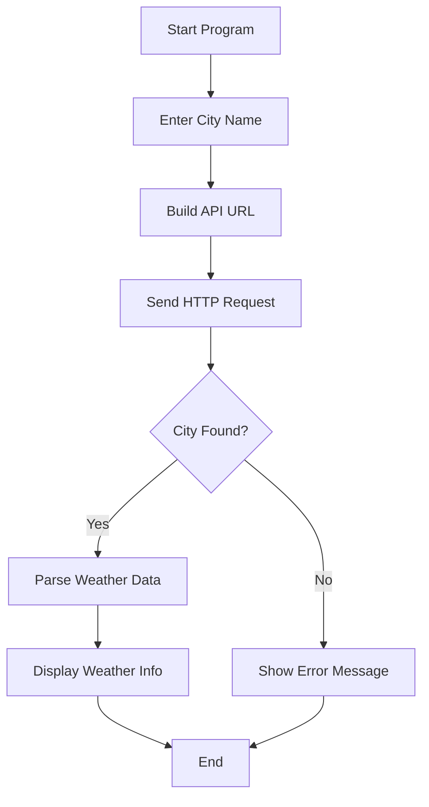

# 🌦️ Fetch Current Weather – Enterprise-Grade Python Utility


> **Enterprise-ready Python program to fetch real-time weather data for any city using the OpenWeatherMap API.**  
> Designed with clarity, scalability concepts, and production-grade documentation standards.

---

## 📌 Project Overview

<details>
<summary><strong>📖 Description</strong></summary>

This project is a **Python-based command-line utility** that retrieves **live weather information** such as:

- 🌡️ Temperature  
- 💧 Humidity  
- 🌬️ Atmospheric Pressure  
- 🌥️ Weather Description  

It uses the **OpenWeatherMap REST API**, making it suitable for:
- Learning API integration
- Automation scripts
- Backend microservices
- IoT & monitoring systems

</details>

---

## 📚 Table of Contents (Indexed)

<details>
<summary><strong>🧭 Expand Table of Contents</strong></summary>

1. Project Overview  
2. Features  
3. Tech Stack  
4. Folder Structure  
5. System Architecture  
6. Data Flow Diagram (DFD)  
7. Execution Flow  
8. Installation & Setup  
9. Configuration  
10. Code Walkthrough  
11. Real-World Use Cases  
12. Example Scenarios  
13. Pros & Cons  
14. Scalability & Enterprise Enhancements  
15. Security Considerations  
16. SEO Keywords  
17. License  

</details>

---

## ✨ Features

<details>
<summary><strong>🚀 Key Capabilities</strong></summary>

- 🔄 Real-time weather fetching
- 🌍 City-based weather lookup
- ⚡ Lightweight & fast execution
- 🧩 Easily extendable architecture
- 🧪 Beginner-friendly yet enterprise-ready
- 📦 Uses industry-standard REST APIs

</details>

---

## 🛠️ Tech Stack

<details>
<summary><strong>⚙️ Technologies Used</strong></summary>

- **Language:** Python 3.8+
- **HTTP Client:** `requests`
- **API Provider:** OpenWeatherMap
- **Architecture Style:** Client → REST API
- **Output Format:** JSON Parsing

</details>

---

## 📁 Folder Structure

<details>
<summary><strong>📂 Repository Layout</strong></summary>

```

Cool_Project_2/
└── Fetch_current_weather/
├── weather.py
└── README.md

````

</details>

---

## 🏗️ System Architecture

<details>
<summary><strong>🏛️ Architecture Diagram</strong></summary>

```mermaid
graph TD
    User[User Input: City Name]
    App[Python Weather Script]
    API[OpenWeatherMap API]
    JSON[JSON Response]
    Output[Formatted Weather Output]

    User --> App
    App --> API
    API --> JSON
    JSON --> App
    App --> Output
````

</details>

---

## 🔄 Data Flow Diagram (DFD – Level 0)

<details>
<summary><strong>📊 DFD</strong></summary>

```mermaid
flowchart LR
    U[User]
    P[Weather Fetch Program]
    W[OpenWeatherMap API]

    U -->|City Name| P
    P -->|API Request| W
    W -->|Weather Data| P
    P -->|Weather Details| U
```

</details>

---

## 🔁 Execution Flow

<details>
<summary><strong>🧠 Program Flow</strong></summary>



</details>

---

## ⚙️ Installation & Setup

<details>
<summary><strong>📥 Setup Instructions</strong></summary>

```bash
# Clone the repository
git clone https://github.com/alok-kumar8765/Cool_Project_2.git

# Navigate to project
cd Cool_Project_2/Fetch_current_weather

# Install dependency
pip install requests
```

</details>

---

## 🔐 Configuration

<details>
<summary><strong>🔑 API Configuration</strong></summary>

1. Create a free account on **OpenWeatherMap**
2. Generate an API Key
3. Replace in code:

```python
api_key = "Your_API_Key"
```

✅ **Enterprise Tip:** Use environment variables instead of hardcoding keys.

</details>

---

## 🧩 Code Walkthrough

<details>
<summary><strong>🧪 Explanation</strong></summary>

* Accepts city name as user input
* Constructs REST API endpoint
* Sends GET request via `requests`
* Parses JSON response
* Extracts:

  * Temperature
  * Pressure
  * Humidity
  * Weather description
* Handles invalid city errors gracefully

</details>

---

## 🌍 Real-World Use Cases

<details>
<summary><strong>🏢 Practical Applications</strong></summary>

* 🌾 **Agriculture Apps** – crop planning based on weather
* 🚚 **Logistics Systems** – route & delivery planning
* 🏢 **Smart Buildings** – HVAC automation
* 📱 **Mobile Apps** – backend weather service
* 🌐 **IoT Devices** – climate-aware sensors

</details>

---

## 📘 Example Scenario

<details>
<summary><strong>🧾 Sample Execution</strong></summary>

**Input**

```
Enter city name : Delhi
```

**Output**

```
Temperature = 301.15 K
Atmospheric Pressure = 1012 hPa
Humidity = 65%
Description = haze
```

</details>

---

## ✅ Pros & ❌ Cons

<details>
<summary><strong>⚖️ Advantages & Limitations</strong></summary>

### ✅ Pros

* Simple & readable code
* Real-time data
* Easy API integration
* Beginner & enterprise friendly

### ❌ Cons

* No caching mechanism
* Blocking (non-async)
* CLI-only interface
* No unit conversion (Kelvin default)

</details>

---

## 📈 Scalability & Enterprise Enhancements

<details>
<summary><strong>🚀 Production Improvements</strong></summary>

* Convert to **FastAPI / Flask microservice**
* Add **Redis caching**
* Async requests using `aiohttp`
* API rate-limit handling
* Dockerize the application
* Centralized logging & monitoring

</details>

---

## 🔒 Security Considerations

<details>
<summary><strong>🛡️ Best Practices</strong></summary>

* Never hardcode API keys
* Use `.env` or secret managers
* Implement request timeout
* Validate user input
* Add retry & fallback logic

</details>

---

## 🔎 SEO Keywords

<details>
<summary><strong>📢 Search Optimization</strong></summary>

Python Weather API, OpenWeatherMap Python, Fetch Current Weather Python, REST API Example Python, Weather CLI Tool, Python Requests API, Real-Time Weather App

</details>

---

## 📜 License

<details>
<summary><strong>📄 License Information</strong></summary>

This project is licensed under the **MIT License**.
You are free to use, modify, and distribute this project.

</details>

---

### ⭐ If you find this useful, consider starring the repository

**GitHub:** [https://github.com/alok-kumar8765/Cool_Project_2](https://github.com/alok-kumar8765/Cool_Project_2)

---
