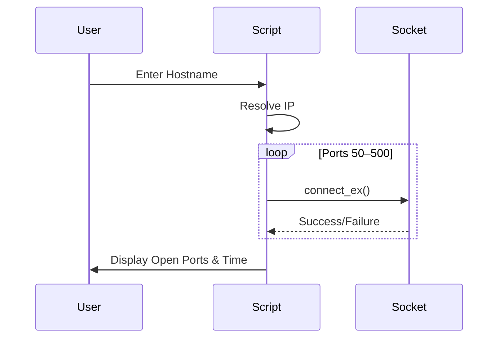

# 🔐 Fetch Open Ports – Python Port Scanner  
> **Enterprise‑Grade Network Port Discovery Utility**

<p align="center">
  
  
  
  
  
</p>

---

<details>
<summary><h2>📌 Project Overview</h2></summary>

### 📖 Description  
**Fetch Open Ports** is a lightweight Python-based TCP port scanner designed to identify **open ports** on a target host within a defined range.  
It leverages low-level socket programming to perform **fast, direct port connectivity checks**, making it suitable for **network diagnostics, security audits, and penetration testing basics**.

### 🎯 Key Objective  
To provide a **simple, educational, and extensible** port scanning tool that demonstrates:
- Network socket fundamentals
- TCP connection probing
- Real-time port discovery
- Execution time benchmarking

</details>

---

<details>
<summary><h2>📚 Table of Contents</h2></summary>

1. Overview  
2. Features  
3. Technology Stack  
4. Project Architecture  
5. Data Flow Diagram (DFD)  
6. Execution Flow Diagram  
7. Code Explanation  
8. Real‑World Use Cases  
9. Pros & Cons  
10. Security Considerations  
11. Future Enhancements  
12. How to Run  
13. Output Example  
14. License & Author  

</details>

---

<details>
<summary><h2>✨ Features</h2></summary>

- 🔍 Scans TCP ports from **50–500**
- 🌐 Hostname to IP resolution
- ⚡ Fast socket-based scanning
- ⏱️ Execution time measurement
- 🧠 Beginner‑friendly & extensible
- 🛡️ No third‑party dependencies

</details>

---

<details>
<summary><h2>🧰 Technology Stack</h2></summary>

- **Language**: Python 3.x  
- **Modules Used**:
  - `socket` – TCP communication
  - `time` – performance measurement  
- **Protocol**: TCP (IPv4)

</details>

---

<details>
<summary><h2>🏗️ System Architecture</h2></summary>

```mermaid
graph TD
    User[User Input Hostname] --> Resolver[DNS Resolution]
    Resolver --> IP[Target IP Address]
    IP --> Scanner[Port Scanner Engine]
    Scanner --> Socket[TCP Socket]
    Socket --> Result[Open/Closed Port Status]
    Result --> Output[Console Output]
````

</details>

---

<details>
<summary><h2>📊 Data Flow Diagram (DFD)</h2></summary>

```mermaid
flowchart LR
    U[User] -->|Hostname| P[Python Script]
    P -->|Resolve| D[DNS]
    D -->|IP Address| P
    P -->|Port Range| S[Socket Engine]
    S -->|Connection Status| P
    P -->|Results| U
```

</details>

---

<details>
<summary><h2>🔄 Execution Flow Diagram</h2></summary>



</details>

---

<details>
<summary><h2>🧠 Code Explanation</h2></summary>

### 🔹 Host Resolution

```python
t_IP = gethostbyname(target)
```

Converts hostname into IPv4 address.

### 🔹 Port Scanning Logic

```python
for i in range(50, 500):
    s = socket(AF_INET, SOCK_STREAM)
    conn = s.connect_ex((t_IP, i))
```

Attempts TCP connection on each port.

### 🔹 Open Port Detection

```python
if conn == 0:
    print(f"Port {i}: OPEN")
```

### 🔹 Performance Measurement

```python
time.time() - startTime
```

</details>

---

<details>
<summary><h2>🌍 Real‑World Use Cases</h2></summary>

### 🏢 Enterprise IT

* Detect unintended exposed services
* Internal network audits

### 🛡️ Cybersecurity

* Reconnaissance phase in penetration testing
* Identifying attack surfaces

### 🎓 Education

* Teaching socket programming
* Understanding TCP handshakes

### 🧪 DevOps

* Verifying service availability before deployment

**Example**

> Scanning a staging server to ensure only ports `80` and `443` are open.

</details>

---

<details>
<summary><h2>⚖️ Pros & Cons</h2></summary>

### ✅ Pros

* Simple & readable
* No external libraries
* Fast execution
* Cross-platform

### ❌ Cons

* No multithreading
* Limited port range
* No UDP scanning
* No service detection

</details>

---

<details>
<summary><h2>🔐 Security Considerations</h2></summary>

⚠️ **Important**

* Use only on **authorized systems**
* Unauthorized scanning may be illegal
* Intended for **educational & ethical use only**

</details>

---

<details>
<summary><h2>🚀 Future Enhancements</h2></summary>

* 🔁 Multithreaded scanning
* 🌐 Custom port ranges
* 📄 Export results (JSON / CSV)
* 🧠 Service & banner detection
* 🖥️ GUI or Web dashboard

</details>

---

<details>
<summary><h2>▶️ How to Run</h2></summary>

```bash
python fetch_open_ports.py
```

Then enter:

```
Enter the host to be scanned: google.com
```

</details>

---

<details>
<summary><h2>📤 Sample Output</h2></summary>

```
Starting scan on host: 142.250.182.14
Port 80: OPEN
Port 443: OPEN
Time taken: 2.13 seconds
```

</details>

---

<details>
<summary><h2>📜 License</h2></summary>

Licensed under the **MIT License** – free to use, modify, and distribute.

</details>

---

<details>
<summary><h2>👨‍💻 Author</h2></summary>

**Alok Kumar**
🔗 GitHub: [https://github.com/alok-kumar8765](https://github.com/alok-kumar8765)
📂 Project: `Cool_Project_2 / Fetch_open_ports`

> ⭐ If you found this useful, please star the repository!

</details>


---

