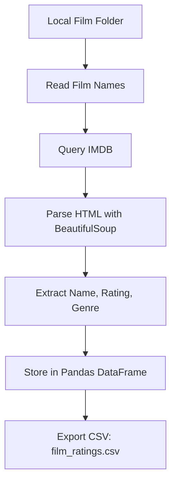
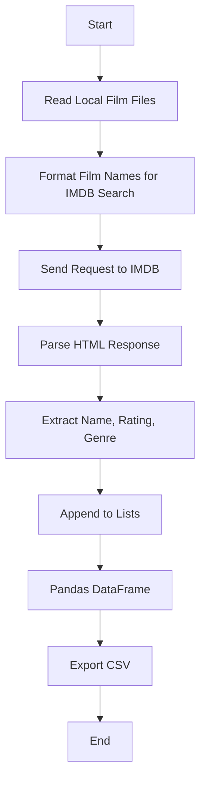

# 🎬 Find IMDB Ratings - Cool_Project_2

[](https://github.com/alok-kumar8765/Cool_Project_2/tree/main/Find_imdb_rating)
[](https://www.python.org/)
[](https://github.com/alok-kumar8765/Cool_Project_2/blob/main/LICENSE)
[](https://github.com/alok-kumar8765/Cool_Project_2/issues)

---

## 📖 Table of Contents
<details>
<summary>Click to expand</summary>

1. [Project Overview](#project-overview)  
2. [Features](#features)  
3. [Installation](#installation)  
4. [Usage](#usage)  
5. [Architecture & Flow](#architecture--flow)  
   - [Data Flow Diagram (DFD)](#data-flow-diagram-dfd)  
   - [System Architecture](#system-architecture)  
   - [Workflow Flowchart](#workflow-flowchart)  
6. [Code Explanation](#code-explanation)  
7. [Pros & Cons](#pros--cons)  
8. [Real-World Use Cases](#real-world-use-cases)  
9. [Contributing](#contributing)  
10. [License](#license)  

</details>

---

## 📝 Project Overview
<details>
<summary>Click to expand</summary>

**Find IMDB Ratings** is a Python-based automation tool that scrapes IMDB ratings and genres for a list of movies stored locally. Using `BeautifulSoup`, `requests`, and `pandas`, it collects movie details and stores them in a structured CSV file.  

**Key Objectives:**
- Automate movie rating retrieval.
- Build a structured CSV dataset.
- Facilitate personal or enterprise movie analysis.

</details>

---

## ⚡ Features
<details>
<summary>Click to expand</summary>

- Scrapes IMDB for **movie ratings**, **genres**, and **names**.  
- Works with **local movie file lists**.  
- Stores data in a **CSV file** (`film_ratings.csv`).  
- **Easy to extend** for additional metadata like release year, cast, etc.  
- **SEO & GitHub friendly**, with badges and structured documentation.

</details>

---

## 💻 Installation
<details>
<summary>Click to expand</summary>

1. Clone the repository:
```bash
git clone https://github.com/alok-kumar8765/Cool_Project_2.git
cd Cool_Project_2/Find_imdb_rating
````

2. Install dependencies:

```bash
pip install beautifulsoup4 requests pandas
```

3. Run the script:

```bash
python find_imdb_rating.py
```

</details>

---

## 🚀 Usage

<details>
<summary>Click to expand</summary>

1. Place all your movie files in a folder.
2. Run the script and input the folder path when prompted.
3. The script will:

   * Read file names (remove extensions).
   * Search IMDB for ratings and genres.
   * Generate a CSV: `film_ratings.csv`.

**Example:**

```
Enter the path where your films are: /Users/username/Desktop/films
```

CSV Output Example:

| Film Name     | Rating | Genre          |
| ------------- | ------ | -------------- |
| Inception     | 8.8    | Action, Sci-Fi |
| The Godfather | 9.2    | Crime, Drama   |

</details>

---

## 🏗 Architecture & Flow

### Data Flow Diagram (DFD)

<details>
<summary>Click to expand</summary>



</details>

### System Architecture

<details>
<summary>Click to expand</summary>


</details>

### Workflow Flowchart

<details>
<summary>Click to expand</summary>



</details>

---

## 🧩 Code Explanation

<details>
<summary>Click to expand</summary>

1. **Setup**

```python
s = requests.session()
films = []
names, ratings, genres = [], [], []
```

* Initializes session and lists for storing data.

2. **Input & File Reading**

```python
path = input("Enter the path where your films are: ")
filmswe = os.listdir(path)
```

* Reads all films in folder and removes extensions.

3. **IMDB Query & Scraping**

```python
for line in films:
    query = "+".join(line.lower().split())
    URL = "https://www.imdb.com/search/title/?title=" + query
```

* Formats film name for IMDB search.

4. **Data Extraction**

```python
soup = BeautifulSoup(response.content, features="html.parser")
containers = soup.find_all("div", class_="lister-item-content")
```

* Extracts movie rating and genre.

5. **Data Storage**

```python
df = pd.DataFrame({'Film Name':names,'Rating':ratings,'Genre':genres})
df.to_csv('film_ratings.csv', index=False, encoding='utf-8')
```

* Stores results in a CSV for easy analysis.

</details>

---

## ✅ Pros & Cons

<details>
<summary>Click to expand</summary>

**Pros:**

* Lightweight & fast for local file lists.
* Easy to extend for additional IMDB data.
* Works offline except for IMDB queries.
* Generates structured CSV dataset for analytics.

**Cons:**

* Limited to IMDB's HTML structure (site changes can break scraper).
* No multi-threading, slow for large movie lists.
* No automated error handling for missing movies or incorrect titles.

</details>

---

## 🌐 Real-World Use Cases

<details>
<summary>Click to expand</summary>

* **Movie Enthusiasts:** Quickly get ratings for personal film collections.
* **Content Platforms:** Aggregate IMDB ratings for recommendation engines.
* **Data Analytics:** Build datasets for predictive modeling of movie popularity.
* **Academic Research:** Study correlations between genre and rating.

**Example:**
A film blog can scrape 1000 movies from their library to display rating trends and top genres.

</details>

---

## 🤝 Contributing

<details>
<summary>Click to expand</summary>

* Fork the repository.
* Create a new branch: `git checkout -b feature-name`.
* Commit your changes: `git commit -m "Add feature"`.
* Push to the branch: `git push origin feature-name`.
* Open a Pull Request on GitHub.

</details>

---

## 📄 License

<details>
<summary>Click to expand</summary>

This project is licensed under the **MIT License** - see the [LICENSE](https://github.com/alok-kumar8765/Cool_Project_2/blob/main/LICENSE) file for details.

</details>


---

