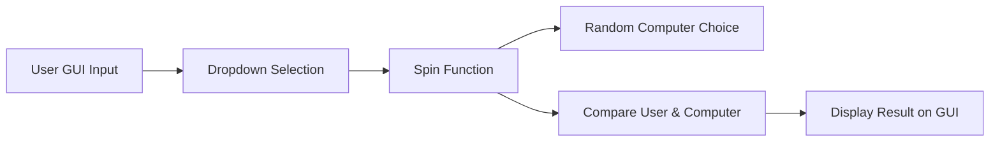
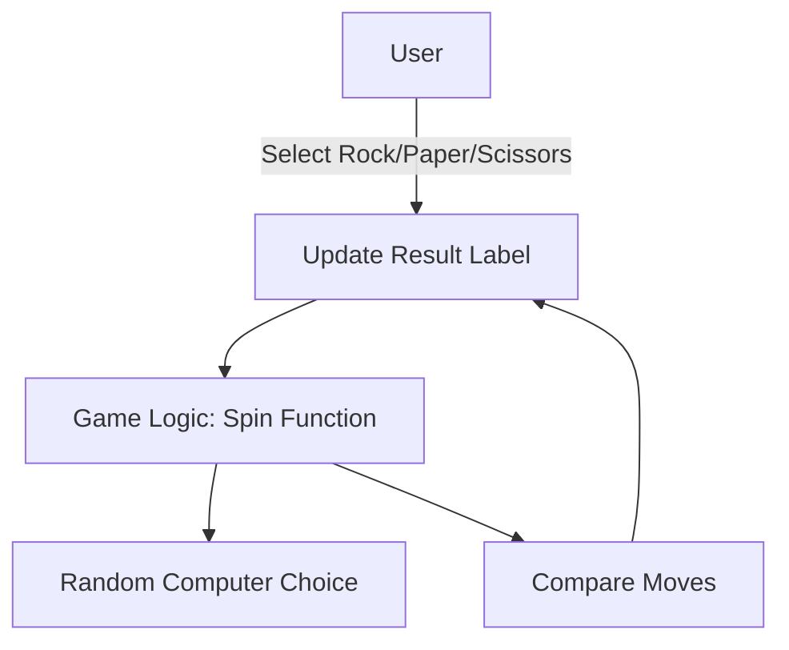
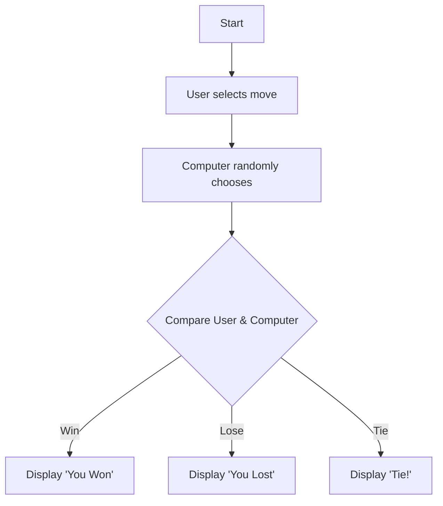

# 🎮 GUI Rock-Paper-Scissors Game

[](https://github.com/alok-kumar8765/Cool_Project_2) 
[](https://www.python.org/) 
[](https://github.com/alok-kumar8765/Cool_Project_2/blob/main/LICENSE) 
[](https://github.com/alok-kumar8765/Cool_Project_2/issues)

---

## 📌 Table of Contents
<details>
<summary>Click to expand</summary>

1. [Project Description](#project-description)  
2. [Features](#features)  
3. [Installation](#installation)  
4. [Usage](#usage)  
5. [Architecture & Flow](#architecture--flow)  
6. [Code Explanation](#code-explanation)  
7. [Pros and Cons](#pros-and-cons)  
8. [Real World Use Cases](#real-world-use-cases)  
9. [SEO Optimized Keywords](#seo-optimized-keywords)  
10. [Contributing](#contributing)  
11. [License](#license)

</details>

---

## 📝 Project Description
This project is a **GUI-based Rock-Paper-Scissors game** developed using Python's **Tkinter library**. It allows a user to play against the computer with a simple, interactive dropdown menu. The game randomly generates computer moves, compares them against user selection, and provides instant feedback on wins, losses, or ties.  

This project is ideal for beginners learning **Python GUI development**, **random number generation**, and basic game logic.

---

## ✨ Features
<details>
<summary>Click to expand</summary>

- Fully functional **Rock-Paper-Scissors game** with a graphical user interface.  
- Randomized computer moves using `randint()`.  
- **Interactive dropdown menu** for user input.  
- Instant **win/lose/tie feedback** on the UI.  
- Responsive, beginner-friendly **Tkinter interface**.  
- Easily extensible for adding **score tracking or animations**.  

</details>

---

## 🛠 Installation
<details>
<summary>Click to expand</summary>

```bash
# Clone the repository
git clone https://github.com/alok-kumar8765/Cool_Project_2.git

# Navigate to the project directory
cd Cool_Project_2/GUI\ Rock-Paper-Scissors\ Game

# Run the game
python game.py  # Ensure Python 3.x is installed
````

**Dependencies:**

* Python 3.x
* Tkinter (usually comes pre-installed with Python)

</details>

---

## 🎮 Usage

<details>
<summary>Click to expand</summary>

1. Run the script using Python.
2. Select your choice from the dropdown: **Rock, Paper, or Scissors**.
3. Click the **Spin!** button.
4. Observe the computer's move and the game result.

Example Output:

* User chooses Rock, computer chooses Scissors → "YOU Won!"
* User chooses Paper, computer chooses Paper → "Tie! Nice game"

</details>

---

## 🏗 Architecture & Flow

<details>
<summary>Click to expand</summary>

### System Architecture



### Data Flow Diagram (DFD)



### Game Logic Flow



</details>

---

## 📜 Code Explanation

<details>
<summary>Click to expand</summary>

* **Libraries Used:** `tkinter`, `ttk`, `random`

* **GUI Setup:**

  * `Tk()` object for window
  * `geometry` and `title` for layout

* **Dropdown:** `ttk.Combobox` for user selection

* **Game Logic:**

  1. Generate random number for computer choice
  2. Map numbers to Rock/Paper/Scissors
  3. Compare with user input
  4. Update label with outcome

* **Win-Loss Logic:**

  * Rock beats Scissors
  * Paper beats Rock
  * Scissors beats Paper
  * Tie handled if both choices are same

</details>

---

## ⚖ Pros and Cons

<details>
<summary>Click to expand</summary>

**Pros:**

* Beginner-friendly GUI project
* Easy to understand Python logic
* Quick deployment and testing
* Extensible for score tracking or multiplayer

**Cons:**

* No persistent score saving
* Basic UI (no images or animations)
* Single-player only
* Logic tied directly to GUI (less modular)

</details>

---

## 🌐 Real World Use Cases

<details>
<summary>Click to expand</summary>

* **Educational tool:** Teaching Python and GUI development.
* **Game prototype:** Base for more advanced games with graphics/animations.
* **Web conversion:** Can be extended to browser-based games using frameworks like Flask or Django.
* **Event gamification:** Simple interactive games for kiosks or fun quizzes.

**Example:**

* At a school fair, the Rock-Paper-Scissors GUI can serve as a **fun interactive booth** where kids play against a computer.

</details>

---

## 🔑 SEO Optimized Keywords

<details>
<summary>Click to expand</summary>

Python GUI Game, Tkinter Rock Paper Scissors, Python Beginner Project, Desktop Game Python, Interactive Python Game, Python Tkinter Dropdown, Random Number Game Python, GUI Game Tutorial, Rock Paper Scissors Python Code, Tkinter Game Tutorial

</details>

---

## 🤝 Contributing

<details>
<summary>Click to expand</summary>

Contributions are welcome! You can:

* Fork the repository
* Create a branch (`git checkout -b feature-name`)
* Make changes and commit (`git commit -m 'Add new feature'`)
* Push to branch (`git push origin feature-name`)
* Create a Pull Request

</details>

---

## 📝 License

<details>
<summary>Click to expand</summary>

This project is licensed under the **MIT License**.
See [LICENSE](https://github.com/alok-kumar8765/Cool_Project_2/blob/main/LICENSE) for more details.

</details>


---

