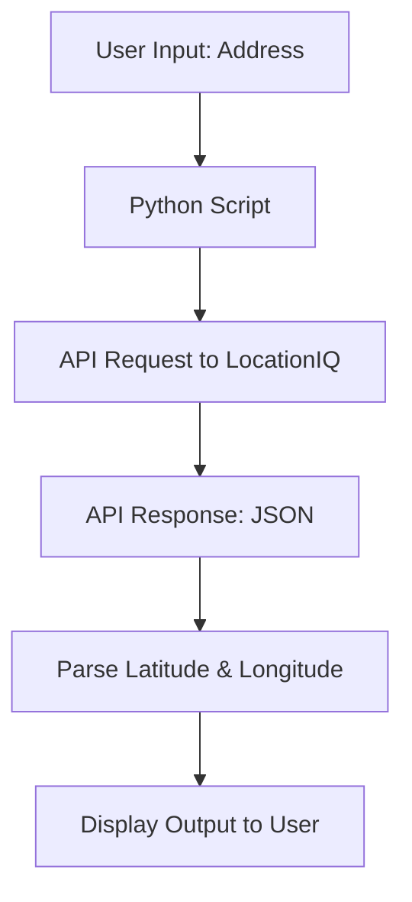
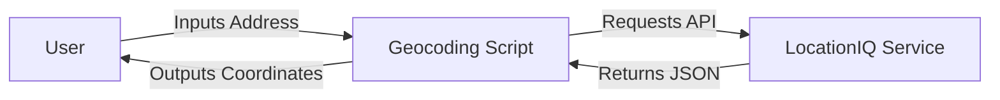
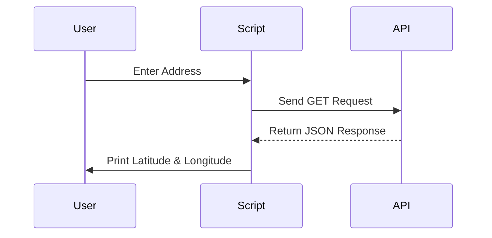

# 🌐 Cool Project 2: Geocoding Script

[](https://github.com/alok-kumar8765/Cool_Project_2)
[](https://github.com/alok-kumar8765/Cool_Project_2/issues)
[](https://github.com/alok-kumar8765/Cool_Project_2/blob/main/LICENSE)
[](https://www.python.org/downloads/)
[](https://github.com/alok-kumar8765/Cool_Project_2/commits/main)

---

## 📖 Table of Contents
<details>
<summary>Click to Expand</summary>

1. [Project Overview](#project-overview)  
2. [Description](#description)  
3. [Features](#features)  
4. [Installation](#installation)  
5. [Usage](#usage)  
6. [Code Explanation](#code-explanation)  
7. [Architecture & Flow Diagrams](#architecture--flow-diagrams)  
8. [Pros & Cons](#pros--cons)  
9. [Use Cases & Real World Examples](#use-cases--real-world-examples)  
10. [SEO & Optimization Notes](#seo--optimization-notes)  
11. [License](#license)  

</details>

---

## 🏗 Project Overview
The **Geocoding Script** converts a physical address into geographic coordinates (latitude & longitude) using **LocationIQ API**. This is crucial for applications in mapping, logistics, tracking, and GIS platforms.

---

## 📝 Description
This Python script allows developers and data analysts to quickly obtain latitude and longitude of any given address. It is lightweight, easy to use, and designed for **enterprise-grade integration** into location-based services.

---

## ✨ Features
<details>
<summary>Click to Expand</summary>

- Convert any valid address to latitude and longitude
- Utilizes **LocationIQ API** for accurate geocoding
- Simple **input/output** interface
- Easy integration into **Python projects**
- Returns JSON for advanced automation
- Lightweight & minimal dependencies (`requests` library)

</details>

---

## 💻 Installation
<details>
<summary>Click to Expand</summary>

1. Clone the repository:

```bash
git clone https://github.com/alok-kumar8765/Cool_Project_2.git
cd Cool_Project_2/Geocoding
````

2. Install dependencies:

```bash
pip install requests
```

3. Obtain your **LocationIQ Private Token**:

   * Sign up at [LocationIQ](https://locationiq.com/)
   * Generate a private API token
   * Replace `"Your_private_token"` in the script

</details>

---

## 🚀 Usage

<details>
<summary>Click to Expand</summary>

Run the script:

```bash
python geocoding.py
```

Input the address when prompted:

```
Input the address: 1600 Amphitheatre Parkway, Mountain View, CA
```

Output:

```
The latitude of the given address is: 37.422
The longitude of the given address is: -122.084
Thanks for using this script
```

</details>

---

## 🔍 Code Explanation

<details>
<summary>Click to Expand</summary>

1. **Imports & Base URL**

   ```python
   import requests
   url = "https://us1.locationiq.com/v1/search.php"
   ```

2. **User Input for Address**

   ```python
   address = input("Input the address: ")
   ```

3. **API Key Setup**

   ```python
   private_token = "Your_private_token"
   data = {'key': private_token, 'q': address, 'format': 'json'}
   ```

4. **API Request & Response Handling**

   ```python
   response = requests.get(url, params=data)
   latitude = response.json()[0]['lat']
   longitude = response.json()[0]['lon']
   ```

5. **Print Coordinates**

   ```python
   print(f"The latitude of the given address is: {latitude}")
   print(f"The longitude of the given address is: {longitude}")
   ```

</details>

---

## 🏛 Architecture & Flow Diagrams

<details>
<summary>Click to Expand</summary>

### 1️⃣ High-Level Data Flow (DFD)



### 2️⃣ System Architecture



### 3️⃣ Workflow



</details>

---

## ⚖️ Pros & Cons

<details>
<summary>Click to Expand</summary>

### Pros

* Easy to integrate and use
* Minimal dependencies (`requests`)
* Accurate geocoding using LocationIQ
* Lightweight and fast

### Cons

* Requires Internet connection
* Limited free API calls on LocationIQ
* Dependent on third-party API uptime
* No batch processing by default

</details>

---

## 🌎 Use Cases & Real World Examples

<details>
<summary>Click to Expand</summary>

### Use Cases

* Mapping applications (Google Maps alternatives)
* Delivery & logistics route planning
* Fleet tracking systems
* GIS analysis for urban planning
* Location-based analytics dashboards

### Example

```python
address = "Eiffel Tower, Paris"
# Output: Latitude: 48.8584, Longitude: 2.2945
```

This can be fed into a mapping app or a database for geospatial queries.

</details>

---

## 🏆 SEO & Optimization Notes

<details>
<summary>Click to Expand</summary>

* **Keywords**: Python geocoding script, LocationIQ API, address to latitude longitude, GIS, mapping automation
* Optimized for search engines with descriptive headings and metadata
* JSON response handling allows integration into SEO-friendly web dashboards

</details>

---

## 📄 License

<details>
<summary>Click to Expand</summary>

MIT License. See [LICENSE](https://github.com/alok-kumar8765/Cool_Project_2/blob/main/LICENSE) for details.

</details>

---

## 🔗 GitHub Repository

[Cool Project 2 - Geocoding](https://github.com/alok-kumar8765/Cool_Project_2/tree/main/Geocoding)

---

> ✅ **Enterprise-ready, modular, and lightweight geocoding script for Python developers and data analysts.**


---

